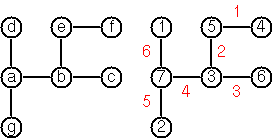

# JavaScriptの問題集(99 Haskell Problemsの翻訳)と解答例・解説

[](https://travis-ci.org/tetsugi/js-99)
[](https://coveralls.io/github/tetsugi/js-99?branch=master)

[H-99: Ninety-Nine Haskell Problems](https://wiki.haskell.org/H-99:_Ninety-Nine_Haskell_Problems)というHaskellの問題集があります。  
元はPrologの問題集だったそうです。  

二番煎じかもしれませんがこの問題集を少し改変して、JavaScriptで解いていくことにします。  
ほぼ自分の腕試し用です。

### TODO

- テストを書く
- 最適化

### 目次

- [環境構築](#環境構築)
  - [Node.jsとYarnのインストール](#Node.jsとYarnのインストール)
  - [パッケージ作成](#パッケージ作成)
  - [Webpack](#Webpack)
  - [Jest](#Jest)
  - [試しに1問解いてみる](#試しに1問解いてみる)
- [問題](#問題99-javascript-problems)
  - [問1～10: 配列](#問110-配列)
  - [問11～20: 配列の続き](#問1120-配列の続き)
  - [問21～28: 配列、再び](#問2128-配列再び)
  - [問31～41: 算術](#問3141-算術)
  - [問46～50: 論理と符号](#問4650-論理と符号)
  - [問54～60: 二分木](#問5460-二分木)
  - [問61～69: 二分木、続き](#問6169-二分木続き)
  - [問70～73: 多分木](#問7073-多分木)
  - [問80～89: グラフ](#問8089-グラフ)
  - [問90～94: その他の問題](#問9094-その他の問題)
  - [問95～99: その他の問題、続き](#問9599-その他の問題続き)
- [解答例・解説](#解答例解説)
  - [解1～10: 配列](#解110-配列)
  - [解11～20: 配列の続き](#解1120-配列の続き)
  - [解21～28: 配列、再び](#解2128-配列再び)
  - [解31～41: 算術](#解3141-算術)
  - [解46～50: 論理と符号](#解4650-論理と符号)
  - [解54～60: 二分木](#解5460-二分木)
  - [解61～69: 二分木、続き](#解6169-二分木続き)
  - [解70～73: 多分木](#解7073-多分木)
  - [解80～89: グラフ](#解8089-グラフ)
  - [解90～94: その他の問題](#解9094-その他の問題)
  - [解95～99: その他の問題、続き](#解9599-その他の問題続き)

## 環境構築  

### Node.jsとYarnのインストール

[Node.js](https://nodejs.org/ja/)を使いますので、インストールしてください。  
インストール後にコンソールを開いて以下のコマンドを実行し、バージョンが表示されればPATHが通っています。  
執筆時点では、Node.jsは`v11.0.0`、npmは`6.4.1`を使用しています。

```sh
$ node -v
$ npm -v
```

[Yarn](https://yarnpkg.com/lang/ja/)もインストールします。  
Yarnはnpmよりも高速なパッケージマネージャです。  

```sh
$ npm i -g yarn
```

### パッケージ作成

問題を解いていくためのパッケージを作成しましょう。  
以下のコマンドを実行します。

```sh
$ mkdir js-99
$ cd js-99
$ yarn init -y
```

`js-99`ディレクトリに`package.json`が生成されます。

### Webpack

問題の解答をライブラリとしてビルドできるようにしましょう。  
たくさん解けば、最終的には[lodash](https://lodash.com/docs/)みたいな感じになりそうですね！

Webpackは分割したモジュールを一つのファイルにまとめてくれるバンドラです。  
最新のJavaScriptの構文をIE11などの古いブラウザでも使えるように変換(トランスパイル)してくれるBabelもインストールします。  
以下のコマンドを実行しましょう。これらのモジュールは`node_modules`ディレクトリが作成されて、そこに格納されます。

```sh
$ yarn add -D @babel/core @babel/preset-env @babel/register babel-loader webpack@4.x webpack-cli
```

プロジェクト直下に`.babelrc`を作成し、以下のように設定します。

```json
{ 
  "presets": ["@babel/preset-env"]
}
```

`webpack.config.babel.js`を作成し、webpackの設定を書いていきます。  
`output`はバンドルしたJSファイルをライブラリとして使えるようにするための設定です。

```js
import path from 'path'

export default {
  mode: 'production',
  entry: path.join(__dirname, 'src', 'index.js'),
  output: {
    library: 'js99',
    libraryTarget: 'umd',
    globalObject: 'this',
    filename: 'js-99.js',
    path: path.join(__dirname, 'dist')
  }
}
```

`package.json`に`scripts`を追記します。  
これはnpm-scriptsというもので、スクリプトを書いておくと`yarn <script名>`で実行できるようになります。

```json
{
  ...
  "scripts": {
    "build": "webpack"
  },
  ...
}
```

`src`ディレクトリを作成し、`index.js`を以下のような内容で作成してみましょう。

```js
export default { hoge: 'fuga' }
```

次のコマンドを実行して`dist/js-99.js`が出力されれば成功です。  
REPLで`require`して確かめることもできます。

```sh
$ yarn build
```

```sh
$ node
> require('./dist/js-99')
{ default: { hoge: 'fuga' } }
```

### Jest

問題が解けたかどうか確かめるために、ユニットテストができる環境を作りましょう。  
ユニットテストをするためにJestを導入します。

```sh
$ yarn add -D jest babel-jest babel-core@^7.0.0-bridge.0 regenerator-runtime
```

`package.json`の`scripts`に`test`を追記します。

```json
{
  ...
  "scripts": {
    "build": "webpack",
    "test": "jest"
  },
  ...
}
```

動作確認してみましょう。  
`test`ディレクトリを作成し、`hoge.test.js`にユニットテストを書いていきます。

```js
import hoge from '../src'

test('動作確認', () => {
  expect(hoge.hoge).toBe('fuga')
})
```

以下のコマンドでユニットテストを実行できます。

```sh
$ yarn test
```

次のような出力になれば成功です。

```
[PASS] test/hoge.test.js
  √ 動作確認 (3ms)

Test Suites: 1 passed, 1 total
Tests:       1 passed, 1 total
Snapshots:   0 total
Time:        1.425s
Ran all test suites.
Done in 2.16s.
```

### 試しに1問解いてみる

H-99の22問目の「指定された範囲内のすべての整数を含む配列を生成する関数`range`を実装する」という問題を試しに解いてみます。  
Haskellには`[4..9]`のように書くと`[4,5,6,7,8,9]`が生成される構文があるため、それと同様の結果を返す`range`は面白そうだと思ったからです。  
初回なので、とりあえずそれなりにテストも書いてみます。

`range`関数は以下のような動作になるはずです。

```js
range(4, 9) // [4,5,6,7,8,9]
```

まずはテストから書いてみます。`range(5, 1)`のような引数を渡すと空の配列が返ってくることを想定します。  
`test/index.test.js`を次のように編集します。

```js
import { range } from '../src'

describe('問22: 指定された範囲内のすべての整数を含む配列を生成する', () => {
  test('4から9までの整数の配列', () => {
    expect(range(4, 9)).toEqual([4, 5, 6, 7, 8, 9])
  })

  test('5から1までの整数の配列（空の配列）', () => {
    expect(range(5, 1)).toEqual([])
  })
})
```

まだ未実装なので`yarn test`をすると失敗します。  
このテストをパスできるように`src/index.js`に実装していきましょう。  
`for`文を使えばすぐに実装できます。

```js
/**
 * 指定された範囲内のすべての整数を含む配列を生成する
 * @param {number} start 開始
 * @param {number} end 終了
 * @returns {number[]} 範囲内のすべての整数を含む配列
 */
export const range = (start, end) => {
  const list = []
  
  for (let i = start; i <= end; i++) {
    list.push(i)
  }

  return list
}
```

これで`yarn test`をパスできるようになりました！書いたテストが全て緑色になるのは気持ちいいですね。  
ついでに、「指定された範囲内のすべての文字を含む配列」も`range`関数で返すようにしてみます。  
Haskellでは`['a'..'z']`で小文字のアルファベットの配列を表現できるからです。

関数に変更を加えても先ほど書いたテストは当然通るようにしなければなりません。  
逆に、変更によってバグが生じた場合は、ユニットテストをパスしなくなってすぐに分かるわけです。

`test/index.test.js`にテストを追加しましょう。

```js
describe('問22: 指定された範囲内のすべての整数または文字を含む配列を生成する', () => {
  /* 省略 */

  test('aからzまでの文字の配列', () => {
    expect(range('a', 'z')).toEqual(['a', 'b', 'c', 'd', 'e', 'f', 'g', 'h', 'i', 'j', 'k', 'l', 'm', 'n', 'o', 'p', 'q', 'r', 's', 't', 'u', 'v', 'w', 'x', 'y', 'z'])
  })

  test('引数の型が異なる（エラー）', () => {
    expect(() => range(1, 'a')).toThrowError()
  })

  test('引数が文字列のとき、長さが2以上ある（エラー）', () => {
    expect(() => range('aa', 'b')).toThrowError()
  })
})
```

`src/index.js`の`range`関数に機能を追加しましょう。  
引数が`string`だった場合、文字をUnicode値に変換してからループさせ、結果を格納するときはUnicode値を文字に変換するようにします。

```js
/**
 * 指定された範囲内のすべての整数または文字を含む配列を生成する
 * @param {number|string} start 開始位置の要素
 * @param {number|string} end 終了位置の要素
 * @returns {number[]|string[]} 範囲内のすべての要素を含む配列
 */
export const range = (start, end) => {
  if (typeof(start) !== typeof(end)) {
    throw new Error('引数は同じ型にしてください')
  }

  const isStr = typeof(start) === 'string'

  if (isStr && (start.length !== 1 || end.length !== 1)) {
    throw new Error('引数にする文字列の長さは1にしてください')
  }

  const list = []
  
  if (isStr) {
    start = start.charCodeAt(0)
    end = end.charCodeAt(0)
  }  

  for (let i = start; i <= end; i++) {
    list.push(isStr ? String.fromCharCode(i) : i)
  }

  return list
}
```

少し長くなってしまいました。`yarn test`で全てパスされていれば成功です。


## 問題(99 JavaScript Problems)

問題をJavaScript用に改変しているところがあります。  
これによって難易度にバラつきが出ていますが、ご了承ください。  

一部の問題は統合しているため、本当に99問あるわけではありません。

### 問1～10: 配列

#### 問1: 最後の要素

> **配列や文字列の最後の要素を取り出す`last`関数を実装せよ。**

```js
last([1, 2, 3, 4]) // 4
last('xyz') // z
```

[解答例](#解1-最後の要素)

#### 問2: 最後の一つ前の要素

> **配列や文字列の最後の一つ前の要素を取り出す`butLast`関数を実装せよ。**

```js
butLast([1, 2, 3, 4]) // 3
butLast('abcdefghijklmnopqrstuvwxyz') // y
```

[解答例](#解2-最後の一つ前の要素)

#### 問3: n番目の要素

> **配列や文字列のn番目の要素を取り出す`elementAt`関数を実装せよ。**  
> **ただし、最初の要素は0番目ではなく、1番目と数える。**

```js
elementAt([1, 2, 3], 2) // 2
elementAt('JavaScript', 5) // S
```

[解答例](#解3-n番目の要素)

#### 問4: 配列の長さ

> **配列や文字列の長さを返す`length`関数を実装せよ。**  
> **ただし、`Array.length`や`String.length`は使用しないこと。**  
> **また、絵文字の長さは`1`と数えるようにすること。**  

```js
length([123, 456, 789]) // 3
length('💃Hello, World!💃') // 15
```

[解答例](#解4-配列の長さ)

#### 問5: 逆順

> **配列や文字列を逆順にして返す`reverse`関数を実装せよ。**  
> **ただし、`Array.reverse`は使用しないこと。**  
> **また、絵文字の長さは`1`と数えるようにすること。**

```js
reverse('A man, a plan, a canal, panama!💃') // 💃!amanap ,lanac a ,nalp a ,nam A
reverse([1, 2, 3, 4]) // [4, 3, 2, 1]
```

[解答例](#解5-逆順)

#### 問6: 回文

> **配列や文字列が回文かどうかを返す`isPalindrome`関数を実装せよ。**

```js
isPalindrome([1, 2, 3]) // false
isPalindrome('たけやぶやけた') // true
isPalindrome([1, 2, 4, 8, 16, 8, 4, 2, 1]) // true
```

[解答例](#解6-回文)

#### 問7: 平坦化

> **ネストしている配列を平坦（一次元配列）にして返す`flatten`関数を実装せよ。**  
> **ただし、`Array.flat`は使用しないこと。**

```js
flatten([1, [2, [3, 4], 5]]) // [1, 2, 3, 4, 5]
```

[解答例](#解7-平坦化)

#### 問8: 繰り返しの排除

> **配列や文字列から同じ要素の繰り返しを排除して返す`compress`関数を実装せよ。**

```js
compress([1, 1, 2, 1, 2, 2, 3, 3, 3, 3]) // [ 1, 2, 1, 2, 3 ]
compress('aaaabccaadeeee') // abcade
```

[解答例](#解8-繰り返しの排除)

#### 問9: 繰り返しの圧縮

> **配列や文字列の同じ要素の繰り返しを配列としてまとめて返す`pack`関数を実装せよ。**

```js
pack([1, 1, 2, 1, 2, 2, 3, 3, 3, 3]) // [[1, 1], [2], [1], [2, 2], [3, 3, 3, 3]]
pack('aaaabccaadeeee') // ['aaaa', 'b', 'cc', 'aa', 'd', 'eeee']
```

[解答例](#解9-繰り返しの圧縮)

#### 問10: ランレングス圧縮

> **`pack`関数を用いて、配列や文字列をランレングス圧縮する`encode`関数を実装せよ。**

```js
encode([1, 1, 2, 1, 2, 2, 3, 3, 3, 3]) // [[2, 1], [1, 2], [1, 1], [2, 2], [4, 3]]
encode('aaaabccaadeeee')
// [[4, 'a'], [1, 'b'], [2, 'c'], [2, 'a'], [1, 'd'], [4, 'e']]
```

[解答例](#解10-ランレングス圧縮)

### 問11～20: 配列の続き

#### 問11: ランレングス圧縮２

> **問10の結果を変更し、重複が無ければランレングス圧縮せずに要素を格納する`encodeModified`関数を実装せよ。**

```js
encodeModified([1, 1, 2, 1, 2, 2, 3, 3, 3, 3]) // [[2, 1], 2, 1, [2, 2], [4, 3]]
encodeModified('aaaabccaadeeee')
// [[4, 'a'], 'b', [2, 'c'], [2, 'a'], 'd', [4, 'e']]
```

[解答例](#解11-ランレングス圧縮２)

#### 問12: ランレングス圧縮の解凍

> **ランレングス圧縮した配列をデコードする`decodeModified`関数を実装せよ。**

```js
decodeModified([[2, 1], 2, 1, [2, 2], [4, 3]]) // [1, 1, 2, 1, 2, 2, 3, 3, 3, 3]
decodeModified([[4, 'a'], 'b', [2, 'c'], [2, 'a'], 'd', [4, 'e']]) // aaaabccaadeeee
```

[解答例](#解12-ランレングス圧縮の解凍)

#### 問13: ランレングス圧縮３

> **`pack`関数のように重複を含む配列を作らずに、直接ランレングス圧縮する`encodeDirect`関数を実装せよ。**

```js
encodeDirect([1, 1, 2, 1, 2, 2, 3, 3, 3, 3]) // [[2, 1], 2, 1, [2, 2], [4, 3]]
encodeDirect('aaaabccaadeeee')
// [[4, 'a'], 'b', [2, 'c'], [2, 'a'], 'd', [4, 'e']]
```

[解答例](#解13-ランレングス圧縮３)

#### 問14: 要素の複製

> **配列や文字列の要素を複製する`dupli`関数を実装せよ。**

```js
dupli([1, 2, 3]) // [1, 1, 2, 2, 3, 3]
dupli('abc') // aabbcc
```

[解答例](#解14-要素の複製)

#### 問15: 要素の複製２

> **指定された回数だけ配列や文字列の要素を複製する`repli`関数を実装せよ。**

```js
repli([1, 2, 3], 3) // [1, 1, 1, 2, 2, 2, 3, 3, 3]
repli('abc', 3) // aaabbbccc
```

[解答例](#解15-要素の複製２)

#### 問16: 要素の削除

> **nの倍数の位置の要素を配列や文字列から削除する`drop`関数を実装せよ。**

```js
drop([1, 2, 3, 4], 2) // [1, 3] 
drop('abcdefghik', 3) // 'abdeghk'
```

[解答例](#解16-要素の削除)

#### 問17: 分割

> **配列や文字列を指定した位置で分ける`split`関数を実装せよ。**

```js
split([1, 2, 3, 4], 2) // [[1, 2], [3, 4]]
split('abcdefghik', 3) // ['abc', 'defghik']
```

[解答例](#解17-分割)

#### 問18: 抽出

> **選択した範囲を配列や文字列から取り出す`slice`関数を実装せよ。**  
> **ただし、`Array.slice`、`Array.splice`は使用しないこと。**

```js
slice([1, 2, 3, 4], 2, 4) // [2, 3, 4]
slice('abcdefghik', 3, 7) // cdefg
```

[解答例](#解18-抽出)

#### 問19: ローテーション

> **配列や文字列の要素を左にn個ずらす`rotate`関数を実装せよ。**  
> **負の数を渡したときは右にずらすようにすること。**

```js
rotate([1, 2, 3], 1) // [2, 3, 1]
rotate('abcdefgh', 3) // defghabc
rotate('abcdefgh', -2) // ghabcdef
```

[解答例](#解19-ローテーション)

#### 問20: 要素の削除２

> **配列や文字列のn番目の要素を削除する`removeAt`関数を実装せよ。**  
> **削除した要素と処理後の配列を配列に格納し、呼び出した結果として返しなさい。**

```js
removeAt(3, [1, 2, 3]) // [3, [1, 2]]
removeAt(2, 'abcd') // ['b', 'acd']
```

[解答例](#解20-要素の削除２)

### 問21～28: 配列、再び

#### 問21: 要素の挿入

> **配列や文字列の指定した位置に要素を挿入する`insertAt`関数を実装せよ。**

```js
insertAt(5, [1, 2, 3, 4], 3) // [1, 2, 5, 3, 4]
insertAt('X', 'abcd', 2) // aXbcd
```

[解答例](#解21-要素の挿入)

#### 問22: 範囲

> **指定された範囲内のすべての整数または文字を含む配列を生成する`range`関数を実装せよ。**

```js
range(4, 9) // [4, 5 ,6, 7, 8, 9]
range('a', 'z') // ['a', 'b', 'c', 'd', 'e', 'f', 'g', 'h', 'i', 'j', 'k', 'l', 'm', 'n', 'o', 'p', 'q', 'r', 's', 't', 'u', 'v', 'w', 'x', 'y', 'z']
```

[解答例](#解22-範囲)

#### 問23: ランダムセレクト

> **配列や文字列から指定された数ぶんだけランダムに要素を取り出す`rndSelect`関数を実装せよ。**

```js
rndSelect('abcdefgh', 3) // eda など
```

[解答例](#解23-ランダムセレクト)

#### 問24: 乱数列

> **長さnの1以上m以下の乱数列を生成する`diffSelect`関数を実装せよ。**

```js
diffSelect(6, 49) // [23, 1, 17, 33, 21, 37] など
```

[解答例](#解24-乱数列)

#### 問25: ランダム並び替え

> **配列や文字列をランダムに並び替える`rndPermu`関数を実装せよ。**

```js
rndPermu('abcdef') // badcef など
```

[解答例](#解25-ランダム並び替え)

#### 問26: 組み合わせ

> **m個の要素からn個を選んだ組み合わせを返す`combinations`関数を実装せよ。**

```js
combinations('abcdef', 2) // ['ab', 'ac', 'ad', 'ae', 'af', 'bc', 'bd', 'be', 'bf', 'cd', 'ce', 'cf', 'de', 'df', 'ef']
```

[解答例](#解26-組み合わせ)

#### 問27: グループ化

> **配列の要素を互いに素な配列にグループ化して返す`group`関数を実装せよ。**

```js
group(["aldo","beat","carla","david","evi","flip","gary","hugo","ida"], 2, 3, 4)
// [[["aldo","beat"],["carla","david","evi"],["flip","gary","hugo","ida"]],...] 1260個の解
group(["aldo","beat","carla","david","evi","flip","gary","hugo","ida"], 2, 2, 5)
// [[["aldo","beat"],["carla","david"],["evi","flip","gary","hugo","ida"]],...] 756個の解
```

[解答例](#解27-グループ化)

#### 問28: 配列の長さによるソート

> **配列の配列を、要素の長さでソートする`lsort`関数を実装せよ。**  
> **また、要素の長さの頻度順にソートする`lfsort`関数を実装せよ。**

```js
lsort(["abc","de","fgh","de","ijkl","mn","o"]) // ["o","de","de","mn","abc","fgh","ijkl"]

lfsort(["abc", "de", "fgh", "de", "ijkl", "mn", "o"]) // ["ijkl","o","abc","fgh","de","de","mn"]
```

[解答例](#解28-配列の長さによるソート)

### 問31～41: 算術

#### 問31: 素数判定

> **引数が素数かどうかを返す`isPrime`関数を実装せよ。**

```js
isPrime(7) // true
```

[解答例](#解31-素数判定)

#### 問32: ユークリッドの互除法

> **[ユークリッドの互除法](https://ja.wikipedia.org/wiki/%E3%83%A6%E3%83%BC%E3%82%AF%E3%83%AA%E3%83%83%E3%83%89%E3%81%AE%E4%BA%92%E9%99%A4%E6%B3%95)を使って最大公約数を求める`gcd`関数を実装せよ。**

```js
gcd(36, 63) // 9
```

[解答例](#解32-ユークリッドの互除法)

#### 問33: 互いに素

> **渡した2つの整数が互いに素かどうかを返す`coprime`関数を実装せよ。**

```js
coprime(35, 64) // true
```

[解答例](#解33-互いに素)

#### 問34: オイラーのφ関数

> **[オイラーのφ関数](https://ja.wikipedia.org/wiki/%E3%82%AA%E3%82%A4%E3%83%A9%E3%83%BC%E3%81%AE%CF%86%E9%96%A2%E6%95%B0)`totient`を実装せよ。**

```js
totient(10) // 4
```

[解答例](#解34-オイラーのφ関数)

#### 問35: 素因数分解

> **引数を素因数分解する`primeFactors`関数を実装せよ。**

結果は昇順にソートすること。

```js
primeFactors(315) // [3, 3, 5, 7]
```

[解答例](#解35-素因数分解)

#### 問36: 素因数分解２

> **問35の結果を累乗で表現する`primeFactorsMult`関数を実装せよ。**

`3 ** 2`なら`[3, 2]`と表現します。

```js
primeFactorsMult(315) // [[3, 2], [5, 1], [7, 1]]
```

[解答例](#解36-素因数分解２)

#### 問37: オイラーのφ関数２

> **オイラーのφ関数を改良した`phi`関数を実装せよ。**

問36の結果を`[[p1, m1], [p2, m2], [p3, m3], ...]`としたとき、オイラーのφ関数は次のようにして計算できます。

```
phi(m) = (p1 - 1) * p1 ** (m1 - 1) * 
         (p2 - 1) * p2 ** (m2 - 1) * 
         (p3 - 1) * p3 ** (m3 - 1) * ...
```

```js
phi(10) // 4
```

[解答例](#解37-オイラーのφ関数２)

#### 問38: オイラーのφ関数３

> **問34と問37の実行時間を比較せよ。**

`totient(10090)`と`phi(10090)`を実行して、`phi`関数のほうが効率的であることを確かめてください。  
せっかくなので、関数の実行時間を計測する`time`関数を実装して調べましょう。

```js
time(totient, 10090) < time(phi, 10090) // true
```

[解答例](#解38-オイラーのφ関数３)

#### 問39: 範囲内の素数

> **与えられた範囲内の素数の配列を返す`primesR`関数を実装せよ。**

```js
primesR(10, 20) // [11, 13, 17, 19]
```

[解答例](#解39-範囲内の素数)

#### 問40: ゴールドバッハの予想

> **ゴールドバッハの予想を確かめる`goldbach`関数を実装せよ。**

ゴールドバッハの予想は「全ての2よりも大きな偶数は2つの素数の和として表すことができる」という予想です。

```js
goldbach(28) // [5, 23]
```

[解答例](#解40-ゴールドバッハの予想)

#### 問41: ゴールドバッハの予想２

> **与えられた範囲内の`goldbach`の結果を出力する`goldbachList`関数を実装せよ。**  
> **第三引数を与えた場合、2つの素数がその値より大きいもののみを出力するようにすること。**

```js
goldbachList(9, 20) // [[3, 7], [5, 7], [3, 11], [3, 13], [5, 13], [3,17]]
goldbachList(4, 2000, 50) // [[73, 919], [61, 1321], [67, 1789], [61, 1867]]
```

[解答例](#解41-ゴールドバッハの予想２)

### 問46～50: 論理と符号

#### 問46: 真理値表

> **真理値表を作成する`table`関数を実装せよ。**  
> **`table((a, b, c) => a && (b || c))`のように、引数が増えても真理値表を出力できるようにすること。**

```js
table((a, b) => a && (a || b))
/*
[
  [[true, true], true],
  [[true, false], true],
  [[false, true], false],
  [[false, false], false]
]
*/
```

[解答例](#解46-真理値表)

#### 問49: グレイコード

> **与えられたbit数の[グレイコード](https://ja.wikipedia.org/wiki/%E3%82%B0%E3%83%AC%E3%82%A4%E3%82%B3%E3%83%BC%E3%83%89)の配列を求める`gray`関数を実装せよ。**

```js
gray(3) // ["000","001","011","010","110","111","101","100"]
```

[解答例](#解49-グレイコード)

#### 問50: ハフマン符号

> **[ハフマン符号化](https://ja.wikipedia.org/wiki/%E3%83%8F%E3%83%95%E3%83%9E%E3%83%B3%E7%AC%A6%E5%8F%B7)をする`huffman`関数を実装せよ。**

符号化する要素は`[記号, 出現頻度]`で表されます。ついでに、文字列も変換できるようにしましょう。

```js
huffman([['a', 45], ['b', 13], ['c', 12], ['d', 16], ['e', 9], ['f', 5]])
// [['a', '0'], ['b', '101'], ['c', '100'], ['d', '111'], ['e', '1101'], ['f', '1100']]
huffman('DAEBCBACBBBC') // [['A', '111'], ['B', '0'], ['C', '10'], ['D', '1100'], ['E', '1101'] ]
```

[解答例](#解50-ハフマン符号)

### 問54～60: 二分木

#### 問54: 二分木クラス

> **二分木クラス`BinaryTree`を実装せよ。**

二分木は、あるノードが持つ子の数が2個以下の木構造です。  

以下のようにコンストラクタに二分木にしたい配列を渡すと、二分木として表現できるようにします。  
引数とする配列は、`[値, 左部分木, 右部分木]`で表現することにします。

```js
const tree = new BinaryTree(['a', ['b', 'd', 'e'], ['c', null, ['f', 'g', null]]])
console.log(tree.toString())
/*
{
  "value": "a",
  "left": {
    "value": "b",
    "left": {
      "value": "d",
      "left": null,
      "right": null
    },
    "right": {
      "value": "e",
      "left": null,
      "right": null
    }
  },
  "right": {
    "value": "c",
    "left": null,
    "right": {
      "value": "f",
      "left": {
        "value": "g",
        "left": null,
        "right": null
      },
      "right": null
    }
  }
}
*/
```

[解答例](#解54-二分木クラス)

#### 問55: 平衡木

> **左部分木と右部分木のノードの数の差が1以下である二分木を全て生成する`cbalTree`関数を実装せよ。**

下記の省略されている`[BinaryTree]`の部分は、`BinaryTree { value: 'x', left: null, right: null }`のようになっています。

```js
BinaryTree.cbalTree(4)
/*
[ BinaryTree {
    value: 'x',
    left: BinaryTree { value: 'x', left: null, right: null },
    right: BinaryTree { value: 'x', left: null, right: [BinaryTree] } },
  BinaryTree {
    value: 'x',
    left: BinaryTree { value: 'x', left: null, right: [BinaryTree] },
    right: BinaryTree { value: 'x', left: null, right: null } },
  BinaryTree {
    value: 'x',
    left: BinaryTree { value: 'x', left: null, right: null },
    right: BinaryTree { value: 'x', left: [BinaryTree], right: null } },
  BinaryTree {
    value: 'x',
    left: BinaryTree { value: 'x', left: [BinaryTree], right: null },
    right: BinaryTree { value: 'x', left: null, right: null } } ]
*/
```

[解答例](#解55-平衡木)

#### 問56: 対称な二分木

> **二分木が対称かどうかを返す`isSymmetric`関数を実装せよ。**

ノードの値は比較しません。あくまで、構造が対称かどうかを調べます。

```js
const x = new BinaryTree(['x', 'x', null])
const y = new BinaryTree(['x', 'x', 'x'])

x.isSymmetric // false
y.isSymmetric // true
```

[解答例](#解56-対称な二分木)

#### 問57: 二分探索木

> **二分探索木を生成する`searchTree`関数を実装せよ。**

引数は一次元配列とします。

```js
BinaryTree.searchTree([3, 2, 5, 7, 1])
/*
BinaryTree {
  value: 3,
  left:
   BinaryTree {
     value: 2,
     left: BinaryTree { value: 1, left: null, right: null },
     right: null },
  right:
   BinaryTree {
     value: 5,
     left: null,
     right: BinaryTree { value: 7, left: null, right: null } } }
*/
BinaryTree.searchTree([5, 3, 18, 1, 4, 12, 21]).isSymmetric // true
BinaryTree.searchTree([3, 2, 5, 7, 4]).isSymmetric // false
```

[解答例](#解57-二分探索木)

#### 問58: 平衡で対称な二分木

> **問55のように平衡で、かつ対称な二分木があれば返す`symCbalTrees`関数を実装せよ。**

引数はノード数で、そのような二分木が見つからなければ`[]`を返します。  

```js
BinaryTree.symCbalTrees(5)
/*
[ BinaryTree {
    value: 'x',
    left: BinaryTree { value: 'x', left: null, right: [BinaryTree] },
    right: BinaryTree { value: 'x', left: [BinaryTree], right: null } },
  BinaryTree {
    value: 'x',
    left: BinaryTree { value: 'x', left: [BinaryTree], right: null },
    right: BinaryTree { value: 'x', left: null, right: [BinaryTree] } } ]
*/
```

[解答例](#解58-平衡で対称な二分木)

#### 問59: AVL木

> **左部分木と右部分木の高さの差が1以下である二分木を全て生成する`hbalTree`関数を実装せよ。**

引数は生成する木構造の高さ（根ノードの高さ）とします。

```js
BinaryTree.hbalTree(3)[0]
/*
BinaryTree {
  value: 'x',
  left: BinaryTree { value: 'x', left: null, right: null },
  right:
   BinaryTree {
     value: 'x',
     left: null,
     right: BinaryTree { value: 'x', left: null, right: null } } }
*/
BinaryTree.hbalTree(4).length // 315
```

[解答例](#解59-AVL木)

#### 問60: 決められたノード数のAVL木

> **与えられた数のノードを持つ問59のような二分木を全て生成する`hbalTreeNodes`関数を実装せよ。**

**ヒント**  
まず、左部分木と右部分木の高さの差が1以下である二分木の高さ`h`を実現するために必要な最小ノード数を計算する`minNodes`関数を定義します。  
少し数式を考えてみれば、最小ノード数はフィボナッチ数列に近いものになるはずです。  
次に、`minNodes`関数を用いて、問題の木構造の最大の高さを求める`maxHeight`関数を定義します。  
その後、最小から最大までの高さについて、与えられたノード数を持つ二分木があるかどうか調べます。

```js
BinaryTree.hbalTreeNodes(15).length // 1553
[0, 1, 2, 3].map(BinaryTree.hbalTreeNodes)
/*
[ [ null ],
  [ BinaryTree { value: 'x', left: null, right: null } ],
  [ BinaryTree { value: 'x', left: null, right: [BinaryTree] },
    BinaryTree { value: 'x', left: [BinaryTree], right: null } ],
  [ BinaryTree { value: 'x', left: [BinaryTree], right: [BinaryTree] } ] ]
*/
```

[解答例](#解60-決められたノード数のAVL木)

### 問61～69: 二分木、続き

#### 問61: 二分木の葉の数

> **二分木の葉の数を数える`countLeaves`関数を実装せよ。**

```js
(new BinaryTree([1, [2, null, 4], 2])).countLeaves // 2
```

[解答例](#解61-二分木の葉の数)

#### 問61A: 二分木の葉

> **二分木の葉のリストを返す`leaves`関数を実装せよ。**

```js
(new BinaryTree([1, [2, null, 4], 2])).leaves // [ 4, 2 ]
```

[解答例](#解61A-二分木の葉)

#### 問62: 二分木の内部ノード

> **二分木の内部ノード（葉以外の節）を返す`internals`関数を実装せよ。**

```js
(new BinaryTree([1, [2, null, 4], 2])).internals // [ 1, 2 ]
```

[解答例](#解62-二分木の内部ノード)

#### 問62B: ある深さのノード

> **指定された深さのノードのリストを返す`atLevel`関数を実装せよ。**

```js
(new BinaryTree([1, [2, null, 4], 2])).atLevel(2) // [ 2, 2 ]
```

[解答例](#解62B-ある深さのノード)

#### 問63: 完全二分木

> **完全二分木を生成する`completeBinaryTree`関数と、完全二分木かどうかを返す`isCompleteBinaryTree`関数を実装せよ。**

完全二分木は、根からすべての葉までの深さの差が1以下で、葉が左詰めになっている二分木です。  
引数はノード数とします。

```js
BinaryTree.completeBinaryTree(4)
/*
BinaryTree {
  value: 'x',
  left:
   BinaryTree {
     value: 'x',
     left: BinaryTree { value: 'x', left: null, right: null },
     right: null },
  right: BinaryTree { value: 'x', left: null, right: null } }
*/
(new BinaryTree(['x', ['x', 'x', null], ['x', null, null]])).isCompleteBinaryTree // true
(new BinaryTree(['x', ['x', 'x', null], ['x', null, 'x']])).isCompleteBinaryTree // false
```

[解答例](#解63-完全二分木)

#### 問64: レイアウト

> **次の図のように、各ノードに座標を付与する`layout`関数を実装せよ。**


次のようにノードに座標を割り振ります。

- x座標は、中順に走査したときの順番
- y座標は、そのノードがある深さ

結果が見づらくなるので、各ノードの座標を分かりやすく取得できる`positions`関数もついでに定義しましょう。

```js
const result = (new BinaryTree(['n', ['k', ['c', 'a', ['h', ['g', 'e', null], null]], 'm'], ['u', ['p', null, ['s', 'q', null]], null]])).layout()
result.positions
/*
[ { value: 'n', x: 8, y: 1 },
  { value: 'k', x: 6, y: 2 },
  { value: 'c', x: 2, y: 3 },
  { value: 'a', x: 1, y: 4 },
  { value: 'h', x: 5, y: 4 },
  { value: 'g', x: 4, y: 5 },
  { value: 'e', x: 3, y: 6 },
  { value: 'm', x: 7, y: 3 },
  { value: 'u', x: 12, y: 2 },
  { value: 'p', x: 9, y: 3 },
  { value: 's', x: 11, y: 4 },
  { value: 'q', x: 10, y: 5 } ]
*/
```

[解答例](#解64-レイアウト)

#### 問65: 広いレイアウト

> **次の図のように、各ノードに座標を付与する`wideLayout`関数を実装せよ。**


配置ルールは図を見て考えてください。  

**ヒント**  
ある深さの隣接するノードの水平距離が一定なことに着目しましょう。

```js
const result = (new BinaryTree(['n', ['k', ['c', 'a', ['e', 'd', 'g']], 'm'], ['u', ['p', null, 'q'], null]])).wideLayout()
result.positions
/*
[ { value: 'n', x: 15, y: 1 },
  { value: 'k', x: 7, y: 2 },
  { value: 'c', x: 3, y: 3 },
  { value: 'a', x: 1, y: 4 },
  { value: 'e', x: 5, y: 4 },
  { value: 'd', x: 4, y: 5 },
  { value: 'g', x: 6, y: 5 },
  { value: 'm', x: 11, y: 3 },
  { value: 'u', x: 23, y: 2 },
  { value: 'p', x: 19, y: 3 },
  { value: 'q', x: 21, y: 4 } ]
*/
```

[解答例](#解65-広いレイアウト)

#### 問66: コンパクトなレイアウト

> **次の図のように、各ノードに座標を付与する`compactLayout`関数を実装せよ。**


このレイアウトを用いると、全てのノードにおいて一定の対称性を保ちつつ、コンパクトに二分木を表現できます。  
配置ルールは図を見て考えてください。  

**ヒント**  
ノードと後継ノード間の水平距離に着目しましょう。

```js
const result = (new BinaryTree(['n', ['k', ['c', 'a', ['e', 'd', 'g']], 'm'], ['u', ['p', null, 'q'], null]])).compactLayout()
result.positions
/*
[ { value: 'n', x: 5, y: 1 },
  { value: 'k', x: 3, y: 2 },
  { value: 'c', x: 2, y: 3 },
  { value: 'a', x: 1, y: 4 },
  { value: 'e', x: 3, y: 4 },
  { value: 'd', x: 2, y: 5 },
  { value: 'g', x: 4, y: 5 },
  { value: 'm', x: 4, y: 3 },
  { value: 'u', x: 7, y: 2 },
  { value: 'p', x: 6, y: 3 },
  { value: 'q', x: 7, y: 4 } ]
*/
```

[解答例](#解66-コンパクトなレイアウト)

#### 問67: 二分木の文字列表現

> **文字列をパースして二分木にする`fromString`関数を実装せよ。**  
> **二分木の文字列表現は`x(y,a(,b))`のようにして与えられる。**

```js
BinaryTree.stringToTree('x(y,a(,b))')
/*
BinaryTree {
  value: 'x',
  left: BinaryTree { value: 'y', left: null, right: null },
  right:
    BinaryTree {
      value: 'a',
      left: null,
      right: BinaryTree { value: 'b', left: null, right: null } } }
*/
```

[解答例](#解67-二分木の文字列表現)

#### 問68: 前順、中順

> **二分木を前順に走査する`preorder`関数と、中順に走査する`inorder`関数を実装せよ。**  
> **また、前順と中順に走査した結果を用いて二分木を生成する`preInTree`関数を実装せよ。**

前順と中順で走査した結果があれば、二分木の木構造は一通りに定められます。

```js
const tree = BinaryTree.stringToTree('a(b(d,e),c(,f(g,)))')
tree.preorder // [ 'a', 'b', 'd', 'e', 'c', 'f', 'g' ]
tree.inorder  // [ 'd', 'b', 'e', 'a', 'c', 'g', 'f' ]
BinaryTree.preInTree(tree.preorder, tree.inorder)
/*
BinaryTree {
  value: 'a',
  left:
    BinaryTree {
      value: 'b',
      left: BinaryTree { value: 'd', left: null, right: null },
      right: BinaryTree { value: 'e', left: null, right: null } },
  right:
    BinaryTree {
      value: 'c',
      left: null,
      right:
        BinaryTree {
          value: 'f',
          left: BinaryTree { value: 'g', left: null, right: null },
          right: null } } }
*/
```

[解答例](#解68-前順、中順)

#### 問69: 二分木の文字列表現２

> **文字列を二分木に変換する`dotstrToTree`関数と、逆変換する`toDotstr`関数を実装せよ。**  
> **二分木は`'abd..e..c.fg...'`のような文字列表現で渡される。**  
> **`.`は`null`とし、各ノードには1文字のみ入る。**

```js
const tree = BinaryTree.dotstrToTree('abd..e..c.fg...') // 問68の二分木と同じ
tree.toDotstr // abd..e..c.fg...
```

[解答例](#解69-二分木の文字列表現２)

### 問70～73: 多分木

二分木と違って比較的簡単な問題しかないので、こちらから先に着手するのも手です。

#### 問70: 多分木クラス

> **多分木クラス`MultiwayTree`を実装せよ。**  
> **また、ノードの数を返す`count`関数を実装せよ。**

二分木と同様に、配列から変換できるようにしておきます。

```js
const tree = new MultiwayTree(['a', ['f', 'g'], 'c', ['b', 'd', 'e']])
console.log(tree)
/*
MultiwayTree {
  '0':
    MultiwayTree { '0': MultiwayTree { value: 'g' }, value: 'f' },
  '1': MultiwayTree { value: 'c' },
  '2':
    MultiwayTree {
      '0': MultiwayTree { value: 'd' },
      '1': MultiwayTree { value: 'e' },
      value: 'b' },
  value: 'a' }
*/
tree.count // 7
```

[解答例](#解70-多分木クラス)

#### 問70A: 多分木の文字列表現

> **文字列表現を多分木に変換する`stringToTree`関数と、逆変換する`toString`関数を実装せよ。**  
> **問70の多分木は`'afg^^c^bd^e^^^'`のように表現される。**  
> **`^`は前の深さに戻るという意味で、根より前に戻った場合、そこで木構造が確定する。**

```js
const tree = MultiwayTree.stringToTree('afg^^c^bd^e^^^')
console.log(tree) // 問70の多分木と同じ
tree.toString() // afg^^c^bd^e^^^
```

[解答例](#解70A-多分木の文字列表現)

#### 問71: 経路長の総和

> **根から全ノードまでの経路長の総和を求める`internalPathLength`関数を実装せよ。**

```js
MultiwayTree.stringToTree('afg^^c^bd^e^^^').internalPathLength // 9
```

[解答例](#解71-経路長の総和)

#### 問72: 後順

> **多分木を後順に走査する`postorder`関数を実装せよ。**

```js
MultiwayTree.stringToTree('afg^^c^bd^e^^^').postorder
// [ 'g', 'f', 'c', 'd', 'e', 'b', 'a' ]
```

[解答例](#解72-後順)

#### 問73: 多分木の配列表現

> **Lispのような木構造の配列表現を返す`lisp`関数を実装せよ。**

配列から多分木に変換できるようにしていましたが、`lisp`関数で逆変換もできるようにします。  
関数名が`lisp`なのは、この木構造の配列での表現がLispライクだからです。  
（元々の問題では、`['a', ['b', 'c']]`が`(a (b c))`のような表現になっています）

```js
new MultiwayTree('a').lisp
new MultiwayTree(['a', 'b']).lisp
new MultiwayTree(['a', ['b', 'c']]).lisp
new MultiwayTree(['b', 'd', 'e']).lisp
new MultiwayTree(['a', ['f', 'g'], 'c', ['b', 'd', 'e']]).lisp
// 結果は全て引数と同じになる
```

[解答例](#解73-多分木の配列表現)

### 問80～89: グラフ

#### 問80: グラフクラス

> **グラフを表現する`Graph`クラスを実装せよ。**


頂点のリストと、辺（`[from, to, cost]`）のリストを渡すと、図のようなラベル付きグラフを構築できるようにします。  
また、辺のリストのみ渡された場合でもグラフを構築できるようにします。  
各辺はコストを持ちます。`cost`が渡されなかった場合は`1`にします。

クラスの設計は今後の問題が解きやすいようにしてください。  
この結果通りのインスタンスが生成されなくても構いません。

```js
new Graph(['b', 'c', 'd', 'f', 'g', 'h', 'k'], [['b', 'c', 1], ['b', 'f', 2], ['c', 'f', 5], ['f', 'k', 3], ['g', 'h']])
// new Graph([['b', 'c', 1], ['b', 'f', 2], ['c', 'f', 5], ['f', 'k', 3], ['g', 'h'], 'd'])
/*
Graph {
  b: { from: {}, to: { c: 1, f: 2 } },
  c: { from: { b: 1 }, to: { f: 5 } },
  d: { from: {}, to: {} },
  f: { from: { b: 2, c: 5 }, to: { k: 3 } },
  g: { from: {}, to: { h: 1 } },
  h: { from: { g: 1 }, to: {} },
  k: { from: { f: 3 }, to: {} } }
*/
```

[解答例](#解80-グラフクラス)

#### 問81: 経路

> **ある頂点から別の頂点までの経路を返す`paths`関数を実装せよ。**

```js
new Graph([[1, 2], [2, 3], [1, 3], [3, 4], [4, 2], [5, 6]]).paths('1', '4')
/*
[ [ [ '1', '2', 1 ], [ '2', '3', 1 ], [ '3', '4', 1 ] ],
  [ [ '1', '3', 1 ], [ '3', '4', 1 ] ] ]
*/
```

[解答例](#解81-経路)

#### 問82: 閉路 

> **閉路（ある頂点から始まってある頂点へ帰るまでの経路）を見つける`cycle`関数を実装せよ。**

```js
new Graph([[1, 2], [2, 3], [1, 3], [3, 4], [4, 2], [5, 6]]).cycle('2')
// [ [ [ '2', '3', 1 ], [ '3', '4', 1 ], [ '4', '2', 1 ] ] ]
```

[解答例](#解82-閉路)

#### 問83: スパニングツリー

> **グラフから[スパニングツリー](https://ja.wikipedia.org/wiki/%E5%85%A8%E5%9F%9F%E6%9C%A8)を全て探す`spanningTrees`関数を実装せよ。**

```js
const trees = new Graph([['a', 'b'], ['b', 'c'], ['c', 'd'], ['d', 'a'], ['a', 'c'], ['b', 'd']]).spanningTrees
trees[0]
/*
Graph {
  a: { from: {}, to: { b: 1, c: 1 } },
  b: { from: { a: 1 }, to: { d: 1 } },
  c: { from: { a: 1 }, to: {} },
  d: { from: { b: 1 }, to: {} } }
*/
trees.length // 16
```

[解答例](#解83-スパニングツリー)

#### 問84: 最小スパニングツリー

> **最小スパニングツリー(MST)を[Prim法](https://ja.wikipedia.org/wiki/%E3%83%97%E3%83%AA%E3%83%A0%E6%B3%95)で全て探す`prim`関数を実装せよ。**

```js
new Graph([[1, 2, 12], [1, 3, 34], [1, 5, 78], [2, 4, 55], [2, 5, 32], [3, 4, 61], [3, 5, 44], [4, 5, 93]]).prim
/*
[ Graph {
    '1': { from: {}, to: { '2': 12, '3': 34 } },
    '2': { from: { '1': 12 }, to: { '4': 55, '5': 32 } },
    '3': { from: { '1': 34 }, to: {} },
    '4': { from: { '2': 55 }, to: {} },
    '5': { from: { '2': 32 }, to: {} } } ]
*/
```

[解答例](#解84-最小スパニングツリー)

#### 問85: グラフ同型

> **二つのグラフが[グラフ同型](https://ja.wikipedia.org/wiki/%E3%82%B0%E3%83%A9%E3%83%95%E5%90%8C%E5%9E%8B)であるかを返す`isomorphism`関数を実装せよ。**

折角なので、グラフ同型だった場合は頂点の対応表を返すと、結果が正しいか検証しやすくなって良いと思います。

```js
const graph1 = new Graph([1, 2, 3, 4, 5, 6, 7, 8], [[1, 5], [1, 6], [1, 7], [2, 5], [2, 6], [2, 8], [3, 5], [3, 7], [3, 8], [4, 6], [4, 7], [4, 8]])
const graph2 = new Graph([1, 2, 3, 4, 5, 6, 7, 8], [[1, 2], [1, 4], [1, 5], [6, 2], [6, 5], [6, 7], [8, 4], [8, 5], [8, 7], [3, 2], [3, 4], [3, 7]])
graph1.isomorphism(graph2)
/*
{ '1': '1',
  '2': '3',
  '3': '6',
  '4': '8',
  '5': '2',
  '6': '4',
  '7': '5',
  '8': '7' }
*/
```

[解答例](#解85-グラフ同型)

#### 問86: 頂点彩色

> **[Welsh-Powellの頂点彩色アルゴリズム](https://ja.wikipedia.org/wiki/%E3%82%B0%E3%83%A9%E3%83%95%E5%BD%A9%E8%89%B2#%E8%B2%AA%E6%AC%B2%E5%BD%A9%E8%89%B2)を使用して、隣接ノードが異なる色になるように彩色する`paint`関数を実装せよ。**

頂点を次数が小さくなる順序でソートした後、貪欲彩色を行います。

```js
const graph = new Graph(['a', 'b', 'c', 'd', 'e', 'f', 'g', 'h', 'i', 'j'], [['a', 'b'], ['a', 'e'], ['a', 'f'], ['b', 'c'], ['b', 'g'], ['c', 'd'], ['c', 'h'], ['d', 'e'], ['d', 'i'], ['e', 'j'], ['f', 'h'], ['f', 'i'], ['g', 'i'], ['g', 'j'], ['h', 'j']])
graph.paint()
// { a: 1, b: 2, c: 1, d: 2, e: 3, f: 2, g: 1, h: 3, i: 3, j: 2 }
```

[解答例](#解86-頂点彩色)

#### 問87: 深さ優先探索

> **深さを優先してグラフを探索する`depthFirst`関数を実装せよ。**

```js
const graph = new Graph([1, 2, 3, 4, 5, 6, 7], [[1, 2], [2, 3], [1, 4], [3, 4], [5, 2], [5, 4], [6, 7]])
graph.depthFirst('1')
// [ '1', '2', '3', '4', '5' ]
```

[解答例](#解87-深さ優先探索)

#### 問88: グラフの分離

> **グラフを連結している頂点で分離する`connectedComponents`関数を実装せよ。**

```js
const graph = new Graph([1, 2, 3, 4, 5, 6, 7], [[1, 2], [2, 3], [1, 4], [3, 4], [5, 2], [5, 4], [6, 7]])
graph.connectedComponents
// [ [ '1', '2', '3', '4', '5' ], [ '6', '7' ] ]
```

[解答例](#解88-グラフの分離)

#### 問89: 2部グラフ

> **グラフが[2部グラフ](https://ja.wikipedia.org/wiki/2%E9%83%A8%E3%82%B0%E3%83%A9%E3%83%95)かどうかを返す`bipartite`関数を実装せよ。**

2部グラフだった場合、頂点を二つのグループに分けてみましょう。

```js
const graph1 = new Graph([1, 2, 3, 4, 5], [[1, 2], [2, 3], [1, 4], [3, 4], [5, 2], [5, 4]])
const graph2 = new Graph([1, 2, 3, 4, 5], [[1, 2], [2, 3], [1, 4], [3, 4], [5, 2], [5, 4], [1, 3]])
graph1.bipartite // [ [ '1', '3', '5' ], [ '2', '4' ] ]
graph2.bipartite // null
```

[解答例](#解89-2部グラフ)

### 問90～94: その他の問題

#### 問90: N-クイーン問題

> **[N-クイーン問題](https://ja.wikipedia.org/wiki/%E3%82%A8%E3%82%A4%E3%83%88%E3%83%BB%E3%82%AF%E3%82%A4%E3%83%BC%E3%83%B3)を解く`queens`関数を実装せよ。**

```js
const result = [...queen(8)]
result.length // 92
result[0] // [ 1, 5, 8, 6, 3, 7, 2, 4 ] など
```

[解答例](#解90-N-クイーン問題)

#### 問91: ナイト・ツアー問題

> **[ナイト・ツアー問題](https://ja.wikipedia.org/wiki/%E3%83%8A%E3%82%A4%E3%83%88%E3%83%BB%E3%83%84%E3%82%A2%E3%83%BC)を解く`knightsTour`関数を実装せよ。**

`m * n`のチェス盤の上を指定したマスに置かれたナイトが全てのマスを巡回し、その辿った経路を配列として返します。  
余裕があれば、最初の座標にナイトが戻ってくる結果のみを収集できるようにもしてみましょう。

```js
knightsTour([1, 1], [8, 8]).next().value // 例では初期座標と盤面サイズを渡している
/*
[ [ 1, 1 ], [ 3, 2 ], [ 5, 1 ], [ 7, 2 ], [ 8, 4 ], [ 7, 6 ], [ 8, 8 ], [ 6, 7 ], [ 8, 6 ], [ 7, 8 ], [ 5, 7 ], [ 3, 8 ], [ 1, 7 ], [ 2, 5 ], [ 1, 3 ], [ 2, 1 ], [ 4, 2 ], [ 6, 1 ], [ 8, 2 ], [ 6, 3 ], [ 7, 1 ], [ 8, 3 ], [ 7, 5 ], [ 8, 7 ], [ 6, 8 ], [ 4, 7 ], [ 2, 8 ], [ 1, 6 ], [ 2, 4 ], [ 1, 2 ], [ 3, 1 ], [ 2, 3 ], [ 1, 5 ], [ 3, 6 ], [ 4, 8 ], [ 2, 7 ], [ 3, 5 ], [ 1, 4 ], [ 2, 2 ], [ 4, 1 ], [ 3, 3 ], [ 5, 2 ], [ 4, 4 ], [ 5, 6 ], [ 6, 4 ], [ 4, 3 ], [ 5, 5 ], [ 3, 4 ], [ 2, 6 ], [ 1, 8 ], [ 3, 7 ], [ 4, 5 ], [ 5, 3 ], [ 7, 4 ], [ 6, 2 ], [ 8, 1 ], [ 7, 3 ], [ 5, 4 ], [ 4, 6 ], [ 6, 5 ], [ 7, 7 ], [ 8, 5 ], [ 6, 6 ], [ 5, 8 ] ] 
など
*/
```

[解答例](#解91-ナイト・ツアー問題)

#### 問92: コッホ予想

> **コッホ予想を解く`vonKoch`関数を実装せよ。**



ヘルゲ・フォン・コッホの予想によると、`n`個の頂点と`n - 1`個の辺があるグラフ（木構造）の場合、Graceful Labelingができます。  
グラフの各頂点が固有のラベル（数値）を持ち、各辺が繋がる頂点のラベルの差の絶対値の固有のラベルを持っているパターンを探します。  
結果は変換後の各頂点のラベルや、引数として与えられた各辺に付与されたラベルなどを返しましょう。

```js
[...vonKoch([[4, 1], [1, 2], [1, 7], [2, 3], [2, 5], [5, 6]])]
// [ [ 7, 3, 6, 1, 5, 4, 2 ], [ 6, 4, 5, 3, 2, 1 ] ] など
```

[解答例](#解92-コッホ予想)

#### 問93: 算数パズル

> **四則演算と等号と括弧を使って与えられた数列内で等式が成り立つものを見つける`puzzle`関数を実装せよ。**

配列の順番は変更しないものとします。

```js
[...puzzle([2, 3, 5, 7, 11])]
/*
[ '2 = 3 - (5 + 7 - 11)',
  '2 = 3 - 5 - (7 - 11)',
  '2 = 3 - (5 + 7) + 11',
  '2 = 3 - 5 - 7 + 11',
  '2 = (3 * 5 + 7) / 11',
  '2 * (3 - 5) = 7 - 11',
  '2 - (3 - (5 + 7)) = 11',
  '2 - (3 - 5 - 7) = 11',
  '2 - (3 - 5) + 7 = 11',
  '2 - 3 + 5 + 7 = 11' ]
*/
```

[解答例](#解93-算数パズル)

#### 問94: 正則単純グラフ

> **k-正則単純グラフを生成する`regular`関数を実装せよ。**

k-正則グラフは全ての頂点の次数が`k`のグラフです。つまり、各頂点は`k`本の辺を持っています。  
単純グラフは自己ループが無く、頂点間に複数の辺も無いグラフです。  
余裕があれば、結果にグラフ同型なものを含まないようにします。

```js
[...regular(6, 3)]
/*
[ Graph {
    '1': { from: {}, to: { '2': 1, '3': 1, '4': 1 } },
    '2': { from: { '1': 1 }, to: { '3': 1, '5': 1 } },
    '3': { from: { '1': 1, '2': 1 }, to: { '6': 1 } },
    '4': { from: { '1': 1 }, to: { '5': 1, '6': 1 } },
    '5': { from: { '2': 1, '4': 1 }, to: { '6': 1 } },
    '6': { from: { '3': 1, '4': 1, '5': 1 }, to: {} } },
  Graph {
    '1': { from: {}, to: { '2': 1, '3': 1, '4': 1 } },
    '2': { from: { '1': 1 }, to: { '5': 1, '6': 1 } },
    '3': { from: { '1': 1 }, to: { '4': 1, '5': 1 } },
    '4': { from: { '1': 1, '3': 1 }, to: { '6': 1 } },
    '5': { from: { '2': 1, '3': 1 }, to: { '6': 1 } },
    '6': { from: { '2': 1, '4': 1, '5': 1 }, to: {} } } ]
*/
```

[解答例](#解94-正則単純グラフ)

### 問95～99: その他の問題、続き

#### 問95: 数字の英単語変換

> **数字を英単語に変換する`fullWords`関数を実装せよ。**

0以上の整数のみ引数として渡されます。

```js
fullWords(175) // one-seven-five
```

[解答例](#解95-数字の英単語変換)

#### 問96: Adaの識別子

> **文字列がAdaの識別子かどうかを返す`identifier`関数を実装せよ。**

プログラミング言語Adaの識別子はBNFで次のように表されます。

```
identifier ::= letter { [ underscore ] letter | digit }
letter ::= A | ... | Z | a | ... | z
digit ::= 0 | ... | 9
underscore ::= _
```

```js
identifier('Time_Of_Day') // true
identifier('2nd_turn') // false
identifier('General__Alarm') // false
```

[解答例](#解96-Adaの識別子)

#### 問97: 数独

> **数独を実装せよ。**

未着手。Vue.jsで実装すると面白そうです。問題生成もできるようにするといいかもしれません。

#### 問98: お絵描きロジック

> **お絵描きロジックを実装せよ。**

未着手。64*64程度のドット絵からパズルを生成して解けるようにすると面白いかもしれません。

#### 問99: クロスワードパズル

> **クロスワードパズルを解く`crossword`関数を実装せよ。**

以下のように単語（キー）とクロスワードパズルが与えられたとき、マス目（ピリオド）を全て埋めたものを出力します。  
解答が無い場合は`null`を返すようにします。

```
LINUX
PROLOG
PERL
ONLINE
GNU
XML
NFS
SQL
EMACS
WEB
MAC

......  .
. .  .  .
. ..... .
. . . ...
  . ... .
 ...     
```

```js
import fs from 'fs'
crossword(fs.readFileSync('./test/crossword/1.dat', 'utf8'))
```

```
PROLOG  E
E N  N  M
R LINUX A
L I F MAC
  N SQL S
 WEB     
```

[解答例](#解99-クロスワードパズル)


## 解答例・解説

解答例の解き方は短く書こうとしていたり、丁寧に書こうとしていたりで、その時の気分によってまちまちです。  
パフォーマンスも考慮していません。  
知識不足で冗長になっている部分もあります。  

実際に解くときは無理して短く書くよりも、読み手が分かりやすいコードを書くようにしましょう。

### 解1～10: 配列

#### 解1: 最後の要素

> **配列や文字列の最後の要素を取り出す`last`関数を実装せよ。**

```js
const last = list => list[list.length - 1]

last([1, 2, 3, 4]) // 4
last('xyz') // z
```

配列の`index`は`0`から開始するため、`配列の長さ - 1`で最後の要素が取れます。  
JavaScriptの場合は定義していないプロパティを参照すると`undefined`が返ってくるので、空文字や空の配列を扱うことがあるときは注意します。

#### 解2: 最後の一つ前の要素

> **配列や文字列の最後の一つ前の要素を取り出す`butLast`関数を実装せよ。**

```js
const butLast = list => list[list.length - 2]

butLast([1, 2, 3, 4]) // 3
butLast('abcdefghijklmnopqrstuvwxyz') // y
```

問1と同様です。

#### 解3: n番目の要素

> **配列や文字列のn番目の要素を取り出す`elementAt`関数を実装せよ。**  
> **ただし、最初の要素は0番目ではなく、1番目と数える。**

```js
const elementAt = (list, index) => list[index - 1]

elementAt([1, 2, 3], 2) // 2
elementAt('JavaScript', 5) // S
```

`elementAt`関数を作る意味は無いですが、たぶんこれは複数の引数を扱う練習でしょう。

#### 解4: 配列の長さ

> **配列や文字列の長さを返す`length`関数を実装せよ。**  
> **ただし、`Array.length`や`String.length`は使用しないこと。**  
> **また、絵文字の長さは`1`と数えるようにすること。**  

```js
const length = list => [...list].reduce(a => a + 1, 0)

length([123, 456, 789]) // 3
length('💃Hello, World!💃') // 15
```

文字列の方には絵文字が混ざっています。  
**絵文字はサロゲートペアで表現されているため、`length`で2文字扱いになります。**  
スプレッド演算子を用いると、`[...'💃Hello!💃']`で`[ '💃', 'H', 'e', 'l', 'l', 'o', '!', '💃' ]`に変換できるため、`length`で正しい長さを返すことができます。

さて、`length`の使用が禁止されているため、その代わりとなる方法を考えなければなりません。  
`reduce`は配列の要素を左から右に読んでいき、何か処理をすることができます。  
引数の`a`はアキュムレータと呼ばれ、繰り返しの中で前の戻り値が保存されています。  
つまり、`a`の初期値を`0`にし、`1`を足していけば長さが求められます。

#### 解5: 逆順

> **配列や文字列を逆順にして返す`reverse`関数を実装せよ。**  
> **ただし、`Array.reverse`は使用しないこと。**  
> **また、絵文字の長さは`1`と数えるようにすること。**

```js
const reverse = list => [...list].reduceRight(
  (a, c) => a.concat(c), Array.isArray(list) ? [] : '')

reverse('A man, a plan, a canal, panama!💃') // 💃!amanap ,lanac a ,nalp a ,nam A
reverse([1, 2, 3, 4]) // [4, 3, 2, 1]
```

絵文字の処理は問4と同様です。  
配列の要素を右から左に結合していけば逆になるため、`reduceRight`を用います。  
引数が配列のときと文字列のときで結果を変えたいので、初期値を`Array.isArray(list) ? [] : ''`で分岐させ、`Array.concat`または`String.concat`で結合させています。

#### 解6: 回文

> **配列や文字列が回文かどうかを返す`isPalindrome`関数を実装せよ。**

```js
const isPalindrome = list => list.toString() === reverse(list).toString()

isPalindrome([1, 2, 3]) // false
isPalindrome('たけやぶやけた') // true
isPalindrome([1, 2, 4, 8, 16, 8, 4, 2, 1]) // true
```

問5の`reverse`を使うと楽に書けます。  
配列の厳密な比較は面倒なので、`toString`して同じ文字列になればよしとします。

#### 解7: 平坦化

> **ネストしている配列を平坦（一次元配列）にして返す`flatten`関数を実装せよ。**  
> **ただし、`Array.flat`は使用しないこと。**

```js
const flatten = list => list.reduce(
  (a, c) => a.concat(Array.isArray(c) ? flatten(c) : c), [])

flatten([1, [2, [3, 4], 5]]) // [1, 2, 3, 4, 5]
```

`reduce`を使います。要素が配列なら再帰的に`flatten`を呼んで一次元配列を返し、`concat`で結合します。

#### 問8: 繰り返しの排除

> **配列や文字列から同じ要素の繰り返しを排除して返す`compress`関数を実装せよ。**

```js
const compress = list => [...list].reduce(
  (a, c) => a.concat(a[a.length - 1] !== c ? c : []), 
  Array.isArray(list) ? [] : '')

compress([1, 1, 2, 1, 2, 2, 3, 3, 3, 3]) // [ 1, 2, 1, 2, 3 ]
compress('aaaabccaadeeee') // abcade
```

`reduce`を使います。  
アキュムレータ`a`の最後の要素が現在値`c`と等しくなければ`c`を結合し、等しければ何も結合しないようにします。

#### 解9: 繰り返しの圧縮

> **配列や文字列の同じ要素の繰り返しを配列としてまとめて返す`pack`関数を実装せよ。**

```js
const pack = list => {
  const isArray = Array.isArray(list)
  list = [...list]

  const result = []
  let element = null
  let current = null

  list.forEach((e, i) => {
    if (current === e) {
      element = element.concat(e)

    } else {
      if (element) { result.push(element) }
      current = e
      element = isArray ? [e] : e
    }

    if (i === (list.length - 1)) {
      result.push(element)
    }
  })

  return result
}

pack([1, 1, 2, 1, 2, 2, 3, 3, 3, 3]) // [[1, 1], [2], [1], [2, 2], [3, 3, 3, 3]]
pack('aaaabccaadeeee') // ['aaaa', 'b', 'cc', 'aa', 'd', 'eeee']
```

結果の配列`result`に格納したい要素`element`と、現在対象としている値`current`を宣言します。  
`forEach`でループさせ、`current`と要素が等しければ`element`と結合させ、等しくなければ`current`と`element`に新しい値をセットします。  
ループが末尾のときは、`element`を`result`に格納するのを忘れないようにします。

#### 解10: ランレングス圧縮

> **`pack`関数を用いて、配列や文字列をランレングス圧縮する`encode`関数を実装せよ。**

```js
const encode = list => pack(list).map(e => [e.length, e[0]])

encode([1, 1, 2, 1, 2, 2, 3, 3, 3, 3]) // [[2, 1], [1, 2], [1, 1], [2, 2], [4, 3]]
encode('aaaabccaadeeee')
// [[4, 'a'], [1, 'b'], [2, 'c'], [2, 'a'], [1, 'd'], [4, 'e']]
```

`map`で各要素の長さと最初の要素を格納した配列に変換します。

### 解11～20: 配列の続き

#### 解11: ランレングス圧縮２

> **問10の結果を変更し、重複が無ければランレングス圧縮せずに要素を格納する`encodeModified`関数を実装せよ。**

```js
const encodeModified = list => encode(list).map(e => e[0] === 1 ? e[1] : e)

encodeModified([1, 1, 2, 1, 2, 2, 3, 3, 3, 3]) // [[2, 1], 2, 1, [2, 2], [4, 3]]
encodeModified('aaaabccaadeeee')
// [[4, 'a'], 'b', [2, 'c'], [2, 'a'], 'd', [4, 'e']]
```

`encode`の最初の要素が`1`になっているペアのみを`map`で展開します。

#### 解12: ランレングス圧縮の解凍

> **ランレングス圧縮した配列をデコードする`decodeModified`関数を実装せよ。**

```js
const decodeModified = list => {
  const result = []
  
  list.forEach(e => {
    if (Array.isArray(e)) for (let i = 0; i < e[0]; i++) {
      result.push(e[1])
    } else {
      result.push(e)
    }
  })
  
  return typeof(result[0]) === 'string' ? result.join('') : result
}

decodeModified([[2, 1], 2, 1, [2, 2], [4, 3]]) // [1, 1, 2, 1, 2, 2, 3, 3, 3, 3]
decodeModified([[4, 'a'], 'b', [2, 'c'], [2, 'a'], 'd', [4, 'e']]) // aaaabccaadeeee
```

配列なら1番目の要素を長さの分だけ格納し、そうでないなら要素をそのまま配列に格納します。  
文字の配列だった場合は、最後に`join`で文字列にします。文字と数値の混在には対応していません。  

文字列かどうかの判定は`typeof`を使っています。  
`typeof`は、引数の型を文字列で返してくれます。

#### 解13: ランレングス圧縮３

> **`pack`関数のように重複を含む配列を作らずに、直接ランレングス圧縮する`encodeDirect`関数を実装せよ。**

```js
const encodeDirect = list => {
  list = [...list]

  const result = []
  let count = 1
  let current = null

  const push = () => result.push(count > 1 ? [count, current] : current)

  list.forEach((e, i) => {
    if (current === e) {
      count++

    } else {
      if (current) { push() }
      count = 1
      current = e
    }

    if (i === (list.length - 1)) { push() }
  })

  return result
}

encodeDirect([1, 1, 2, 1, 2, 2, 3, 3, 3, 3]) // [[2, 1], 2, 1, [2, 2], [4, 3]]
encodeDirect('aaaabccaadeeee')
// [[4, 'a'], 'b', [2, 'c'], [2, 'a'], 'd', [4, 'e']]
```

`pack`関数を改造して直接エンコードできるようにします。  
要素の数をカウントして、1個しかないならその要素自体を、2個以上あるならランレングス圧縮した結果を格納します。

#### 解14: 要素の複製

> **配列や文字列の要素を複製する`dupli`関数を実装せよ。**

```js
dupli([1, 2, 3]) // [1, 1, 2, 2, 3, 3]
dupli('abc') // aabbcc
```

`repli`関数のデフォルトを`dupli`関数の動作にするのでスキップします。

#### 解15: 要素の複製２

> **指定された回数だけ配列や文字列の要素を複製する`repli`関数を実装せよ。**

```js
const repli = (list, n = 2) => {
  const isStr = typeof(list) === 'string'
  list = [...list]
  const result = []

  list.forEach(e => { for (let i = 0; i < n; i++) result.push(e) })

  return isStr ? result.join('') : result
}

repli([1, 2, 3], 3) // [1, 1, 1, 2, 2, 2, 3, 3, 3]
repli('abc', 3) // aaabbbccc
```

`for`文で指定された回数分だけ配列に要素を繰り返し`push`します。  
デフォルト引数を与えているため、第二引数を渡さなければ`dupli`の動作になります。

#### 解16: 要素の削除

> **nの倍数の位置の要素を配列や文字列から削除する`drop`関数を実装せよ。**

```js
const drop = (list, n) => ((ret = [...list].filter((_, i) => (i + 1) % n !== 0)) => 
  typeof(list) === 'string' ? ret.join('') : ret)()

drop([1, 2, 3, 4], 2) // [1, 3] 
drop('abcdefghik', 3) // 'abdeghk'
```

1行で書く必要は全くありませんが、デフォルト引数とアロー関数を利用すれば1行で色々な処理をさせることができます。  
`filter`で`index + 1`が`n`で割り切れるなら除外するようにしています。

#### 解17: 分割

> **配列や文字列を指定した位置で分ける`split`関数を実装せよ。**

```js
const split = (list, n) => ((x = [...list], ret = [x, x.splice(n)]) => 
  typeof(list) === 'string' ? ret.map(e => e.join('')) : ret)()

split([1, 2, 3, 4], 2) // [[1, 2], [3, 4]]
split('abcdefghik', 3) // ['abc', 'defghik']
```

`splice`を使えば簡単に二つに分けることができます。  
元の配列にも変更を加えてしまうので、使う際はスプレッド演算子などで配列をコピーしておいたほうが安全です。  
その性質を利用して、`[x, x.splice(n)]`で二つに分けています。

#### 解18: 抽出

> **選択した範囲を配列や文字列から取り出す`slice`関数を実装せよ。**  
> **ただし、`Array.slice`、`Array.splice`は使用しないこと。**

```js
const slice = (list, start, end = list.length) => {
  let result = Array.isArray(list) ? [] : ''

  for (let i = start - 1; i < end; i++) {
    result = result.concat(list[i])
  }
  return result
}

slice([1, 2, 3, 4], 2, 4) // [2, 3, 4]
slice('abcdefghik', 3, 7) // cdefg
```

指定した範囲内の要素を`for`文でそれぞれ参照して、要素を結合して返します。

#### 解19: ローテーション

> **配列や文字列の要素を左にn個ずらす`rotate`関数を実装せよ。**  
> **負の数を渡したときは右にずらすようにすること。**

```js
const rotate = (list, n) => ((x = [...list], _ = x.unshift(...x.splice(n))) =>
  typeof(list) === 'string' ? x.join('') : x)()

rotate([1, 2, 3], 1) // [2, 3, 1]
rotate('abcdefgh', 3) // defghabc
rotate('abcdefgh', -2) // ghabcdef
```

先頭に要素を追加する`unshift`と、配列から要素を取り除く`splice`を組み合わせれば簡単に実装できます。

#### 解20: 要素の削除２

> **配列や文字列のn番目の要素を削除する`removeAt`関数を実装せよ。**  
> **削除した要素と処理後の配列を配列に格納し、呼び出した結果として返しなさい。**

```js
const removeAt = (n, list) => ((x = [...list], removed = x.splice(n - 1, 1)[0]) => 
  [removed, typeof(list) === 'string' ? x.join('') : x])()

removeAt(3, [1, 2, 3]) // [3, [1, 2]]
removeAt(2, 'abcd') // ['b', 'acd']
```

`splice`の第二引数に数値を渡すと、その数だけ開始位置から取り除かれます。

### 解21～28: 配列、再び

#### 解21: 要素の挿入

> **配列や文字列の指定した位置に要素を挿入する`insertAt`関数を実装せよ。**

```js
const insertAt = (element, list, n) => ((x = [...list], ret = x.concat(element, x.splice(n - 1))) => 
  typeof(list) === 'string' ? ret.join('') : ret)()

insertAt(5, [1, 2, 3, 4], 3) // [1, 2, 5, 3, 4]
insertAt('X', 'abcd', 2) // aXbcd
```

`concat`と`splice`を組み合わせて、指定位置に`element`を挿入します。

#### 解22: 範囲

> **指定された範囲内のすべての整数または文字を含む配列を生成する`range`関数を実装せよ。**

```js
const range = (start, end) => {
  if (typeof(start) !== typeof(end)) {
    throw new Error('引数は同じ型にしてください')
  }

  const isStr = typeof(start) === 'string'

  if (isStr && (start.length !== 1 || end.length !== 1)) {
    throw new Error('引数にする文字列の長さは1にしてください')
  }

  const list = []
  
  if (isStr) {
    start = start.charCodeAt(0)
    end = end.charCodeAt(0)
  }  

  for (let i = start; i <= end; i++) {
    list.push(isStr ? String.fromCharCode(i) : i)
  }

  return list
}

range(4, 9) // [4, 5 ,6, 7, 8, 9]
range('a', 'z') // ['a', 'b', 'c', 'd', 'e', 'f', 'g', 'h', 'i', 'j', 'k', 'l', 'm', 'n', 'o', 'p', 'q', 'r', 's', 't', 'u', 'v', 'w', 'x', 'y', 'z']
```

[試しに1問解いてみる](#試しに1問解いてみる)で解答済みです。  
文字列の場合は`String.charCodeAt`で数値化し、`start`と`end`の範囲内の文字を配列に格納します。

#### 解23: ランダムセレクト

> **配列や文字列から指定された数ぶんだけランダムに要素を取り出す`rndSelect`関数を実装せよ。**

```js
const rndSelect = (list, n) => {
  const isStr = typeof(list) === 'string'
  list = [...list]
  const result = []

  for (let i = 0; i < n && list.length > 0; i++) {
    const target = Math.floor(Math.random() * list.length)
    const removed = list.splice(target, 1)[0]
    result.push(removed)
  }
  return isStr ? result.join('') : result
}

rndSelect('abcdefgh', 3) // eda など
```

`Math.floor(Math.random() * n)`で、0以上n未満の乱数を生成することができます。  
あとは`splice`で除去しながら結果の配列に格納していきます。  
この場合、条件文に`list.length > 0`を加えないと、`rndSelect([1, 2, 3], 10)`などの場合に`undefined`を含む長さ10の配列が返ってきてしまいます。

#### 解24: 乱数列

> **長さnの1以上m以下の乱数列を生成する`diffSelect`関数を実装せよ。**

```js
const diffSelect = (length, max) => {
  if (max < 1) { throw new Error('最大値は1以上の値を指定してください') }
  const result = []

  for (let i = 0; i < length; i++) {
    result.push(Math.floor(Math.random() * max) + 1)
  }
  return result
}

diffSelect(6, 49) // [23, 1, 17, 33, 21, 37] など
```

問題23で扱った`Math.floor(Math.random() * max)`に1を足すと1以上`max`以下の乱数になります。

#### 解25: ランダム並び替え

> **配列や文字列をランダムに並び替える`rndPermu`関数を実装せよ。**

```js
const rndPermu = list => rndSelect(list, list.length)
rndPermu('abcdef') // badcef など
```

定義済みの`rndSelect`を使えばすぐに定義できます。

#### 解26: 組み合わせ

> **m個の要素からn個を選んだ組み合わせを返す`combinations`関数を実装せよ。**

```js
const combinations = (list, n) => {
  if (n < 0 || list.length < n) throw new Error('不正な引数です')
  if (n === 0) return [null]

  const isStr = typeof(list) === 'string'
  if (n === 1) return isStr ? [...list] : [...list].map(e => [e])
  
  const result = []
  n--

  for (let i = 0; i < list.length - n; i++) {
    const combi = combinations(list.slice(i + 1), n)

    for (let j = 0; j < combi.length; j++){
      const concatenated = [list[i]].concat(combi[j])
      result.push(isStr ? concatenated.join('') : concatenated)
    }
  }

  return result
}

combinations('abcdef', 3) 
// ['abc', 'abd', 'abe', 'abf', 'acd', 'ace', 'acf', 'ade', 'adf', 'aef', 'bcd', 'bce', 'bcf', 'bde', 'bdf', 'bef', 'cde', 'cdf', 'cef', 'def']
```

高校一年生くらいで習う組み合わせです。  

`0`の場合は、何も選ばないので`null`を入れた配列を返します。  
`1`の場合は各要素を選ぶので、スプレッド演算子でバラします。  

`2`以上の場合は再帰的に`combinations`を適用しましょう。  
例えば`abcd`で`2`のとき、`a`に`b, c, d`、`b`に`c, d`、`c`に`d`を結合すれば組み合わせ`['ab', 'ac', 'ad', 'bc', 'bd', 'cd']`が出ます。  
`3`のとき、`a`に`b, c, d`から`2`個選んだ組み合わせ`bc, bd, cd`と、`b`に`c, d`から`2`個選んだ組み合わせ`cd`を結合すれば`['abc', 'abd', 'acd', 'bcd']`が出ます。  
つまり、`i`番目の要素に後続(`i + 1`以降)の要素を`n - 1`個選んだ組み合わせを結合すれば、組み合わせを導出できます。

#### 解27: グループ化

> **配列の要素を互いに素な配列にグループ化して返す`group`関数を実装せよ。**

```js
const exCombinations = (list, n) => {
  const isStr = typeof(list) === 'string'

  if (n === 0) return [isStr ? '' : [], list]
  if (list.length === 0) return []

  if (n === 1) return [...list].map((_, i) => {
    let r = [...list]
    r = [r.splice(i, 1), r]
    return isStr ? r.map(e => e.join('')) : r
  })

  const result = []
  const [x, ...xs] = list
  
  exCombinations(isStr ? xs.join('') : xs, n - 1).forEach(
    ([ys, zs]) => result.push([isStr ? x + ys : [x].concat(ys), zs]))

  exCombinations(isStr ? xs.join('') : xs, n).forEach(
    ([ys, zs]) => result.push([ys, isStr ? x + zs : [x].concat(zs)]))

  return result
}

const group = (list, ...numbers) => {
  if (list.length === 0) return [[]]

  const [n, ...ns] = numbers
  const result = []

  exCombinations(list, n).forEach(([g, rs]) =>
    group(rs, ...ns).forEach(e => result.push([g].concat(e))))

  return result
}

group(["aldo","beat","carla","david","evi","flip","gary","hugo","ida"], 2, 3, 4)
// [[["aldo","beat"],["carla","david","evi"],["flip","gary","hugo","ida"]],...] 1260個の解
group(["aldo","beat","carla","david","evi","flip","gary","hugo","ida"], 2, 2, 5)
// [[["aldo","beat"],["carla","david"],["evi","flip","gary","hugo","ida"]],...] 756個の解
```

まず、選択されなかった要素も一緒に返す`exCombinations`関数を定義します。  
結果は`[選んだものの配列, 選ばなかったものの配列]`の構造にします。

再帰させるので、再帰を抜けるための条件文は最初に書いておきましょう。  
`n === 1`のときは、配列の全ての要素が選択されるようにします。

`exCombinations`は、最初の要素を選ぶ場合と、選ばない場合を考慮して再帰させます。  
`exCombinations`がどう呼ばれるのか例を見てみましょう。

```js
exCombinations([1,2,3,4], 2)
exCombinations([2,3,4], 1) // [ [ [ 2 ], [ 3, 4 ] ], [ [ 3 ], [ 2, 4 ] ], [ [ 4 ], [ 2, 3 ] ] ]
exCombinations([2,3,4], 2) // [ [ [ 2, 3 ], [ 4 ] ], [ [ 2, 4 ], [ 3 ] ], [ [ 3, 4 ], [ 2 ] ] ]
```

最初の要素を`x`、後続する要素を`xs`とします。  
最初の要素`x`を選んだ場合、`xs`から残りの`n - 1`個の要素を選択すれば`n`個選んだことになります。  
結果は`[選んだものの配列, 選ばなかったものの配列]`になっているため、結果の0番目に`x`を結合させます。

`x`を選ばなかった場合、`xs`から残りの`n`個の要素を選択すれば`n`個選んだことになります。  
`x`は結果の配列の1番目に結合させます。

これを再帰的に呼ぶと、配列から`n`個選んだ組み合わせと選ばなかった組み合わせを取得できます。

肝心の`group`ですが、選んだ組み合わせに、選ばなかった組み合わせのグループを結合していけば生成できます。  

#### 解28: 配列の長さによるソート

> **配列の配列を、要素の長さでソートする`lsort`関数を実装せよ。**  
> **また、要素の長さの頻度順にソートする`lfsort`関数を実装せよ。**

```js
const lsort = list => list.sort((a, b) => a.length - b.length)
lsort(["abc","de","fgh","de","ijkl","mn","o"]) // ["o","de","de","mn","abc","fgh","ijkl"]
```

```js
const lfsort = list => {
  const map = new Map(encode(list.map(e => e.length).sort()).map(([value, key]) => [key, value]))
  return list.sort((a, b) => map.get(a.length) - map.get(b.length))
}
lfsort(["abc", "de", "fgh", "de", "ijkl", "mn", "o"]) // ["ijkl","o","abc","fgh","de","de","mn"]
```

`sort`を使えば簡単に長さの昇順にソートできます。  
`sort`には比較関数を渡すのですが、この関数の戻り値が0未満なら`a`を`b`より前に、0なら変更なし、0より大きいなら`b`を`a`より前に移動します。  
つまり、前の要素の長さから次の要素の長さを引けば、どちらが長いか分かります。

頻度順にソートするには、前に作ったランレングス圧縮する`encode`関数を使うと楽にできます。長さの配列を昇順ソートしたものをランレングス圧縮しましょう。  
長さを`key`、頻度を`value`にして`Map`に格納したいので、そのように入れ替えておきます。  
あとは生成した`Map`から、長さを`key`にして頻度を参照しながらソートすればよいでしょう。

### 解31～41: 算術

#### 解31: 素数判定

> **引数が素数かどうかを返す`isPrime`関数を実装せよ。**

```js
const isPrime = (n, loop = 100) => {
  if (n === 2) return true
  if (n <= 1 || n % 2 === 0) return false

  let d = (n - 1) >> 1
  while (d % 2 === 0) { d >>= 1 }

  const pow = (base, power, mod) => {
    let result = 1
    
    while (power > 0) {
      if (power % 2 === 1) { result = (result * base) % mod }
      base = (base ** 2) % mod
      power >>= 1
    }
    return result
  }

  for (let i = 0; i < loop; i++) {
    const rand = Math.floor(Math.random() * (n - 1) + 1)
    let t = d
    let y = pow(rand, t, n)

    while ((t !== (n - 1)) && (y !== 1) && (y !== (n - 1))) {
      y = (y ** 2) % n
      t <<= 1
    }

    if ((y !== (n - 1)) && (t % 2 === 0)) return false
  }

  return true
}

isPrime(7) // true
```

素数判定は[エラトステネスの篩](https://ja.wikipedia.org/wiki/%E3%82%A8%E3%83%A9%E3%83%88%E3%82%B9%E3%83%86%E3%83%8D%E3%82%B9%E3%81%AE%E7%AF%A9)が単純で実装しやすいです。  
今回は[ミラー–ラビン素数判定法](https://ja.wikipedia.org/wiki/%E3%83%9F%E3%83%A9%E3%83%BC%E2%80%93%E3%83%A9%E3%83%93%E3%83%B3%E7%B4%A0%E6%95%B0%E5%88%A4%E5%AE%9A%E6%B3%95)で実装しました。

解答のコードは、Wikipediaの記事のRubyのコードをJavaScriptに翻訳したものになっています。  
アルゴリズムに関しては、[アルゴリズムと実行時間](https://ja.wikipedia.org/wiki/%E3%83%9F%E3%83%A9%E3%83%BC%E2%80%93%E3%83%A9%E3%83%93%E3%83%B3%E7%B4%A0%E6%95%B0%E5%88%A4%E5%AE%9A%E6%B3%95#%E3%82%A2%E3%83%AB%E3%82%B4%E3%83%AA%E3%82%BA%E3%83%A0%E3%81%A8%E5%AE%9F%E8%A1%8C%E6%99%82%E9%96%93)を参照してください。  
ただし、確率的素数判定法なので、極々低確率で素数でないものを素数と判定してしまうことがあります。

補足ですが、`(d & 1) === 0`は`d % 2 === 0`と同じです。奇数は`2n + 1`なので、二進表現の1桁目が0なら偶数、1なら奇数となります。  
例えば、`0b1011 & 1`は`1`で奇数、`0b1010 & 1`は`0`で偶数となります。  
JavaScriptでは`&`演算子の優先度が`===`より低いので、使用する際は注意しましょう。

#### 解32: ユークリッドの互除法

> **[ユークリッドの互除法](https://ja.wikipedia.org/wiki/%E3%83%A6%E3%83%BC%E3%82%AF%E3%83%AA%E3%83%83%E3%83%89%E3%81%AE%E4%BA%92%E9%99%A4%E6%B3%95)を使って最大公約数を求める`gcd`関数を実装せよ。**

```js
const gcd = (a, b) => b === 0 ? Math.abs(a) : gcd(b, a % b)
gcd(36, 63) // 9
```

例えば`a`と`b`の最大公約数を求めるとき`gcd(a, b)`は、

- `b === 0`なら`a`の絶対値を返す
- そうでないなら次の処理を行う
  - `b`を新しい`a`とする
  - `a`を`b`で割った余りを新しい`b`とする
  - `gcd(a, b)`を呼ぶ

のように実装すればユークリッドの互除法によって最大公約数を求めることができます。  
`a >= b`である必要がありますが、`a < b`のときは`a`を`b`で割った余りを算出すると`a`になるので、結果的に`a`と`b`を入れ替えて再帰呼び出しすることになります。

#### 解33: 互いに素

> **渡した2つの整数が互いに素かどうかを返す`coprime`関数を実装せよ。**

```js
const coprime = (a, b) => gcd(a, b) === 1
coprime(35, 64) // true
```

`a`と`b`を共に割り切る整数が`1`のみ、つまり最大公約数が`1`の場合は`a`と`b`が互いに素となっています。  
問32の`gcd`関数を利用して、戻り値が`1`なら互いに素であると判別します。

#### 解34: オイラーのφ関数

> **[オイラーのφ関数](https://ja.wikipedia.org/wiki/%E3%82%AA%E3%82%A4%E3%83%A9%E3%83%BC%E3%81%AE%CF%86%E9%96%A2%E6%95%B0)`totient`を実装せよ。**

```js
const totient = n => n === 1 ? 1 : [...Array(n - 1)].map((_, i) => i + 1).filter(e => coprime(n, e)).length
totient(10) // 4
```

`1`から`n`までの自然数のうち、`n`と互いに素なものの個数がφ関数の戻り値になります。  
`[...Array(n - 1)].map((_, i) => i + 1)`をすると`1..(n - 1)`の配列が生成できるので、それを`coprime`関数でフィルタしてから要素の個数を取得しています。


#### 解35: 素因数分解

> **引数を素因数分解する`primeFactors`関数を実装せよ。**

結果は昇順にソートすること。

```js
const primeFactors = n => ((f = ((a, b = 2) =>
  (a < b ** 2) ? [a] 
  : (a % b === 0) ? [b].concat(f(a / b, b))
  : f(a, b + 1)
)) => f(n))()

primeFactors(315) // [3, 3, 5, 7]
```

与えられた自然数`n`を`2`から順に割っていき、割り切れなくなるまで計算します。  

処理している値`a`と、割るのに用いる現在値`b`を引数にとる`f`を定義します。  
`a`は`sqrt(a)`より大きい数では割り切れないため、その場合は`a`を配列に詰めて返します。  
`a`が`b`で割り切れるなら、`b`と`f(a / b, b)`を結合します。  
それ以外の場合は、割るのに用いる数値を1進めて再帰します。  
`4`や`10`なども`b`に入りますが、事前にその自然数までの素数で割っている場合は割り切れないため、素数しか結果の配列には入りません。

#### 解36: 素因数分解２

> **問35の結果を累乗で表現する`primeFactorsMult`関数を実装せよ。**

`3 ** 2`なら`[3, 2]`と表現します。

```js
const primeFactorsMult = n => ((factors = primeFactors(n)) => 
  factors.filter((e, i, self) => self.indexOf(e) === i)
    .map(e => [e, factors.filter(v => e === v).length])
)()

primeFactorsMult(315) // [[3, 2], [5, 1], [7, 1]]
```

先ほど定義した`primeFactors`関数を利用します。  

まず、重複なしの配列を`filter((e, i, self) => self.indexOf(e) === i)`で作ります。  
これは、要素の位置と要素の検索位置が一致していない要素（重複要素）があれば排除する処理になっています。  
その後、`map(e => [e, factors.filter(v => e === v).length])`で要素と個数をペアにした配列を作成します。  
これで、`primeFactors`の結果を`[[底, 指数], ...]`の形に変換することができます。

#### 解37: オイラーのφ関数２

> **オイラーのφ関数を改良した`phi`関数を実装せよ。**

問36の結果を`[[p1, m1], [p2, m2], [p3, m3], ...]`としたとき、オイラーのφ関数は次のようにして計算できます。

```
phi(m) = (p1 - 1) * p1 ** (m1 - 1) * 
         (p2 - 1) * p2 ** (m2 - 1) * 
         (p3 - 1) * p3 ** (m3 - 1) * ...
```

```js
const phi = n => primeFactorsMult(n).map(([p, m]) => (p - 1) * p ** (m - 1)).reduce((a, c) => a * c)
phi(10) // 4
```

先ほど定義した`primeFactorsMult`関数を利用します。  
`map`で数式の形に合わせて`reduce`で掛け合わせるだけで計算できます。

#### 解38: オイラーのφ関数３

> **問34と問37の実行時間を比較せよ。**

`totient(10090)`と`phi(10090)`を実行して、`phi`関数のほうが効率的であることを確かめてください。  
せっかくなので、関数の実行時間を計測する`time`関数を実装して調べましょう。

```js
const time = (f, ...args) => {
  const perf = typeof(performance) === 'undefined' ? require('perf_hooks').performance : performance

  const t0 = perf.now()
  f(...args)
  const t1 = perf.now()
  
  return t1 - t0
}

time(totient, 10090) < time(phi, 10090) // true
```

パフォーマンスを計測するには`performance.now`を使用します。  
Node.jsで実行する際はグローバルに定義されていないので、`perf_hooks`から`require`もしくは`import`しましょう。

#### 解39: 範囲内の素数

> **与えられた範囲内の素数の配列を返す`primesR`関数を実装せよ。**

```js
const primesR = (min, max) => [...Array(max - min + 1)].map((_, i) => i + min).filter(e => isPrime(e))
primesR(10, 20) // [11, 13, 17, 19]
```

`isPrime`関数を利用します。  
下限と上限を含めた整数の配列は`[...Array(max - min + 1)].map((_, i) => i + min)`で作成できるので、これを`isPrime`でフィルタしましょう。

#### 解40: ゴールドバッハの予想

> **ゴールドバッハの予想を確かめる`goldbach`関数を実装せよ。**

ゴールドバッハの予想は「全ての2よりも大きな偶数は2つの素数の和として表すことができる」という予想です。

```js
const goldbach = n => {
  if (n < 4 || n % 2 === 1) return []
  if (n === 4) return [2, 2]

  return [...Array(Math.floor(n / 2))]
    .map((_, i) => i + 1)
    .filter(e => e % 2 === 1)
    .map(e => [e, n - e])
    .find(([x, y]) => isPrime(x) && isPrime(y))
}

goldbach(28) // [5, 23]
```

`4`未満や奇数が渡された場合は空配列を返すことにします。  
`4`の場合は、`[2, 2]`を返すようにします。

引数を`2`で割った結果までの奇数の配列を作成します。  
次に、`map`でその奇数との和で`n`になるような整数のペアに変換します。  
最後に、両方とも素数の組を`find`の中で`isPrime`を使って見つけます。

#### 解41: ゴールドバッハの予想２

> **与えられた範囲内の`goldbach`の結果を出力する`goldbachList`関数を実装せよ。**  
> **第三引数を与えた場合、2つの素数がその値より大きいもののみを出力するようにすること。**

```js
const goldbachList = (min, max, gt) => {
  const result = [...Array(max - min + 1)]
    .map((_, i) => i + min)
    .filter(e => e % 2 === 0)
    .map(e => goldbach(e))

  return gt ? result.filter(([x, y]) => x > gt && y > gt) : result
}

goldbachList(9, 20) // [[3, 7], [5, 7], [3, 11], [3, 13], [5, 13], [3,17]]
goldbachList(4, 2000, 50) // [[73, 919], [61, 1321], [67, 1789], [61, 1867]]
```

偶数の配列を作成し、`map`で`goldbach`関数を適用するだけです。  
第三引数が与えられている場合は、ペアがその値より大きいかどうかでフィルタします。


### 解46～50: 論理と符号

#### 解46: 真理値表

> **真理値表を作成する`table`関数を実装せよ。**  
> **`table((a, b, c) => a && (b || c))`のように、引数が増えても真理値表を出力できるようにすること。**

```js
const truth = n => {
  if (n < 1) return []
  if (n === 1) return [[true], [false]]
  
  const result = []
  
  truth(n - 1).forEach(e => {
    result.push(e.concat(true))
    result.push(e.concat(false))
  })
  return result
}

const table = f => truth(f.length).map(e => [e, f(...e)])

table((a, b) => a && (a || b))
/*
[
  [[true, true], true],
  [[true, false], true],
  [[false, true], false],
  [[false, false], false]
]
*/
```

`truth`関数を定義して、真理値表で使う真理値の組み合わせを生成するようにします。  
これは再帰で解けば、全てのパターンを簡単に生成できます。  
`table`関数では、渡された関数の引数の長さを`Function.length`で取得して、`truth`関数に渡しています。  
後は`map`内で渡された関数を呼び出してその結果を配列に格納します。

#### 解49: グレイコード

> **与えられたbit数の[グレイコード](https://ja.wikipedia.org/wiki/%E3%82%B0%E3%83%AC%E3%82%A4%E3%82%B3%E3%83%BC%E3%83%89)の配列を求める`gray`関数を実装せよ。**

```js
const gray = n => [...Array(2 ** n)].map((_, i) => Number(i ^ (i >> 1)).toString(2).padStart(n, '0'))
gray(3) // ["000","001","011","010","110","111","101","100"]
```

グレイコードは、対象の二進表現と、それを1bit右シフトしたものの`XOR`をとれば生成できます。  
数値を二進表現の文字列として出力するのは、`Number.toString`に基数を渡せば変換することができます。  
その際、頭の`0`は揃わないので、`padStart`を用いて長さを合わせます。

#### 解50: ハフマン符号

> **[ハフマン符号化](https://ja.wikipedia.org/wiki/%E3%83%8F%E3%83%95%E3%83%9E%E3%83%B3%E7%AC%A6%E5%8F%B7)をする`huffman`関数を実装せよ。**

符号化する要素は`[記号, 出現頻度]`で表されます。ついでに、文字列も変換できるようにしましょう。

```js
const huffman = raws => {
  if (typeof(raws) === 'string') {
    const characters = [...raws]
    raws = characters.filter((e, i, self) => self.indexOf(e) === i).map(e => [e, characters.filter(v => e === v).length])
  }
  if (raws.length < 2) throw new Error('この配列はハフマン符号化できません')

  const sort = list => list.sort(([, a], [, b]) => a - b)

  while (raws.length >= 2) {
    raws = sort(raws)
    const [xValues, xFreq] = raws.shift()
    const [yValues, yFreq] = raws.shift()
    raws.unshift([[xValues, yValues], xFreq + yFreq])
  } 

  const result = []

  const encode = ([left, right], prefix = '') => {
    if (Array.isArray(left)) { encode(left, `${prefix}0`) } else { result.push([left, `${prefix}0`]) }
    if (Array.isArray(right)) { encode(right, `${prefix}1`) } else { result.push([right, `${prefix}1`]) }
  }
  encode(raws[0][0])

  return result.sort(([a,], [b,]) => a.codePointAt() - b.codePointAt())
}

huffman([['a', 45], ['b', 13], ['c', 12], ['d', 16], ['e', 9], ['f', 5]])
// [['a', '0'], ['b', '101'], ['c', '100'], ['d', '111'], ['e', '1101'], ['f', '1100']]
huffman('DAEBCBACBBBC') // [['A', '111'], ['B', '0'], ['C', '10'], ['D', '1100'], ['E', '1101'] ]
```

引数に文字列が与えられた場合は、重複を排除にしてから`map`で出現頻度とペアにします。  
配列として渡すときと同じ表現になれば問題ありません。

ハフマン符号化するには、ハフマンツリーと呼ばれる二分木を構築する必要があります。  
ハフマンツリーは次のようにして生成します（Wikipediaより引用）。

> 1. まず、葉を含むすべての節点のうち、親を持たないものを集める。  
> 2. その中から、最小の値を持つものと2番目に小さい値を持つものを取り出す。
> 3. それらを子供に持つ新しい節点を作る。このとき、新しい節点の値は、両方の子供の値の和とする。

つまり、今回の場合、次のように言い換えられます。

1. 頻度で昇順ソートする
1. 先頭から要素を2つ取り出し、0番目の要素を左、1番目の要素を右とする
1. 先頭に`[[左, 右], 頻度の和]`を格納する
1. 1～3を配列の長さが1になるまで繰り返す

これで、結果の配列の先頭にはハフマンツリーが格納されることになります。  

次に、ハフマンツリーを用いてハフマン符号化します。  
左なら`0`、右なら`1`を文字列の後ろに付け加えていくことにします。  
子が配列の場合は、再帰で子の左右を見て、葉に突き当たるまで処理を繰り返しましょう。  
子が葉の場合は、結果の配列に`[子, 子をハフマン符号化したもの]`を格納します。

ハフマン符号化の結果は実装や引数によって異なります。  
復号するには、どの文字がどの符号に対応しているかの対応表（`huffman`関数の結果）が必要になります。


### 解54～60: 二分木

#### 解54: 二分木クラス

> **二分木クラス`BinaryTree`を実装せよ。**

二分木は、あるノードが持つ子の数が2個以下の木構造です。  

以下のようにコンストラクタに二分木にしたい配列を渡すと、二分木として表現できるようにします。  
引数とする配列は、`[値, 左部分木, 右部分木]`で表現することにします。

```js
class BinaryTree {
  
  constructor(value, left = null, right = null) {
    if (Array.isArray(value)) { [value, left, right] = value } 
    else if (value instanceof BinaryTree) { ({value, left, right} = value) }

    this.value = value
    this.left = left !== null ? new BinaryTree(left) : left
    this.right = right !== null ? new BinaryTree(right) : right
  }

  toString() {
    return JSON.stringify(this, null, 2)
  }
}

const tree = new BinaryTree(['a', ['b', 'd', 'e'], ['c', null, ['f', 'g', null]]])
console.log(tree.toString())
/*
{
  "value": "a",
  "left": {
    "value": "b",
    "left": {
      "value": "d",
      "left": null,
      "right": null
    },
    "right": {
      "value": "e",
      "left": null,
      "right": null
    }
  },
  "right": {
    "value": "c",
    "left": null,
    "right": {
      "value": "f",
      "left": {
        "value": "g",
        "left": null,
        "right": null
      },
      "right": null
    }
  }
}
*/
```

二分木を表現した配列が渡されたら、コンストラクタの引数の`value`、`left`、`right`に分割代入します。  
また、`value`に二分木が渡されたときは、その二分木のコピーを作成できるようにしておきます。  
JavaScriptではコンストラクタを複数定義することができないので、擬似的に定義したい場合は引数の数や型などで条件を分岐する必要があります。  

結果を見たいとき、今回の場合は`toString`でJSONにシリアライズできるようにしておくと木構造が把握しやすくなるかもしれません（ので、問題に追加しました）。

#### 解55: 平衡木

> **左部分木と右部分木のノードの数の差が1以下である二分木を全て生成する`cbalTree`関数を実装せよ。**

下記の省略されている`[BinaryTree]`の部分は、`BinaryTree { value: 'x', left: null, right: null }`のようになっています。

```js
BinaryTree.cbalTree = n => {
  n = Math.floor(n)
  if (n <= 0) return [null]
  if (n === 1) return [new BinaryTree('x')]
  
  const result = []

  if (n % 2 === 1) {
    const trees = BinaryTree.cbalTree((n - 1) / 2)
    trees.forEach(left => trees.forEach(right => result.push(new BinaryTree('x', left, right))))

  } else {
    const left = BinaryTree.cbalTree(n / 2 - 1)
    const right = BinaryTree.cbalTree(n / 2)

    left.forEach(l => right.forEach(r => result.push(...[new BinaryTree('x', l, r), new BinaryTree('x', r, l)])))
  }

  return result
}

BinaryTree.cbalTree(4)
/*
[ BinaryTree {
    value: 'x',
    left: BinaryTree { value: 'x', left: null, right: null },
    right: BinaryTree { value: 'x', left: null, right: [BinaryTree] } },
  BinaryTree {
    value: 'x',
    left: BinaryTree { value: 'x', left: null, right: [BinaryTree] },
    right: BinaryTree { value: 'x', left: null, right: null } },
  BinaryTree {
    value: 'x',
    left: BinaryTree { value: 'x', left: null, right: null },
    right: BinaryTree { value: 'x', left: [BinaryTree], right: null } },
  BinaryTree {
    value: 'x',
    left: BinaryTree { value: 'x', left: [BinaryTree], right: null },
    right: BinaryTree { value: 'x', left: null, right: null } } ]
*/
```

再帰させたいので、終了する条件から先に考えてしまいましょう。  
`0`以下ならそもそも木構造が無いので`null`で、`1`なら`x`のノードがあるだけの木です。  
左右の部分木のノード数の合計は根を取り除いた数なので`n - 1`になります。  

`n`が奇数のとき、左部分木と右部分木のノードの数の差は`0`です。  
なので`cbalTree((n - 1) / 2)`の結果を二重ループさせて、全ての二分木のパターンを生成します。

`n`が偶数のとき、左部分木と右部分木のノードの数の差は`1`です。  
`2`の場合を考えてみると、左右のどちらかが`null`になることが分かると思います。  
つまり、左右の部分木が`cbalTree(n / 2 - 1)`と`cbalTree(n / 2)`の結果を組み合わせたパターンになります。

#### 解56: 対称な二分木

> **二分木が対称かどうかを返す`isSymmetric`関数を実装せよ。**

ノードの値は比較しません。あくまで、構造が対称かどうかを調べます。

```js
class BinaryTree {
  /* 省略 */
  get isSymmetric() {
    const mirror = (x, y) => {
      if (x === null && y === null) return true
      if (x !== null && y !== null) return mirror(x.left, y.right) && mirror(x.right, y.left)
      return false
    }
    return mirror(this, this)
  }
}

const x = new BinaryTree(['x', 'x', null])
const y = new BinaryTree(['x', 'x', 'x'])

x.isSymmetric // false
y.isSymmetric // true
```

`mirror`関数は二つの木を比較して対称かどうかを調べてくれる関数です。  
左の要素と右の要素が`null`の場合は`true`にします。  
木構造が入っている場合は、左右の要素を`mirror`関数を再帰呼び出しすることで比較します。  

`mirror`関数の最初の呼び出しは、この二分木自身(`this`)を渡しましょう。

#### 解57: 二分探索木

> **二分探索木を生成する`searchTree`関数を実装せよ。**

引数は一次元配列とします。

```js
BinaryTree.searchTree = numbers => {
  if (numbers.length === 0) return null
  const [x, ...xs] = numbers

  const tree = new BinaryTree(x)
  let target = tree

  const insert = n => {
    const property = n < target.value ? 'left' : 'right'

    if (target[property] !== null) {
      target = target[property]
      insert(n)
    } else {
      target[property] = new BinaryTree(n)
      target = tree
    }
  }
  xs.forEach(insert)
  
  return tree
}

BinaryTree.searchTree([3, 2, 5, 7, 1])
/*
BinaryTree {
  value: 3,
  left:
   BinaryTree {
     value: 2,
     left: BinaryTree { value: 1, left: null, right: null },
     right: null },
  right:
   BinaryTree {
     value: 5,
     left: null,
     right: BinaryTree { value: 7, left: null, right: null } } }
*/
BinaryTree.searchTree([5, 3, 18, 1, 4, 12, 21]).isSymmetric // true
BinaryTree.searchTree([3, 2, 5, 7, 4]).isSymmetric // false
```

二分探索木では、挿入しようとしている値が着目しているノードの値より小さければ左に、それ以上なら右に挿入を試みます。  
挿入先にもノードがあるなら同様の操作を繰り返していき、何もなければ（`null`の場合）挿入します。  
解答例では、`insert`関数を再帰呼び出しすることで、挿入位置を決定して挿入しています。

JavaScriptのオブジェクトは連想配列のようになっているので、添字にプロパティ名を渡せば参照できます。  
今回のように左や右を見るだけであれば便利かもしれません。  

#### 解58: 平衡で対称な二分木

> **問55のように平衡で、かつ対称な二分木があれば返す`symCbalTrees`関数を実装せよ。**

引数はノード数で、そのような二分木が見つからなければ`[]`を返します。  

```js
BinaryTree.symCbalTrees = n => BinaryTree.cbalTree(n).filter(e => e.isSymmetric)

BinaryTree.symCbalTrees(5)
/*
[ BinaryTree {
    value: 'x',
    left: BinaryTree { value: 'x', left: null, right: [BinaryTree] },
    right: BinaryTree { value: 'x', left: [BinaryTree], right: null } },
  BinaryTree {
    value: 'x',
    left: BinaryTree { value: 'x', left: [BinaryTree], right: null },
    right: BinaryTree { value: 'x', left: null, right: [BinaryTree] } } ]
*/
```

`cbalTree`の結果を`isSymmetric`でフィルタするだけです。  
既に単体テスト済みなら、今まで作った関数を組み合わせるのが安全でしょう。

#### 解59: AVL木

> **左部分木と右部分木の高さの差が1以下である二分木を全て生成する`hbalTree`関数を実装せよ。**

引数は生成する木構造の高さ（根ノードの高さ）とします。

```js
BinaryTree.hbalTree = maxHeight => {
  if (maxHeight <= 0) return [null]
  if (maxHeight === 1) return [new BinaryTree('x')]

  const highers = BinaryTree.hbalTree(maxHeight - 1)
  const lowers = BinaryTree.hbalTree(maxHeight - 2)

  const result = []
  lowers.forEach(lower => highers.forEach(higher => result.push(new BinaryTree('x', lower, higher))))
  highers.forEach(x => highers.forEach(y => result.push(new BinaryTree('x', x, y))))
  highers.forEach(higher => lowers.forEach(lower => result.push(new BinaryTree('x', higher, lower))))

  return result
}

BinaryTree.hbalTree(3)[0]
/*
BinaryTree {
  value: 'x',
  left: BinaryTree { value: 'x', left: null, right: null },
  right:
   BinaryTree {
     value: 'x',
     left: null,
     right: BinaryTree { value: 'x', left: null, right: null } } }
*/
BinaryTree.hbalTree(4).length // 315
```

このような二分木を[AVL木](https://ja.wikipedia.org/wiki/AVL%E6%9C%A8)といいます。  
AVL木はどの左部分木と右部分木を見ても高さの差が1以下です。つまり、

- 左部分木が低くて右部分木が高い二分木
- 左部分木と右部分木の高さが同じ二分木
- 左部分木が高くて右部分木が低い二分木

をそれぞれ生成して格納すればいいことになります。

#### 解60: 決められたノード数のAVL木

> **与えられた数のノードを持つ問59のような二分木を全て生成する`hbalTreeNodes`関数を実装せよ。**

**ヒント**  
まず、左部分木と右部分木の高さの差が1以下である二分木の高さ`h`を実現するために必要な最小ノード数を計算する`minNodes`関数を定義します。  
少し数式を考えてみれば、最小ノード数はフィボナッチ数列に近いものになるはずです。  
次に、`minNodes`関数を用いて、問題の木構造の最大の高さを求める`maxHeight`関数を定義します。  
その後、最小から最大までの高さについて、与えられたノード数を持つ二分木があるかどうか調べます。

```js
class BinaryTree {
  /* 省略 */
  get countNodes() {
    const count = tree => tree === null ? 0 : count(tree.left) + count(tree.right) + 1
    return count(this)
  }
}

const hbalTreeMaxHeight = (n, prev = 0, ac = 1, height = 1) => {
  if (n < 1) return 0
  const value = prev + ac + 1
  return n < value ? height : hbalTreeMaxHeight(n, ac, value, height + 1)
}

BinaryTree.hbalTreeNodes = n => {
  if (n <= 0) return [null]

  const minHeight = Math.ceil(Math.log2(n + 1))
  const maxHeight = hbalTreeMaxHeight(n)
  const result = []

  for (let i = minHeight; i <= maxHeight; i++) {
    const trees = BinaryTree.hbalTree(i).filter(e => e.countNodes === n)
    result.push(...trees)
  }
  return result
}

BinaryTree.hbalTreeNodes(15).length // 1553
[0, 1, 2, 3].map(BinaryTree.hbalTreeNodes)
/*
[ [ null ],
  [ BinaryTree { value: 'x', left: null, right: null } ],
  [ BinaryTree { value: 'x', left: null, right: [BinaryTree] },
    BinaryTree { value: 'x', left: [BinaryTree], right: null } ],
  [ BinaryTree { value: 'x', left: [BinaryTree], right: [BinaryTree] } ] ]
*/
```

先に、`BinaryTree`クラスに合計ノード数を計算する`countNodes`を定義しておきます。  

高さ`h`のAVL木の最小ノード数を求める関数`a(h)`について考えましょう。  
高さ`1`のときは最小ノード数は`1`です。高さ`2`のときは`2`で、高さ`3`のときは`4`ですね。  
また、高さ`h`を実現するためにノード数を最小にする場合、左部分木と右部分木の高さが異なります。  
つまり、一方の部分木の最小ノード数は`a(h - 1)`で、もう一方の部分木の最小ノード数は`a(h - 2)`となります。  
根も含めるので、`a(h) = a(h - 1) + a(h - 2) + 1`となります。
（`n`番目のフィボナッチ数は`a(n) = a(n - 1) + a(n - 2)`なので、この漸化式にかなり似ていますね）

求めた`a(h)`により、高さ`h`のAVL木の最小ノード数は`[1, 2, 4, 7, 12, 20, 33, 54, 88, 143, ...]`のようになることが分かりました。  
この配列の`index + 1`が最大の高さと一致しているため、ノード数と数列を比較しながら最大の高さを求める`hbalTreeMaxHeight`関数を定義します。  
また、最小の高さはノードを順に詰めていくため、`Math.ceil(Math.log2(n + 1))`になります。

あとは最小から最大の高さまで`hbalTree`でAVL木を全て生成して`countNodes`でフィルタします。


### 解61～69: 二分木、続き

#### 解61: 二分木の葉の数

> **二分木の葉の数を数える`countLeaves`関数を実装せよ。**

```js
class BinaryTree {
  /* 省略 */
  get countLeaves() {
    const count = tree => {
      if (tree === null) return 0
      const { left, right } = tree
      return left === null && right === null ? 1 : count(left) + count(right)
    }
    return count(this)
  }
}

(new BinaryTree([1, [2, null, 4], 2])).countLeaves // 2
```

葉以外のノードは無視するようにして、`count`関数を再帰させて数えます。

#### 解61A: 二分木の葉

> **二分木の葉のリストを返す`leaves`関数を実装せよ。**

```js
class BinaryTree {
  /* 省略 */
  get leaves() {
    const take = tree => {
      if (tree === null) return []
      const { value, left, right } = tree
      return left === null && right === null ? [value] : [...take(left), ...take(right)]
    }
    return take(this)
  }
}

(new BinaryTree([1, [2, null, 4], 2])).leaves // [ 4, 2 ]
```

`countLeaves`の結果を少し変えれば実装できます。  
葉なら`value`のみ格納された配列を返し、それ以外なら再帰します。

#### 解62: 二分木の内部ノード

> **二分木の内部ノード（葉以外の節）を返す`internals`関数を実装せよ。**

```js
class BinaryTree {
  /* 省略 */
  get internals() {
    const take = tree => {
      if (tree === null) return []
      const { value, left, right } = tree
      return left === null && right === null ? [] : [value, ...take(left), ...take(right)]
    }
    return take(this)
  }
}

(new BinaryTree([1, [2, null, 4], 2])).internals // [ 1, 2 ]
```

これも`leaves`を少し変えれば実装できます。  
葉なら空配列を返すようにして、それ以外なら`value`（内部ノード）と、`left`と`right`の内部ノードの配列を結合したものを返します。

#### 解62B: ある深さのノード

> **指定された深さのノードのリストを返す`atLevel`関数を実装せよ。**

```js
class BinaryTree {
  /* 省略 */
  atLevel(level) {
    if (level === 1) return [this.value]

    if (level > 1) {
      const left = this.left === null ? [] : this.left.atLevel(level - 1)
      const right = this.right === null ? [] : this.right.atLevel(level - 1)
      return [...left, ...right]
    }
    return []
  }
}

(new BinaryTree([1, [2, null, 4], 2])).atLevel(2) // [ 2, 2 ]
```

`level`が`1`なら、その深さのノードの値のみを返します。  
`level`が`1`より大きい場合、左右の部分木が`null`でないなら、それぞれ`atLevel(level - 1)`を呼びます。  
得られた配列を結合すると、結果的に同じ深さのノードを集めることができます。

#### 解63: 完全二分木

> **完全二分木を生成する`completeBinaryTree`関数と、完全二分木かどうかを返す`isCompleteBinaryTree`関数を実装せよ。**

完全二分木は、根からすべての葉までの深さの差が1以下で、葉が左詰めになっている二分木です。  
引数はノード数とします。

```js
class BinaryTree {
  /* 省略 */
  get isCompleteBinaryTree() {
    const equals = (x, y) => {
      if (x === null && y === null) return true
      if (x !== null && y !== null) return equals(x.left, y.left) && equals(x.right, y.right)
      return false
    }
    return equals(this, BinaryTree.completeBinaryTree(this.countNodes))
  }
}
BinaryTree.completeBinaryTree = n => ((f = x => x > n ? null : new BinaryTree('x', f(x * 2), f(x * 2 + 1))) => f(1))()

BinaryTree.completeBinaryTree(4)
/*
BinaryTree {
  value: 'x',
  left:
   BinaryTree {
     value: 'x',
     left: BinaryTree { value: 'x', left: null, right: null },
     right: null },
  right: BinaryTree { value: 'x', left: null, right: null } }
*/
(new BinaryTree(['x', ['x', 'x', null], ['x', null, null]])).isCompleteBinaryTree // true
(new BinaryTree(['x', ['x', 'x', null], ['x', null, 'x']])).isCompleteBinaryTree // false
```

完全二分木の幅優先探索について、任意の部分木の根ノードを`n`番目とするとき、子ノードは左が`2n`番目、右が`2n + 1`番目になります。  
これを利用すると`completeBinaryTree`関数を定義できます。指定したノード数を超えてしまった場合は`null`を返します。

二分木が完全二分木かどうかを調べるには、調べたい二分木のノード数から完全二分木を生成して、これらの構造が等しいかどうかを確かめましょう。

#### 解64: レイアウト

> **次の図のように、各ノードに座標を付与する`layout`関数を実装せよ。**


次のようにノードに座標を割り振ります。

- x座標は、中順に走査したときの順番
- y座標は、そのノードがある深さ

結果が見づらくなるので、各ノードの座標を分かりやすく取得できる`positions`関数もついでに定義しましょう。

```js
class BinaryTree {
  /* 省略 */
  get positions() {
    const f = tree => {
      if (tree === null) return []
      const { value, x, y } = tree
      return [{ value, x, y }, ...f(tree.left), ...f(tree.right)]
    }
    return f(this)
  }

  layout() {
    const f = (x, y, tree) => {
      if (tree === null) return x
      
      const lx = f(x, y + 1, tree.left)
      tree.x = lx
      tree.y = y

      return f(lx + 1, y + 1, tree.right)
    }

    f(1, 1, this)
    return this
  }
}

const result = (new BinaryTree(['n', ['k', ['c', 'a', ['h', ['g', 'e', null], null]], 'm'], ['u', ['p', null, ['s', 'q', null]], null]])).layout()
result.positions
/*
[ { value: 'n', x: 8, y: 1 },
  { value: 'k', x: 6, y: 2 },
  { value: 'c', x: 2, y: 3 },
  { value: 'a', x: 1, y: 4 },
  { value: 'h', x: 5, y: 4 },
  { value: 'g', x: 4, y: 5 },
  { value: 'e', x: 3, y: 6 },
  { value: 'm', x: 7, y: 3 },
  { value: 'u', x: 12, y: 2 },
  { value: 'p', x: 9, y: 3 },
  { value: 's', x: 11, y: 4 },
  { value: 'q', x: 10, y: 5 } ]
*/
```

`positions`は、各ノードの`value`と`x`と`y`プロパティを入れたオブジェクトをまとめた配列を返すようにします。  
中順の走査では、一度左側の子を再帰で見てから、今見ているノードのx座標を決定します。  
その後、右側の子のx座標を`決定されたx座標 + 1`として再帰呼び出しし、これを戻り値とします。

#### 解65: 広いレイアウト

> **次の図のように、各ノードに座標を付与する`wideLayout`関数を実装せよ。**


配置ルールは図を見て考えてください。  

**ヒント**  
ある深さの隣接するノードの水平距離が一定なことに着目しましょう。

```js
class BinaryTree {
  /* 省略 */
  get height() {
    const f = tree => tree === null ? 0 : Math.max(f(tree.left), f(tree.right)) + 1
    return f(this)
  }

  get leftHeight() {
    const f = tree => tree === null ? 0 : f(tree.left) + 1
    return f(this)
  }

  wideLayout() {
    const f = (x, y, sep, tree) => {
      if (tree === null) return

      tree.x = x
      tree.y = y
      f(x - sep, y + 1, sep / 2, tree.left)
      f(x + sep, y + 1, sep / 2, tree.right)
    }

    const h = this.height
    const lh = this.leftHeight
    const x = 2 ** (h - 1) - 2 ** (h - lh) + 1
    const sep = 2 ** (h - 2)

    f(x, 1, sep, this)
    return this
  }
}

const result = (new BinaryTree(['n', ['k', ['c', 'a', ['e', 'd', 'g']], 'm'], ['u', ['p', null, 'q'], null]])).wideLayout()
result.positions
/*
[ { value: 'n', x: 15, y: 1 },
  { value: 'k', x: 7, y: 2 },
  { value: 'c', x: 3, y: 3 },
  { value: 'a', x: 1, y: 4 },
  { value: 'e', x: 5, y: 4 },
  { value: 'd', x: 4, y: 5 },
  { value: 'g', x: 6, y: 5 },
  { value: 'm', x: 11, y: 3 },
  { value: 'u', x: 23, y: 2 },
  { value: 'p', x: 19, y: 3 },
  { value: 'q', x: 21, y: 4 } ]
*/
```

図を見ると、一番深いところの二分木は、左右の子ノードと親ノード間のx座標の距離が`1`です。  
また、それより一つ浅いところは距離が`2`になっていて、さらに一つ浅いところは`4`になっています。  
つまり、深さによって`[1, 2, 4, 8, ...]`のように間隔が大きくなります。

左右にノードがあるだけの二分木の高さは`2`なので、間隔は`2 ** (高さ - 2)`で求められそうです。  
間隔は一つ深いところになると半分になります。  
x座標は、左が`現在のx座標 - 間隔`、右が`現在のx座標 + 間隔`になるので、これを引数にして再帰しましょう。

最初の関数呼び出しの引数ですが、根ノードのx座標は`2 ** (高さ - 1) - 2 ** (高さ - 左端の子までの高さ) + 1`で求められます。  
後述していますが、x座標を`0`から始めて左端のノードのx座標を見てからもう一度振りなおす手法でも、各ノードのx座標を求められるかと思います。

#### 解66: コンパクトなレイアウト

> **次の図のように、各ノードに座標を付与する`compactLayout`関数を実装せよ。**


このレイアウトを用いると、全てのノードにおいて一定の対称性を保ちつつ、コンパクトに二分木を表現できます。  
配置ルールは図を見て考えてください。  

**ヒント**  
ノードと後継ノード間の水平距離に着目しましょう。

```js
class BinaryTree {
  /* 省略 */
  compactLayout() {
    const margin = (left, right) => {
      if (left === null || right === null) return 1
      if (left.right === null || right.left === null) return 1
      return margin(left.right, right.left) + 1
    }

    const layout = (x, y, tree) => {
      if (tree === null) return
      tree.x = x
      tree.y = y
      
      const m = margin(tree.left, tree.right)
      layout(x - m, y + 1, tree.left)
      layout(x + m, y + 1, tree.right)
    }

    const leftX = tree => tree.positions.sort(({x: a}, {x: b}) => a - b)[0].x

    layout(0, 1, this)
    const x = Math.abs(leftX(this)) + 1
    layout(x, 1, this)

    return this
  }
}

const result = (new BinaryTree(['n', ['k', ['c', 'a', ['e', 'd', 'g']], 'm'], ['u', ['p', null, 'q'], null]])).compactLayout()
result.positions
/*
[ { value: 'n', x: 5, y: 1 },
  { value: 'k', x: 3, y: 2 },
  { value: 'c', x: 2, y: 3 },
  { value: 'a', x: 1, y: 4 },
  { value: 'e', x: 3, y: 4 },
  { value: 'd', x: 2, y: 5 },
  { value: 'g', x: 4, y: 5 },
  { value: 'm', x: 4, y: 3 },
  { value: 'u', x: 7, y: 2 },
  { value: 'p', x: 6, y: 3 },
  { value: 'q', x: 7, y: 4 } ]
*/
```

間隔は`1`が標準で、左の子ノードの右、右の子ノードの左があると`2`になるようです。  
また、左右右、右左左が両方とも存在すると`3`になることが分かります。  
`margin`関数はこの比較を再帰呼び出しですることで、間隔を算出しています。  
この間隔を引けば左側のx座標、足せば右側のx座標が求められます。

根ノードのx座標が不明なので、`0`として座標を計算します。  
その後、`左端のノードのx座標の絶対値 + 1`を初期のx座標とし、再び座標を計算します。

#### 解67: 二分木の文字列表現

> **文字列をパースして二分木にする`fromString`関数を実装せよ。**  
> **二分木の文字列表現は`x(y,a(,b))`のようにして与えられる。**

```js
BinaryTree.stringToTree = str => {
  if (str === null) return null

  const regex = /^([^\(\,]+)\((.+)\)$/
  const groups = regex.exec(str)
  
  if (groups === null) {
    if (str.indexOf('(') !== -1 || str.indexOf(')') !== -1 || str.indexOf(',') !== -1) throw new Error('parse error')
    return new BinaryTree(str)
  }
  
  const [, id, arg] = groups
  const args = []
  let value = null
  let brace = 0

  for (let i = 0; i < arg.length; i++) {
    const current = arg[i]

    if (current === ',' && brace === 0) {
      args.push(value)
      value = null
    } else {
      value = (value || '') + current
    
      brace = current === '(' ? brace + 1 
        : current === ')' ? brace - 1 
        : brace
    }

    if (i === arg.length - 1) { args.push(value) }
  }
  if (args.length !== 2) throw new Error('parse error')

  const [left, right] = args
  return new BinaryTree(id, BinaryTree.stringToTree(left), BinaryTree.stringToTree(right))
}

BinaryTree.stringToTree('x(y,a(,b))')
/*
BinaryTree {
  value: 'x',
  left: BinaryTree { value: 'y', left: null, right: null },
  right:
    BinaryTree {
      value: 'a',
      left: null,
      right: BinaryTree { value: 'b', left: null, right: null } } }
*/
```

正規表現`^([^\(\,]+)\((.+)\)$`でノードの値と括弧の中の文字列を抜き出します。  
一致しなかった場合はノードの値だけなので、括弧やカンマが含まれていないか確認してから二分木インスタンスを生成して返します。  

一致した場合、括弧の中の文字列を調べなければなりません。  
括弧に囲われていないカンマで左右を区切りたいので、変数`brace`で括弧で囲われているかどうかを判別します。  
文字列を二つに分けられたら`stringToTree`関数を再帰して左部分木と右部分木も構築します。

#### 解68: 前順、中順

> **二分木を前順に走査する`preorder`関数と、中順に走査する`inorder`関数を実装せよ。**  
> **また、前順と中順に走査した結果を用いて二分木を生成する`preInTree`関数を実装せよ。**

```js
class BinaryTree {
  /* 省略 */
  get preorder() {
    const f = tree => tree === null ? [] : [tree.value, ...f(tree.left), ...f(tree.right)]
    return f(this)
  }

  get inorder() {
    const f = tree => tree === null ? [] : [...f(tree.left), tree.value, ...f(tree.right)]
    return f(this)
  }
}

BinaryTree.preInTree = (preorder, inorder) => {
  if (preorder.length === 0 || inorder.length === 0) return null
  if (inorder.length === 1) return new BinaryTree(inorder[0])

  const [x, ...xs] = preorder
  const index = inorder.indexOf(x)
  if (index === -1) return BinaryTree.preInTree(xs, inorder)

  const left = inorder.slice(0, index)
  const right = inorder.slice(index + 1, inorder.length)

  return new BinaryTree(x, BinaryTree.preInTree(xs, left), BinaryTree.preInTree(xs, right))
}

const tree = BinaryTree.stringToTree('a(b(d,e),c(,f(g,)))')
tree.preorder // [ 'a', 'b', 'd', 'e', 'c', 'f', 'g' ]
tree.inorder  // [ 'd', 'b', 'e', 'a', 'c', 'g', 'f' ]
BinaryTree.preInTree(tree.preorder, tree.inorder)
/*
BinaryTree {
  value: 'a',
  left:
    BinaryTree {
      value: 'b',
      left: BinaryTree { value: 'd', left: null, right: null },
      right: BinaryTree { value: 'e', left: null, right: null } },
  right:
    BinaryTree {
      value: 'c',
      left: null,
      right:
        BinaryTree {
          value: 'f',
          left: BinaryTree { value: 'g', left: null, right: null },
          right: null } } }
*/
```

前順、中順で走査をするときは、その名の通り再帰すればノードを順番に集められます。  
`preInTree`関数ですが、まず`inorder`の長さが`1`ならその要素で二分木を作って返します。  
`preorder`の先頭の要素が`inorder`に無い場合、`preorder`の残りの要素から探します。  
`inorder`に含まれる場合は、`inorder`を左部分木に含まれる要素の配列`left`と右部分木に含まれる要素の配列`right`に分けます。  
それぞれの配列を`preInTree`関数の`inorder`として渡して再帰させれば、目的の二分木を構築できます。

#### 解69: 二分木の文字列表現２

> **文字列を二分木に変換する`dotstrToTree`関数と、逆変換する`toDotstr`関数を実装せよ。**  
> **二分木は`'abd..e..c.fg...'`のような文字列表現で渡される。**  
> **`.`は`null`とし、各ノードには1文字のみ入る。**

```js
class BinaryTree {
  /* 省略 */
  toDotstr() {
    const f = tree => tree === null ? '.' : tree.value + f(tree.left) + f(tree.right)
    return f(this)
  }
}

BinaryTree.dotstrToTree = ds => {
  const f = str => {
    if (str.length === 0) return [null, '']

    let [x, ...xs] = [...str]
    xs = xs.join('')

    if (x === '.') return [null, xs]
    
    const [left, ys] = f(xs)
    const [right, rest] = f(ys)
    return [new BinaryTree(x, left, right), rest]
  }
  return f(ds)[0]
}

const tree = BinaryTree.dotstrToTree('abd..e..c.fg...') // 問68の二分木と同じ
tree.toDotstr() // abd..e..c.fg...
```

戻り値は`[二分木, 残りの文字列]`とします。  

`dotstrToTree`関数では、渡した文字列を先頭から順番に見ていきます。  
見ている文字が`.`なら、`[null, 残りの文字列]`を返します。  
それ以外のときは、まず左部分木を構築しつつ残りの文字列を取得し、右部分木をその残りの文字列から構築します。  
そして、今見ている文字を根とした二分木と残りの文字列のペアを返します。

`toDotstr`関数は前順で走査するだけです。  
ノードの値が一文字でない場合は正しく変換されないため、この文字列表現は一文字の場合にしか使えません。


### 解70～73: 多分木

#### 解70: 多分木クラス

> **多分木クラス`MultiwayTree`を実装せよ。**  
> **また、ノードの数を返す`count`関数を実装せよ。**

二分木と同様に、配列から変換できるようにしておきます。

```js
class MultiwayTree {

  constructor(value, ...args) {
    if (Array.isArray(value)) { [value, ...args] = value } 
    else if (value instanceof MultiwayTree) { args = [...value]; ({ value } = value) }

    this.value = value
    args.forEach((e, i) => this[i] = e !== null ? new MultiwayTree(e) : e)
  }

  * [Symbol.iterator]() {
    for (let i = 0; typeof(this[i]) !== 'undefined'; i++) {
      yield this[i]
    }
  }

  get count() {
    const f = x => [...x].map(f).reduce((a, c) => a + c, 1)
    return f(this)
  }
}

const tree = new MultiwayTree(['a', ['f', 'g'], 'c', ['b', 'd', 'e']])
console.log(tree)
/*
MultiwayTree {
  '0':
    MultiwayTree { '0': MultiwayTree { value: 'g' }, value: 'f' },
  '1': MultiwayTree { value: 'c' },
  '2':
    MultiwayTree {
      '0': MultiwayTree { value: 'd' },
      '1': MultiwayTree { value: 'e' },
      value: 'b' },
  value: 'a' }
*/
tree.count // 7
```

多分木は配列と似た構造になっています。こう表現することで子が増えても挿入することができるようになります。  
`MultiwayTree`は`Iterable`にすると子が参照しやすくなって便利でしょう。  
`[Symbol.iterator]()`メソッドを実装する必要がありますが、ジェネレータ関数にすると楽なので`*`を頭につけておきます。  
`this[i]`が`undefined`になるまでループします。ループ内では`yield`で`this[i]`を戻しましょう。
これだけでスプレッド演算子`...`や`for...of`が使えるようになります。

コンストラクタは二分木のときとさほど変わりません。  
引数が複数あるときはループして該当する`index`に部分木を入れます。

`count`では、子に関数を適用した後、`reduce`で合計を求めます。  
根が含まれるので初期値は`1`にしておきます。

#### 解70A: 多分木の文字列表現

> **文字列表現を多分木に変換する`stringToTree`関数と、逆変換する`toString`関数を実装せよ。**  
> **問70の多分木は`'afg^^c^bd^e^^^'`のように表現される。**  
> **`^`は前の深さに戻るという意味で、根より前に戻った場合、そこで木構造が確定する。**

```js
class MultiwayTree {
  /* 省略 */
  push(child) {
    let i = 0

    while (true) if (this[i]) { i++ } else {
      this[i] = new MultiwayTree(child)
      return i + 1
    }
  }

  toString() {
    return `${ this.value }${ [...this].join('') }^`
  }
}

MultiwayTree.stringToTree = str => {
  if (str.length === 0) return null
  const trees = []
  
  for (const s of str) if (s === '^') { 
    const parent = trees[trees.length - 2]
    if (parent) { parent.push(trees.pop()) } else break

  } else {
    trees.push(new MultiwayTree(s))
  }

  return trees[0]
}

const tree = MultiwayTree.stringToTree('afg^^c^bd^e^^^')
console.log(tree) // 問70の多分木と同じ
tree.toString() // afg^^c^bd^e^^^
```

`toString`はノードの値、子の文字列表現、`^`を結合したものを返します。  
オブジェクトを文字列にしようとしたときに自動的に`toString`が呼ばれるのを利用しています。

`stringToTree`関数は文字列を先頭から順番に見て、`^`と等しければ親の多分木に子を挿入します。  
（親となる多分木は`trees`の最後尾の一つ前、その子となる多分木は最後尾に格納されています）  
`push`関数で何も入っていない`index`に多分木を挿入できるようにしておきます。

`^`以外の文字のときは、新しい多分木を生成して`trees`に保持しておきます。  
`trees[0]`には構築された多分木が入っていることになるので、最後にそれを返します。

#### 解71: 経路長の総和

> **根から全ノードまでの経路長の総和を求める`internalPathLength`関数を実装せよ。**

```js
class MultiwayTree {
  /* 省略 */
  get internalPathLength() {
    const f = (tree, depth = 0) => [...tree].map(e => f(e, depth + 1)).reduce((a, c) => a + c, depth)
    return f(this)
  }
}

MultiwayTree.stringToTree('afg^^c^bd^e^^^').internalPathLength // 9
```

根から各ノードまでの経路長は、根から見た深さと等しくなります。  
自身の深さと子の深さを足していけば、根から全ノードまでの経路長の総和を求められます。

#### 解72: 後順

> **多分木を後順に走査する`postorder`関数を実装せよ。**

```js
class MultiwayTree {
  /* 省略 */
  get postorder() {
    const f = tree => [...[...tree].map(f).reduce((a, c) => a.concat(c), []), tree.value]
    return f(this)
  }
}

MultiwayTree.stringToTree('afg^^c^bd^e^^^').postorder
// [ 'g', 'f', 'c', 'd', 'e', 'b', 'a' ]
```

後順に走査するので、`tree.value`は配列の後ろ側に入れます。  
子に対しては関数を適用した後、戻り値の配列を結合して展開するようにします。

#### 解73: 多分木の配列表現

> **Lispのような木構造の配列表現を返す`lisp`関数を実装せよ。**

配列から多分木に変換できるようにしていましたが、`lisp`関数で逆変換もできるようにします。  
関数名が`lisp`なのは、この木構造の配列での表現がLispライクだからです。  
（元々の問題では、`['a', ['b', 'c']]`が`(a (b c))`のような表現になっています）

```js
class MultiwayTree {
  /* 省略 */
  get lisp() {
    const f = tree => tree[0] ? [tree.value, ...[...tree].map(f)] : tree.value
    return f(this)
  }
}

new MultiwayTree('a').lisp
new MultiwayTree(['a', 'b']).lisp
new MultiwayTree(['a', ['b', 'c']]).lisp
new MultiwayTree(['b', 'd', 'e']).lisp
new MultiwayTree(['a', ['f', 'g'], 'c', ['b', 'd', 'e']]).lisp
// 結果は全てコンストラクタの引数と同じになる
```

子を持たなければ、`tree.value`をそのまま返します。  
子を持つ場合、配列に`tree.value`と子に関数を適用したものを格納して返します。

### 解80～89: グラフ

#### 解80: グラフクラス

> **グラフを表現する`Graph`クラスを実装せよ。**


頂点のリストと、辺（`[from, to, cost]`）のリストを渡すと、図のようなラベル付きグラフを構築できるようにします。  
また、辺のリストのみ渡された場合でもグラフを構築できるようにします。  
各辺はコストを持ちます。`cost`が渡されなかった場合は`1`などのデフォルト値にします。

クラスの設計は今後の問題が解きやすいようにしてください。  
この結果通りのインスタンスが生成されなくても構いません。

```js
class Graph {

  constructor(nodes = [], edges = null) {
    if (edges) { 
      nodes.forEach(label => this[label] = { from: {}, to: {} })
      edges.forEach(edge => this.connect(...edge))

    } else nodes.forEach(e => {
      if (!Array.isArray(e)) { 
        this[e] = { from: {}, to: {} }

      } else {
        let [from, to, cost] = e
        cost = cost || 1
        this.connect(from, to, cost, true)
      }
    })
  }

  connect(from, to, cost = 1, isInsert = false) {
    if (!isInsert && (!this[from] || !this[to])) throw new Error('missing node')
    
    if (!this[from]) { this[from] = { from: {}, to: {} } }
    if (!this[to]) { this[to] = { from: {}, to: {} } }

    this[from].to[to] = cost
    this[to].from[from] = cost
  }
}

new Graph(['b', 'c', 'd', 'f', 'g', 'h', 'k'], [['b', 'c', 1], ['b', 'f', 2], ['c', 'f', 5], ['f', 'k', 3], ['g', 'h']])
// new Graph([['b', 'c', 1], ['b', 'f', 2], ['c', 'f', 5], ['f', 'k', 3], ['g', 'h'], 'd'])
/*
Graph {
  b: { from: {}, to: { c: 1, f: 2 } },
  c: { from: { b: 1 }, to: { f: 5 } },
  d: { from: {}, to: {} },
  f: { from: { b: 2, c: 5 }, to: { k: 3 } },
  g: { from: {}, to: { h: 1 } },
  h: { from: { g: 1 }, to: {} },
  k: { from: { f: 3 }, to: {} } }
*/
```

頂点のラベルをプロパティ名にします。プロパティを持っていない場合は、`{ from: {}, to: {} }`を持たせます。  
この`from`と`to`には`ラベル: コスト`のプロパティが格納され、行きと帰りの経路をコストを見て選択して辿ることができるようになっています。

コンストラクタは引数が二つある場合と一つのみの場合で分岐させます。  
頂点のリストがある場合は、辺は既に存在する頂点同士を結ばなければなりません。  
そのため`connect`関数を定義し、頂点が存在していない場合はエラーを投げるようにしています。

辺のリストのみ渡された場合は、最初の一回目の参照時はプロパティが定義されていないため定義します。

`console.log`などで中身を見たときの結果を気にしないのであれば、辺のリストをインスタンス生成時に保持しておくと色々楽かもしれません。

#### 解81: 経路

> **ある頂点から別の頂点までの経路を返す`paths`関数を実装せよ。**

```js
class Graph {
  /* 省略 */
  paths(from, to, already = new Set()) {
    const target = this[from].to
    const keys = Object.keys(target)

    if (keys.length === 0 || already.has(from)) return []
    if (target[to]) return [[[from, to, target[to]]]]

    return keys.flatMap(key => this.paths(key, to, new Set([...already, from])).map(e => [[from, key, target[key]], ...e]))
  }
}

new Graph([[1, 2], [2, 3], [1, 3], [3, 4], [4, 2], [5, 6]]).paths('1', '4')
/*
[ [ [ '1', '2', 1 ], [ '2', '3', 1 ], [ '3', '4', 1 ] ],
  [ [ '1', '3', 1 ], [ '3', '4', 1 ] ] ]
*/
```

何も見つからなかった場合は空の配列を返します。  
また、既に辿った頂点のラベルを`already`に格納して毎回引数として渡します。  
`already`に`from`が含まれているなら辿ったことがあるため空の配列を返します。これで閉路による無限ループを防げます。

`this[from].to`には今見ている頂点と、行先の別の頂点間の経路が格納されています。  
つまり、このオブジェクトが目的の頂点のラベル`to`をプロパティ名とするプロパティを持つなら、`[[from, to, cost]]`を返してもよいことになります。

含まれていない場合、`this[from].to`が持つラベル全てに`paths`関数を適用しましょう。  
`from`には、移動先の頂点のラベルを渡します。`to`は変わらないのでそのまま渡します。  
`already`には、`already`と`from`を結合して渡します。  
経路が見つからなかった場合は空の配列が返ってきているため、最後にフィルタして返します。

#### 解82: 閉路 

> **閉路（ある頂点から始まってある頂点へ帰るまでの経路）を見つける`cycle`関数を実装せよ。**

```js
class Graph {
  /* 省略 */
  cycle(target) { 
    return this.paths(target, target)
  }
}

new Graph([[1, 2], [2, 3], [1, 3], [3, 4], [4, 2], [5, 6]]).cycle('2')
// [ [ [ '2', '3', 1 ], [ '3', '4', 1 ], [ '4', '2', 1 ] ] ]
```

`paths`関数の`from`と`to`を同じ頂点のラベルにして呼び出します。

#### 解83: スパニングツリー

> **グラフから[スパニングツリー](https://ja.wikipedia.org/wiki/%E5%85%A8%E5%9F%9F%E6%9C%A8)を全て探す`spanningTrees`関数を実装せよ。**

```js
import { combinations } from './array' // 問26で実装した組み合わせ関数

class Graph {
  /* 省略 */
  get edges() {
    return Object.keys(this).flatMap(from => {
      const target = this[from].to
      const edges = []

      for (const to in target) {
        edges.push([from, to, target[to]])
      }
      return edges
    })
  }

  get spanningTrees() {
    const keys = Object.keys(this)
    const { edges } = this
    if (!keys.length || edges.length < keys.length - 1) return []

    return combinations(edges, keys.length - 1)
      .filter(x => {
        for (const key of keys) {
          let find = false

          for (const [from, to,] of x) if (key === from || key === to) {
            find = true
            break
          }
          if (!find) return false
        }
        return true
      })
      .map(e => new Graph(e))
  }

const trees = new Graph([['a', 'b'], ['b', 'c'], ['c', 'd'], ['d', 'a'], ['a', 'c'], ['b', 'd']]).spanningTrees
trees[0]
/*
Graph {
  a: { from: {}, to: { b: 1, c: 1 } },
  b: { from: { a: 1 }, to: { d: 1 } },
  c: { from: { a: 1 }, to: {} },
  d: { from: { b: 1 }, to: {} } }
*/
trees.length // 16
```

全ての辺のリストを返す`edges`を定義しておきます。  
辺は各プロパティの`to`とプロパティ名を結合すれば得られます。  

スパニングツリーのリストは、グラフの全ての辺の中から`頂点の数 - 1`本を選んだ組み合わせから、全ての頂点を含む組み合わせのみを抽出すれば得られます。  
`combinations`関数で組み合わせを得た後に、全ての頂点を含まない辺のリストをフィルタで除外しています。  

孤立している頂点があったり、頂点が分断されていたりすれば全域木は無いので、それを判別できれば無駄な処理をせずに済むかもしれません。

#### 解84: 最小スパニングツリー

> **最小スパニングツリー(MST)を[Prim法](https://ja.wikipedia.org/wiki/%E3%83%97%E3%83%AA%E3%83%A0%E6%B3%95)で全て探す`prim`関数を実装せよ。**

```js
import { uniqWith, isEqual } from 'lodash'

class Graph {
  /* 省略 */
  copy(edge = null) {
    const graph = new Graph(Object.keys(this), this.edges)
    if (edge) { graph.connect(...edge, true) }
    return graph
  }

  get prim() {
    const keys = Object.keys(this)
    const { edges } = this
    if (!keys.length || edges.length < keys.length - 1) return []

    /**
     * 次の頂点へ行くために最小コストの辺を探す
     * @param {Graph} graph 調べるグラフ
     * @returns {[string, string, number][]} 最小コストの辺のリスト
     */
    const min = (graph) => {
      const labels = Object.keys(graph)
      const result = []

      labels.forEach(e => {
        const { from, to } = this[e]
        const fromEdges = Object.keys(from).filter(k => !labels.includes(k)).map(k => [k, e, from[k]])
        if (fromEdges.length) { result.push(...fromEdges) }
        
        const toEdges = Object.keys(to).filter(k => !labels.includes(k)).map(k => [e, k, to[k]])
        if (toEdges.length) { result.push(...toEdges) }
      })

      return result.sort(([,,a], [,,b]) => a - b).filter(([,,cost], _, self) => cost <= self[0][2])
    }

    /**
     * MSTを探す
     * @param {Graph} graph 調べるグラフ
     * @returns {Graph[]} MSTのリスト
     */
    const search = (graph) => {
      const edges = min(graph)
      return edges.length ? edges.flatMap(e => search(graph.copy(e))) : [graph]
    }
    
    // 探した後、全ての頂点が含まれているかどうか調べる
    const result = search(new Graph([keys[0]]))
      .filter(x => {        
        for (const key of keys) if (!x[key]) return false
        return true
      })

    return uniqWith(result, isEqual)
  }
}

new Graph([[1, 2, 12], [1, 3, 34], [1, 5, 78], [2, 4, 55], [2, 5, 32], [3, 4, 61], [3, 5, 44], [4, 5, 93]]).prim
/*
[ Graph {
    '1': { from: {}, to: { '2': 12, '3': 34 } },
    '2': { from: { '1': 12 }, to: { '4': 55, '5': 32 } },
    '3': { from: { '1': 34 }, to: {} },
    '4': { from: { '2': 55 }, to: {} },
    '5': { from: { '2': 32 }, to: {} } } ]
*/
```

~~えいニャ！えいニャ！渚の小悪魔☆~~  

グラフを複製する`copy`関数を作っておきます。複製に辺も追加したいので、引数で渡せるようにしておきます。  
Prim法は以下のようにして最小スパニングツリー(以下MST)を探し出します。

1. グラフの全ての頂点から任意の1点を選び、グラフGを生成する
2. Gから最小コストで辿ることができる、まだ追加していない頂点をGに追加する
3. 全ての頂点を追加するまで2を繰り返す

最小のコストを持つ辺は、持っている頂点の`from`と`to`から探し出します。  
この辺が2本以上見つかった場合、MSTを1個探すだけなら任意に選択してもよいのですが、今回は全て見つけ出したいためループします。  
このループによって重複するMSTが何個か生成されてしまいます。

頂点が分断されている場合、走査を行った後に全ての頂点が含まれているとは限らないため、グラフが全ての頂点を持っているかどうかを確かめておきます。  
無駄な計算を抑えるためには最初に判別しておいたほうがいいかもしれません。  
最後に、重複するMSTが格納されていることがあるため、`lodash`の`uniqWith`と`isEqual`を組み合わせて重複排除します。

なお、全ての辺のコストが等しいなら、問83の`spanningTrees`と同じ実行結果となります。

#### 解85: グラフ同型

> **二つのグラフが[グラフ同型](https://ja.wikipedia.org/wiki/%E3%82%B0%E3%83%A9%E3%83%95%E5%90%8C%E5%9E%8B)であるかを返す`isomorphism`関数を実装せよ。**

折角なので、グラフ同型だった場合は頂点の対応表を返すと、結果が正しいか検証しやすくなって良いと思います。

```js
function* permutations(list, n = list.length) {
  if (n <= 1) yield list.slice()
  else for (let i = 0; i < n; i++) {
    yield* permutations(list, n - 1)
    const j = n % 2 ? 0 : i;
    [list[n - 1], list[j]] = [list[j], list[n - 1]]
  }
}

class Graph {
  /* 省略 */
  isomorphism(graph) {
    const xKeys = Object.keys(this)
    const { edges: xEdges } = this

    const yKeys = Object.keys(graph)
    const yEdges = graph.edges.map(([from, to,]) => [from, to])

    if (xKeys.length !== yKeys.length) return null
    if (xEdges.length !== yEdges.length) return null

    for (const perm of permutations(yKeys)) {
      const table = {}
      perm.forEach((e, i) => table[xKeys[i]] = e)
      const edges = xEdges.map(([from, to,]) => [table[from], table[to]])

      const result = yEdges.every(x => edges.some(y => isEqual(x, y)))
      if (result) return table
    }
    return null
  }
}

const graph1 = new Graph([1, 2, 3, 4, 5, 6, 7, 8], [[1, 5], [1, 6], [1, 7], [2, 5], [2, 6], [2, 8], [3, 5], [3, 7], [3, 8], [4, 6], [4, 7], [4, 8]])
const graph2 = new Graph([1, 2, 3, 4, 5, 6, 7, 8], [[1, 2], [1, 4], [1, 5], [6, 2], [6, 5], [6, 7], [8, 4], [8, 5], [8, 7], [3, 2], [3, 4], [3, 7]])
graph1.isomorphism(graph2)
/*
{ '1': '1',
  '2': '3',
  '3': '6',
  '4': '8',
  '5': '2',
  '6': '4',
  '7': '5',
  '8': '7' }
*/
```

配列から全ての要素を選んで並べ替える順列を求める`permutations`関数をあらかじめ定義しておきます。  
総当たりでグラフ同型かを判別するには、頂点を並べ替えたリストが必要になるからです。

頂点の数や辺の数が異なる場合、グラフ同型になり得ないので`null`を返します。  
頂点の数と辺の数が一致するなら、渡したグラフの頂点を並び替えたリストを生成します。  
その後、このパターン一つ一つを用いて頂点と頂点のラベルの対応表を作成し、グラフが持つ辺のリストの頂点のラベルを変更します。  
渡したグラフの辺のリストがこの辺のリストの全要素を含むならグラフ同型であるため、ラベルの対応表を返します。  
見つからなかった場合は`null`を返します。

この`isomorphism`関数のオーダーは頂点数を`n`とすると`O(n!)`です。  
これは巡回セールスマン問題の全探索による解法と同程度遅いアルゴリズムであることを意味しています。  
グラフ同型問題は準多項式時間で解けるらしいので、そのアルゴリズムで実装できればかなり高速化することができます。  

#### 解86: 頂点彩色

> **[Welsh-Powellの頂点彩色アルゴリズム](https://ja.wikipedia.org/wiki/%E3%82%B0%E3%83%A9%E3%83%95%E5%BD%A9%E8%89%B2#%E8%B2%AA%E6%AC%B2%E5%BD%A9%E8%89%B2)を使用して、隣接ノードが異なる色になるように彩色する`paint`関数を実装せよ。**

頂点を次数が小さくなる順序でソートした後、貪欲彩色を行います。

```js
class Graph {
  /* 省略 */
  degree(label) {
    const { from, to } = this[label]
    return Object.keys(from).length + Object.keys(to).length
  }

  paint() {
    const result = {}
    const keys = Object.keys(this).sort((a, b) => this.degree(a) - this.degree(b))

    keys.forEach(key => {
      const { from, to } = this[key]
      let color = 1

      const neighbors = [...Object.keys(from), ...Object.keys(to)]
        .filter((e, i, self) => self.indexOf(e) === i)
        .map(e => result[e])
      
      while (neighbors.includes(color)) { color++ }

      result[key] = color
    })

    return result
  }
}

const graph = new Graph(['a', 'b', 'c', 'd', 'e', 'f', 'g', 'h', 'i', 'j'], [['a', 'b'], ['a', 'e'], ['a', 'f'], ['b', 'c'], ['b', 'g'], ['c', 'd'], ['c', 'h'], ['d', 'e'], ['d', 'i'], ['e', 'j'], ['f', 'h'], ['f', 'i'], ['g', 'i'], ['g', 'j'], ['h', 'j']])
graph.paint()
// { a: 1, b: 2, c: 1, d: 2, e: 3, f: 2, g: 1, h: 3, i: 3, j: 2 }
```

次数は`from`と`to`が持つプロパティの数と等しいことになります。  
グラフが持つ頂点のラベルを次数の昇順でソートします。  
着色する際は近隣の頂点と同じ色になってはいけないので、近隣の着色済みの頂点の色と同じだったらインクリメントすることでズラします。

#### 解87: 深さ優先探索

> **深さを優先してグラフを探索する`depthFirst`関数を実装せよ。**

```js
class Graph {
  /* 省略 */
  depthFirst(start) {
    const visited = []

    const f = label => {
      visited.push(label)
      
      const { from, to } = this[label]
      const keysForEach = obj => Object.keys(obj).forEach(key => {
        if (!visited.includes(key)) { f(key) }
      })

      keysForEach(to)
      keysForEach(from)
    }
    f(start)
    
    return visited
  }
}

const graph = new Graph([1, 2, 3, 4, 5, 6, 7], [[1, 2], [2, 3], [1, 4], [3, 4], [5, 2], [5, 4], [6, 7]])
console.log(graph.depthFirst('1'))
// [ '1', '2', '3', '4', '5' ]
```

探索し終わった頂点については配列に格納します。  
指定された頂点について`to`、`from`の順に繋がっている未探索の頂点を探索していきます。  

#### 解88: グラフの分離

> **グラフを連結している頂点で分離する`connectedComponents`関数を実装せよ。**

```js
class Graph {
  /* 省略 */
  get connectedComponents() {
    const keys = Object.keys(this)
    const set = new Set()
    const result = []

    keys.forEach(key => {
      if (set.has(key)) return
      
      const connected = this.depthFirst(key)
      connected.forEach(e => set.add(e))
      result.push(connected)
    })
    return result
  }
}

const graph = new Graph([1, 2, 3, 4, 5, 6, 7], [[1, 2], [2, 3], [1, 4], [3, 4], [5, 2], [5, 4], [6, 7]])
console.log(graph.connectedComponents)
// [ [ '1', '2', '3', '4', '5' ], [ '6', '7' ] ]
```

`depthFirst`関数を実装したことで、ある頂点から繋がっている頂点を辿ることができるようになりました。  
`connectedComponents`関数は辿ったことがない頂点に対して`depthFirst`関数を適用することで、グラフの頂点を繋がっているもの同士で分離します。

#### 解89: 2部グラフ

> **グラフが[2部グラフ](https://ja.wikipedia.org/wiki/2%E9%83%A8%E3%82%B0%E3%83%A9%E3%83%95)かどうかを返す`bipartite`関数を実装せよ。**

2部グラフだった場合、頂点を二つのグループに分けてみましょう。

```js
class Graph {
  /* 省略 */
  get bipartite() {
    const keys = Object.keys(this)
    if (keys.length < 2) return null

    const colors = {}

    const paint = (key, color) => {
      colors[key] = color
      const { from, to } = this[key]

      for (const k of Object.keys(to)) {
        if (colors[k] === color) return false
        if (!colors[k] && !paint(k, -color)) return false
      }

      for (const k of Object.keys(from)) {
        if (colors[k] === color) return false
        if (!colors[k] && !paint(k, -color)) return false
      }

      return true
    }

    const key = keys[0]
    if (!paint(key, 1)) return null

    const painted = Object.keys(colors)
    if (keys.length !== painted.length) return null 

    const result = [[], []]
    painted.forEach(k => result[colors[k] === 1 ? 0 : 1].push(k))

    return result
  }
}

const graph1 = new Graph([1, 2, 3, 4, 5], [[1, 2], [2, 3], [1, 4], [3, 4], [5, 2], [5, 4]])
const graph2 = new Graph([1, 2, 3, 4, 5], [[1, 2], [2, 3], [1, 4], [3, 4], [5, 2], [5, 4], [1, 3]])
graph1.bipartite // [ [ '1', '3', '5' ], [ '2', '4' ] ]
graph2.bipartite // null
```

2部グラフは2色で彩色することが可能です。  
つまり、各頂点を2色を切り替えながら塗り、隣接する頂点の色と被らなければ2部グラフだと言えます。  
色が被っていたり、頂点同士が繋がっていない場合は`null`を返すようにします。  
解答例では`paint`関数を呼ぶと頂点と色の対応表が生成されるので、それを基に結果の配列を生成しています。

### 解90～94: その他の問題

#### 解90: N-クイーン問題

> **[N-クイーン問題](https://ja.wikipedia.org/wiki/%E3%82%A8%E3%82%A4%E3%83%88%E3%83%BB%E3%82%AF%E3%82%A4%E3%83%BC%E3%83%B3)を解く`queens`関数を実装せよ。**

```js
function* queens(size = 8) {
  const board = []

  for (let i = 0; i < size; i++) { 
    board.push(Array(size).fill(0)) 
  }

  /**
   * 盤面にクイーンを置き、配置できない場所を塞ぐ  
   * 取り除く場合は逆の操作を行う
   * @param {number[][]} board 盤面
   * @param {number} row 行
   * @param {number} column 列
   * @param {boolean} isRemove trueならクイーンを取り除く
   */
  const block = (row, column, isRemove = false) => {
    const n = isRemove ? -1 : 1

    // 横と縦
    for (let i = 0; i < size; i++) {
      board[row][i] += n
      board[i][column] += n
    }

    // 右斜め下
    if (row > column) {
      for (let i = 0; i < size - (row - column); i++) {
        board[i + row - column][i] += n
      }
    } else {
      for (let i = 0; i < size - (column - row); i++) {
        board[i][i + column - row] += n
      }
    }

    // 左斜め下
    const condition = row + column < size
    const start = condition ? 0 : row + column - size + 1
    const max = condition ? row + column + 1 : size

    for (let i = start; i < max; i++) {
      board[row + column - i][i] += n
    }
  }

  /**
   * クイーンを配置・検査していき、最後の行まで達したら結果を格納する
   * @param {number} row 行 
   * @param {number[]} queens 現在までのクイーンの位置
   * @param {number[][]} board 盤面
   * @returns {IterableIterator<number[]>} 確定したクイーンの位置
   */
  function* generate(row = 0, queens = []) {
    if (row === size) return yield queens.map(e => e + 1)

    for (let column = 0; column < size; column++) if (board[row][column] === 0) {
      queens[row] = column
      block(row, column)
      yield* generate(row + 1, queens, board)
      block(row, column, true)
    }
  }

  yield* generate()
}

const result = [...queen(8)]
result.length // 92
result[0] // [ 1, 5, 8, 6, 3, 7, 2, 4 ] など
```

まず、クイーンが移動可能なマスに駒を置けないようにしたり逆に置けるようにする`block`関数を定義します。  

バックトラック法で解を探し出していきます。  
`generate`関数は、最後の行まで辿り着いたなら盤面のクイーンの位置を`yield`します。  
それ以外のときはその行の各マスにクイーンが置けるかどうかを検査し、置ける場合はクイーンを設置してから次の行を検査し、最後にクイーンを取り除きます。

---

- データを変更する
- 次を試す（一手進める）
- データを元に戻す（一手戻す）

を繰り返すことで、全てのパターンを高速に網羅する手法がバックトラック法です。

#### 解91: ナイト・ツアー問題

> **[ナイト・ツアー問題](https://ja.wikipedia.org/wiki/%E3%83%8A%E3%82%A4%E3%83%88%E3%83%BB%E3%83%84%E3%82%A2%E3%83%BC)を解く`knightsTour`関数を実装せよ。**

`m * n`のチェス盤の上を指定したマスに置かれたナイトが全てのマスを巡回し、その辿った経路を配列として返します。  
余裕があれば、最初の座標にナイトが戻ってくる結果のみを収集できるようにもしてみましょう。

```js
function* knightsTour([x, y] = [1, 1], [width, height] = [8, 8], {isClosed, isWarnsdorf} = {isClosed: false, isWarnsdorf: true}) {
  if (width < 1 || height < 1) throw new Error('不正な盤面のサイズです')
  if (!(x >= 1 && y >= 1 && x <= width && y <= height)) throw new Error('ナイトの初期位置が盤外です')

  x -= 1
  y -= 1
  const board = []

  for (let i = 0; i < height + 4; i++) { 
    board.push(Array(width + 4).fill(1)) 
  }

  /**
   * 次のナイトの行先を列挙する
   * @param {number} i y座標
   * @param {number} j x座標
   */
  const destinations = (i, j) => [
    [i - 2, j - 1], [i - 2, j + 1], [i - 1, j - 2], [i - 1, j + 2],
    [i + 1, j - 2], [i + 1, j + 2], [i + 2, j - 1], [i + 2, j + 1]
  ]

  /**
   * 次のナイトの行先を決定する
   * @param {number} i y座標
   * @param {number} j x座標
   */
  const next = (i, j) => destinations(i, j)
    .filter(([y, x]) => x >= 0 && x < width && y >= 0 && y < height && board[y][x] >= 0)

  /** 現在までにナイトが辿った経路 */
  const route = []

  /**
   * ナイトを巡歴させる
   * @param {number} i y座標
   * @param {number} j x座標
   * @param {number} count 何巡目か
   * @returns {IterableIterator<number[][]>} ナイトの辿った経路
   */
  function* generate(i = y, j = x, count = 0) {
    route[count++] = [j, i]

    if (!isClosed && count === width * height) {
      return yield route.map(([x, y]) => [x + 1, y + 1])
    }

    board[i][j] = -1
    const dests = destinations(i, j)
    let nextRoutes = next(i, j)

    if (isWarnsdorf) {
      nextRoutes = nextRoutes.map(([y, x]) => [[y, x], next(y, x).length])
        .sort(([,a], [,b]) => a - b)
        .map(([e,]) => e)
    }

    if (isClosed && count === width * height && nextRoutes.length === 0) {
      const found = dests.some(([i, j]) => i === y && j === x)
      if (found) yield route.map(([x, y]) => [x + 1, y + 1])
    } 
    else for (const [nextY, nextX] of nextRoutes) {
      yield* generate(nextY, nextX, count)
    }

    board[i][j] = 1
  }

  yield* generate()
}

knightsTour([1, 1], [8, 8]).next().value
/*
[ [ 1, 1 ], [ 3, 2 ], [ 5, 1 ], [ 7, 2 ], [ 8, 4 ], [ 7, 6 ], [ 8, 8 ], [ 6, 7 ], [ 8, 6 ], [ 7, 8 ], [ 5, 7 ], [ 3, 8 ], [ 1, 7 ], [ 2, 5 ], [ 1, 3 ], [ 2, 1 ], [ 4, 2 ], [ 6, 1 ], [ 8, 2 ], [ 6, 3 ], [ 7, 1 ], [ 8, 3 ], [ 7, 5 ], [ 8, 7 ], [ 6, 8 ], [ 4, 7 ], [ 2, 8 ], [ 1, 6 ], [ 2, 4 ], [ 1, 2 ], [ 3, 1 ], [ 2, 3 ], [ 1, 5 ], [ 3, 6 ], [ 4, 8 ], [ 2, 7 ], [ 3, 5 ], [ 1, 4 ], [ 2, 2 ], [ 4, 1 ], [ 3, 3 ], [ 5, 2 ], [ 4, 4 ], [ 5, 6 ], [ 6, 4 ], [ 4, 3 ], [ 5, 5 ], [ 3, 4 ], [ 2, 6 ], [ 1, 8 ], [ 3, 7 ], [ 4, 5 ], [ 5, 3 ], [ 7, 4 ], [ 6, 2 ], [ 8, 1 ], [ 7, 3 ], [ 5, 4 ], [ 4, 6 ], [ 6, 5 ], [ 7, 7 ], [ 8, 5 ], [ 6, 6 ], [ 5, 8 ] ] 
など
*/
```

ナイトの駒の動きを再現した`destinations`関数と、盤内にあるマス（次の行先）のみを抽出する`next`関数を定義しておきます。

バックトラック法で結果を求めます。  
基本的には現在ナイトがいるマスの座標を格納し、最後のマスまで辿れたなら辿ったルートを`yield`し、そうでないなら次の行先にナイトを移動させてみます。  

周遊ルートを求める場合は、最初のマスに戻ってこれたかどうかをチェックする必要があります。  
最後のマスに辿り着いたとき、次の行先に最初のマスがあるかどうかをチェックし、あれば辿ったルートを`yield`します。  
なお、このコードだと実行時間が長すぎるため`8 * 8`の周遊ルートを求められません。

Warnsdorfの法則によって、最初の巡歴ルートを発見するのを高速化することができます。  
引数でオプションとして`isWarnsdorf`を渡せるようにし、`true`のときだけ次のマスからのナイトの移動先が少ない順にソートするようにします。

#### 解92: コッホ予想

> **コッホ予想を解く`vonKoch`関数を実装せよ。**


ヘルゲ・フォン・コッホの予想によると、`n`個の頂点と`n - 1`個の辺があるグラフ（木構造）の場合、Graceful Labelingができます。  
グラフの各頂点が固有のラベル（数値）を持ち、各辺が繋がる頂点のラベルの差の絶対値の固有のラベルを持っているパターンを探します。  
結果は変換後の各頂点のラベルや、引数として与えられた各辺に付与されたラベルなどを返しましょう。

```js
import { permutations } from './array'

function* vonKoch(edges) {
  const numbers = [...Array(edges.length + 1)].map((_, i) => i + 1)

  for (const nodes of permutations(numbers)) {
    const costs = edges.map(([from, to]) => Math.abs(nodes[from - 1] - nodes[to - 1]))
    const isFound = costs.filter((e, i, self) => self.indexOf(e) === i).length === edges.length

    if (isFound) yield [nodes, costs]
  }
}

[...vonKoch([[4, 1], [1, 2], [1, 7], [2, 3], [2, 5], [5, 6]])]
// [ [ 7, 3, 6, 1, 5, 4, 2 ], [ 6, 4, 5, 3, 2, 1 ] ] など
```

`n`個から`n`個を選んで得られる順列から、各辺のラベルがユニークになるものを探します。  
各辺のラベルは頂点のラベルの差の絶対値なので、`edges.map(([from, to]) => Math.abs(nodes[from - 1] - nodes[to - 1]))`となります。  
あとは各辺のラベルが重複するものを含まなければGraceful Labelingが成立します。

このコードだと、小さい木の場合しか解を求められません。

#### 解93: 算数パズル

> **四則演算と等号と括弧を使って与えられた数列内で等式が成り立つものを見つける`puzzle`関数を実装せよ。**

配列の順番は変更しないものとします。

```js
function* puzzle(numbers) {
  const add = (a, b) => a + b
  const sub = (a, b) => a - b
  const mul = (a, b) => a * b
  const div = (a, b) => a / b

  /**
   * 配列を指定位置で分ける
   * @param {number[]} list 配列
   * @param {number} n 添え字
   */
  const splitAt = (list, n) => {
    list = [...list]
    return [list, list.splice(n)]
  }

  /**
   * 四則演算のパターンを生成する
   * @param {number[]} numbers 数列
   * @returns {IterableIterator<[string, number, string]>} [数式, 数値, 演算子]
   */
  function* generate(numbers) {
    if (numbers.length === 1) return yield [numbers[0] + '', numbers[0], '_']

    for (let i = 1; i < numbers.length; i++) {
      const [left, right] = splitAt(numbers, i).map(e => [...generate(e)])
      const operators = [['+', add], ['-', sub], ['*', mul], ['/', div]]

      for (const [sl, vl, opsl] of left) for (const [sr, vr, opsr] of right) for (const [ops, op] of operators) {
        if ((ops === '/' && vr === 0) || 
          (ops === '+' && (opsr === '+' || opsr === '-')) || 
          (ops === '*' && (opsr === '*' || opsr === '/'))) continue

        const expression = `${ 
          (opsl !== '_' && 
          (ops === '*' || ops === '/') && 
          (opsl === '+' || opsl === '-')) ? `(${sl})` : sl 
        } ${ ops } ${
          (opsr !== '_' && 
          ((ops === '-' && opsr !== '*' && opsr !== '/') 
          || (ops === '*' && (opsr === '+' || opsr === '-')) 
          || ops === '/')) ? `(${sr})` : sr
        }`

        yield [expression, op(vl, vr), ops]
      }
    }
  }

  for (let i = 1; i < numbers.length; i++) {
    const [left, right] = splitAt(numbers, i).map(e => [...generate(e)])
    
    for (const [sl, vl,] of left) for (const [sr, vr,] of right) {
      if (vl === vr) yield `${sl} = ${sr}`
    }
  }
}

[...puzzle([2, 3, 5, 7, 11])]
/*
[ '2 = 3 - (5 + 7 - 11)',
  '2 = 3 - 5 - (7 - 11)',
  '2 = 3 - (5 + 7) + 11',
  '2 = 3 - 5 - 7 + 11',
  '2 = (3 * 5 + 7) / 11',
  '2 * (3 - 5) = 7 - 11',
  '2 - (3 - (5 + 7)) = 11',
  '2 - (3 - 5 - 7) = 11',
  '2 - (3 - 5) + 7 = 11',
  '2 - 3 + 5 + 7 = 11' ]
*/
```

四則演算ができるように各演算子を関数化します。  
また、配列を指定位置で分けられる`splitAt`関数を定義します。

配列を各位置で左辺と右辺に切り分け、左辺と右辺で四則演算の全てのパターンを生成し、両辺が等しいかどうかを判別すれば解が求められそうです。  

パターン生成用の`generate`関数は、`[数式, 数値, 演算子]`を返すようにします。  
数値のみ返ってくる場合の演算子は`_`にしておきます。  
配列を各位置で切り分けられるように`1 <= i && i < numbers.length`の範囲で`for`ループし、最初に`splitAt`で分けて各要素に`generate`を適用します。  

次に全ての四則演算のパターンを生成することを考えます。  
まず、各演算子を後から適用できるように、`operators`を宣言・初期化しておきます。  
ループは左辺の各パターン、右辺の各パターン、各演算子で三重ループになります。  
分割代入でそれぞれ`[数式(s), 数値(v), 適用した演算子(ops)]`に分けておきます。

弾くパターンについて考えます。
演算子が`/`のとき、右辺値は`0`以外でなければなりません。  
また、同様のパターンが何個も生成されないよう、鏡合わせになるものは除外します。

数式の生成部ですが、適用する演算子が`*`か`/`で左辺の演算子が`+`か`-`のとき、左辺を小括弧で括る必要があります。  
右辺は、適用する演算子が`-`か`*`で右辺の演算子が`+`か`-`のとき、もしくは適用する演算子が`/`で右辺が数式のとき、右辺を小括弧で括る必要があります。  
最後に、`[生成した数式, 演算子を適用した結果, 演算子]`を`yield`します。

#### 解94: 正則単純グラフ

> **k-正則単純グラフを生成する`regular`関数を実装せよ。**

k-正則グラフは全ての頂点の次数が`k`のグラフです。つまり、各頂点は`k`本の辺を持っています。  
単純グラフは自己ループが無く、頂点間に複数の辺も無いグラフです。  
余裕があれば、結果にグラフ同型なものを含まないようにします。

```js
import { isEqual } from 'lodash'

function* regular(n, k) {
  // n * kが2で割り切れないと辺が余るのでk-正則になり得ない
  if (n * k % 2 === 1 || n <= k || n < 0 || k < 0) return

  /**
   * k-正則グラフを探す
   * @param {Graph} graph 操作中のグラフ
   * @param {number} target 頂点のラベル
   * @param {number[]} rest 残りの頂点のラベル
   * @returns {IterableIterator<Graph>} k-正則グラフ
   */
  function* generate(graph, rest) {
    const [target, ...rs] = rest
    const degree = graph.degree(target)
    const done = degree === k

    if (!rs.length) { 
      if (done) yield graph
      return
    }

    if (done) { return yield* generate(graph, rs) }
    if (k - degree > rs.length) return

    const combi = combinations(rs, k - degree)
      .map(x => [x, x.map(y => graph.degree(y))])
      .filter(([,x], i, self) => self.findIndex(([,y]) => isEqual(x, y)) === i)
      .map(([e,]) => e)

    for (const selections of combi) {
      const g = graph.copy()
      selections.forEach(selection => g.connect(target, selection))
      yield* generate(g, rs)
    }
  }

  const labels = [...Array(n)].map((_, i) => i + 1)
  const graph = new Graph(labels)
  for (let i = 2; i < k + 2; i++) { graph.connect(1, i) }

  const [, ...rest] = labels
  yield* generate(graph, rest)
}

[...regular(6, 3)]
/*
[ Graph {
    '1': { from: {}, to: { '2': 1, '3': 1, '4': 1 } },
    '2': { from: { '1': 1 }, to: { '3': 1, '5': 1 } },
    '3': { from: { '1': 1, '2': 1 }, to: { '6': 1 } },
    '4': { from: { '1': 1 }, to: { '5': 1, '6': 1 } },
    '5': { from: { '2': 1, '4': 1 }, to: { '6': 1 } },
    '6': { from: { '3': 1, '4': 1, '5': 1 }, to: {} } },
  Graph {
    '1': { from: {}, to: { '2': 1, '3': 1, '4': 1 } },
    '2': { from: { '1': 1 }, to: { '5': 1, '6': 1 } },
    '3': { from: { '1': 1 }, to: { '4': 1, '5': 1 } },
    '4': { from: { '1': 1, '3': 1 }, to: { '6': 1 } },
    '5': { from: { '2': 1, '3': 1 }, to: { '6': 1 } },
    '6': { from: { '2': 1, '4': 1, '5': 1 }, to: {} } } ]
*/
```

辺が余ったり、頂点数が次数以下だった場合は解が無いので`return`します。  
グラフを生成し、あらかじめ`1`の頂点に指定した次数分だけ他の頂点を繋げておきます。

k-正則グラフを探して生成する`generate`関数を考えてみます。  
引数は操作中のグラフと残りの頂点のラベルにします。  

残りの頂点のラベルを`[対象とする頂点, 残りの頂点]`として分割します。  
対象とする頂点の現在の次数を求め、`regular`の引数として与えられた次数`k`と等しいかどうかも判別します。  
各頂点の次数は前に定義した`Graph.degree`を使って求めます。  
ここで残りの頂点が無い場合は終端なので、次数が`k`と等しければ`yield`し、その後は`return`します。

終端でないとき、次数が`k`と等しければ再帰します。  
また、`k`と次数の差は残りの頂点の数以下でなければ組み合わせが求められないため、超えている場合は`return`します。  

次の手順で頂点同士を辺で繋いでいきます。

- 残りの頂点から`k`と現在の次数の差の個数だけ頂点を選ぶ
- 選んだ頂点のリストをそれぞれ現在の次数に変換したリストとのペアに変換する
- 頂点のリストを次数の重複が無いようにフィルタする
- 頂点のリストのみに戻す
- 組み合わせ分だけループする
  - グラフをコピーする
  - 対象の頂点と頂点のリストにある頂点間を辺で繋ぐ
  - このグラフと残りの頂点のリストを渡して再帰する

ただ、このコードだとフィルタが完璧でないようで、結果にグラフ同型なグラフを含むことがあります。

### 解95～99: その他の問題、続き

#### 解95: 数字の英単語変換

> **数字を英単語に変換する`fullWords`関数を実装せよ。**

0以上の整数のみ引数として渡されます。

```js
const numberNames = ['zero', 'one', 'two', 'three', 'four', 'five', 'six', 'seven', 'eight', 'nine']
const fullWords = number => [...(number + '')].map(e => numberNames[e]).join('-')
fullWords(175) // one-seven-five
```

添え字と数字の英単語を一致させるようにして配列を定義します。  
`fullWords`関数では、数値を受け取ったら文字列に変換し、各桁の数字を添え字にして先ほどの配列の要素を参照するようにします。  
最後に`join('-')`をすれば要素同士が`-`で繋がって文字列になります。

#### 解96: Adaの識別子

> **文字列がAdaの識別子かどうかを返す`identifier`関数を実装せよ。**

プログラミング言語Adaの識別子はBNFで次のように表されます。

```
identifier ::= letter { [ underscore ] letter | digit }
letter ::= A | ... | Z | a | ... | z
digit ::= 0 | ... | 9
underscore ::= _
```

```js
const identifier = str => /^[a-zA-Z](_?[a-zA-Z0-9])*$/.test(str)

identifier('Time_Of_Day') // true
identifier('2nd_turn') // false
identifier('General__Alarm') // false
```

正規表現を使うと簡単に解けます。  
`letter`が必ず先頭に来るので`^[a-zA-Z]`としましょう。  
その後ろに0個以上のアンダースコア（省略可能）と英数字が末尾まで連続するので`(_?[a-zA-Z0-9])*$`となります。

#### 解99: クロスワードパズル

> **クロスワードパズルを解く`crossword`関数を実装せよ。**

以下のように単語（キー）とクロスワードパズルが与えられたとき、マス目（ピリオド）を全て埋めたものを出力します。  
解答が無い場合は`null`を返すようにします。

```
LINUX
PROLOG
PERL
ONLINE
GNU
XML
NFS
SQL
EMACS
WEB
MAC

......  .
. .  .  .
. ..... .
. . . ...
  . ... .
 ...     
```

```js
import fs from 'fs'
import { cloneDeep, findIndex } from 'lodash'
import { lfsort } from './array'

const crossword = file => {
  const [words, puzzle] = file.split('\n\n').filter(e => e).map(e => e.split('\n').filter(e => e))
  lfsort(words)

  const lines = []

  for (let i = 0; i < puzzle.length; i++) {
    const row = puzzle[i]

    for (let j = 0; j < row.length; j++) {
      const char = row[j]
      if (char !== '.') continue

      // 横に繋がっているマスを探す
      if (row[j - 1] !== '.' && row[j + 1] === '.') {
        let count = 0
        for (; row[j + count] === '.'; count++) {}
        lines.push({ direction: 0, x: j, y: i, count })
      }
      // 縦に繋がっているマスを探す
      if ((!puzzle[i - 1] || puzzle[i - 1][j] !== '.') && (puzzle[i + 1] && puzzle[i + 1][j] === '.')) {
        let count = 0
        for (; puzzle[i + count] && puzzle[i + count][j] === '.'; count++) {}
        lines.push({ direction: 1, x: j, y: i, count })
      }
    }
  }

  if (words.length !== lines.length) return null

  /**
   * クロスワードパズルを解く
   * @param {string[]} restWords 残りの単語
   * @param {{ direction: number, x: number, y: number, count: number }[]} restLines 残りのマス
   * @param {string[][]} result 結果が格納される
   * @return {string[][]} 結果
   */
  const solve = (restWords = words, restLines = lines, result = [...Array(puzzle.length)].map(() => Array(puzzle[0].length).fill(' '))) => {
    if (!restWords.length) return result

    const [w, ...ws] = restWords
    let index = -1

    outer: while ((index = findIndex(restLines, ({ count }) => w.length === count, index + 1)) !== -1) {
      const { direction, x, y, count } = restLines[index]
      const board = cloneDeep(result)

      if (direction === 0) for (let i = 0; i < count; i++) {
        if (board[y][x + i] !== ' ' && w[i] !== board[y][x + i]) { continue outer } 
        board[y][x + i] = w[i]
      }
      else for (let i = 0; i < count; i++) {
        if (board[y + i][x] !== ' ' && w[i] !== board[y + i][x]) { continue outer }
        board[y + i][x] = w[i]
      }

      const found = solve(ws, restLines.filter((_, i) => i !== index), board)
      if (found) return found
    }

    return null
  }

  const result = solve()
  return result ? result.map(e => e.join('')).join('\n') : null
}

crossword(fs.readFileSync('./test/crossword/1.dat', 'utf8'))
```
```
PROLOG  E
E N  N  M
R LINUX A
L I F MAC
  N SQL S
 WEB     
```

英単語リストとクロスワードパズルの間には`\n\n`があるのでそこで`split`し、さらにそれぞれ`\n`で`split`すると扱いやすい配列になります。  
改行の関係で空文字が含まれることがあるので、`filter(e => e)`しておくと空文字の要素が取り除かれます。  

パズルが`.`で表現されたままだと扱いづらい気がするのでどうにかします。  
どこの座標から始まって、行なら右に、列なら下に何マス繋がっているかを表現できるオブジェクトがあれば便利な気がしたため変換します。  
型は`{ direction: number, x: number, y: number, count: number }`とし、`direction`が`0`のときは行、`1`のときは列としました。  
`.`から始まって下か右に`.`が続く座標があれば、`.`がいくつ繋がっているかカウントしてオブジェクトに変換して配列（`lines`）に格納します。

前準備ができたので、このクロスワードパズルを解く戦略を考えてみましょう。  
例えば、`PERL`は英単語リストの中で唯一の4文字で、クロスワードパズルにも4マスの行もしくは列は1本しかないため、当てはめる位置をすぐに固定できます。  
文字列の長さの頻度順にソートして順次当てはめるのを試みていけば、手戻りが少なくなって計算量を抑えることができそうです。  
英単語のリストは以前定義した`lfsort`関数でソートしておくことにします。

この英単語のリストの先頭から1つ取り出して、同じ長さのマスに当てはまるかどうか試していけば解くことができそうです。  
既にマスに文字が入っている場合は、その文字とマスに入れようとした文字を比較して等しければ続行し、等しくなければ別のマスを検査します。  
処理の流れは次のようになります。

1. 残りの英単語（もしくは行・列）が無ければ、完成したクロスワードパズルを返す
1. 残りの英単語から先頭の英単語を取り出す
1. この英単語の長さと等しい行・列を探す
1. 探した行・列に対して英単語を当てはめることを試みる
   1. いずれかの行・列に当てはまれば、再帰して残りの英単語と行列に対しても試し、解答が返ってくればそのまま返す
   1. 当てはまらなければ、違う行・列に当てはめることを試みる
1. どの行・列にも当てはまらなければ`null`を返す

この流れに沿って`solve`関数を実装しました。  
結果を格納する`result`は、クロスワードパズルを表す二次元配列にし、最終的に`join`で結合して文字列にします。  
この方法だと`result`をディープコピーしないと想定しない文字が入ることがあるため、Lodashの`cloneDeep`で試行の度にコピーを生成しています。

ラベル付きcontinueは見たことが無い人がいるかもしれません。  
これを使うと、ラベルがついた文を`break`や`continue`の対象にすることができます。  

`solve`関数に残りの英単語、残りの行列、現在のパズルを渡して再帰させれば、解答もしくは`null`が返ってきます。  
解答が返ってきた場合はそれをそのまま返すようにしましょう。  
`null`の場合は当てはめる行・列が間違っていた（または解答が無い）ということなので、別の行・列に当てはめることを試みます。

Node.js上では`fs`でローカルファイルを読み込むことができるため、`fs.readFileSync`でファイルの中の文字列を`crossword`関数に渡しています。  
便利ですが当然フロントエンドでは使えないため、代わりにFile APIを使いましょう。
