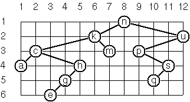
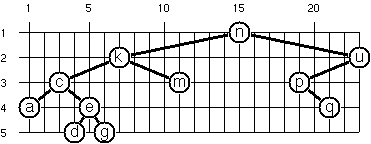
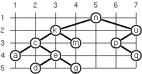

# JavaScriptの問題集(99 Haskell Problemsの翻訳)と解答例・解説

[H-99: Ninety-Nine Haskell Problems](https://wiki.haskell.org/H-99:_Ninety-Nine_Haskell_Problems)というHaskellの問題集があります。元はPrologの問題集だったそうです。  
二番煎じかもしれませんが、今回はこの問題集を少し改変して、JavaScriptで解いていくことにします。  
一応、基本的な構文の学習を一通り終えた初心者に向けた記事として書いています。
  
問題と解答例を分けておくので、問題を解いてから解答例を見るようにすると、より理解が深まるかと思います。  
解答例には解説もつけていきます。

## 環境構築  

### Node.jsとYarnのインストール

[Node.js](https://nodejs.org/ja/)を使いますので、インストールしてください。  
インストール後にコンソールを開いて以下のコマンドを実行し、バージョンが表示されればPATHが通っています。  
執筆時点では、Node.jsは`v11.0.0`、npmは`6.4.1`を使用しています。

```sh
$ node -v
$ npm -v
```

[Yarn](https://yarnpkg.com/lang/ja/)もインストールします。  
Yarnはnpmよりも高速なパッケージマネージャです。  

```sh
$ npm i -g yarn
```

### パッケージ作成

問題を解いていくためのパッケージを作成しましょう。  
以下のコマンドを実行します。

```sh
$ mkdir js-99
$ cd js-99
$ yarn init -y
```

`js-99`ディレクトリに`package.json`が生成されます。

### Webpack

問題の解答をライブラリとしてビルドできるようにしましょう。  
たくさん解けば、最終的には[lodash](https://lodash.com/docs/)みたいな感じになりそうですね！

Webpackは分割したモジュールを一つのファイルにまとめてくれるバンドラです。  
最新のJavaScriptの構文をIE11などの古いブラウザでも使えるように変換(トランスパイル)してくれるBabelもインストールします。  
以下のコマンドを実行しましょう。これらのモジュールは`node_modules`ディレクトリが作成されて、そこに格納されます。

```sh
$ yarn add -D @babel/core @babel/preset-env @babel/register babel-loader webpack@4.x webpack-cli
```

プロジェクト直下に`.babelrc`を作成し、以下のように設定します。

```json
{ 
  "presets": ["@babel/preset-env"]
}
```

`webpack.config.babel.js`を作成し、webpackの設定を書いていきます。  
`output`はバンドルしたJSファイルをライブラリとして使えるようにするための設定です。

```js
import path from 'path'

export default {
  mode: 'production',
  entry: path.join(__dirname, 'src', 'index.js'),
  output: {
    library: 'js99',
    libraryTarget: 'umd',
    globalObject: 'this',
    filename: 'js-99.js',
    path: path.join(__dirname, 'dist')
  }
}
```

`package.json`に`scripts`を追記します。  
これはnpm-scriptsというもので、スクリプトを書いておくと`yarn <script名>`で実行できるようになります。

```json
{
  ...
  "scripts": {
    "build": "webpack"
  },
  ...
}
```

`src`ディレクトリを作成し、`index.js`を以下のような内容で作成してみましょう。

```js
export default { hoge: 'fuga' }
```

次のコマンドを実行して`dist/js-99.js`が出力されれば成功です。  
REPLで`require`して確かめることもできます。

```sh
$ yarn build
```

```sh
$ node
> require('./dist/js-99')
{ default: { hoge: 'fuga' } }
```

### Jest

問題が解けたかどうか確かめるために、ユニットテストができる環境を作りましょう。  
ユニットテストをするためにJestを導入します。

```sh
$ yarn add -D jest babel-jest babel-core@^7.0.0-bridge.0 regenerator-runtime
```

`package.json`の`scripts`に`test`を追記します。

```json
{
  ...
  "scripts": {
    "build": "webpack",
    "test": "jest"
  },
  ...
}
```

動作確認してみましょう。  
`test`ディレクトリを作成し、`index.test.js`にユニットテストを書いていきます。

```js
import hoge from '../src'

test('動作確認', () => {
  expect(hoge.hoge).toBe('fuga')
})
```

以下のコマンドでユニットテストを実行できます。

```sh
$ yarn test
```

次のような出力になれば成功です。

```
[PASS] test/index.test.js
  √ 動作確認 (3ms)

Test Suites: 1 passed, 1 total
Tests:       1 passed, 1 total
Snapshots:   0 total
Time:        1.425s
Ran all test suites.
Done in 2.16s.
```


### 試しに1問解いてみる

H-99の22問目の「指定された範囲内のすべての整数を含む配列を生成する関数`range`を実装する」という問題を試しに解いてみます。  
Haskellには`[4..9]`のように書くと`[4,5,6,7,8,9]`が生成される構文があるため、それと同様の結果を返す`range`は面白そうだと思ったからです。  
初回なので、とりあえずそれなりにテストも書いてみます。

`range`関数は以下のような動作になるはずです。

```js
range(4, 9) // [4,5,6,7,8,9]
```

まずはテストから書いてみます。`range(5, 1)`のような引数を渡すと空の配列が返ってくることを想定します。  
`test/index.test.js`を次のように編集します。

```js
import { range } from '../src'

describe('問22: 指定された範囲内のすべての整数を含む配列を生成する', () => {
  test('4から9までの整数の配列', () => {
    expect(range(4, 9)).toEqual([4, 5, 6, 7, 8, 9])
  })

  test('5から1までの整数の配列（空の配列）', () => {
    expect(range(5, 1)).toEqual([])
  })
})
```

まだ未実装なので`yarn test`をすると失敗します。  
このテストをパスできるように`src/index.js`に実装していきましょう。  

```js
/**
 * 指定された範囲内のすべての整数を含む配列を生成する
 * @param {number} start 開始
 * @param {number} end 終了
 * @returns {number[]} 範囲内のすべての整数を含む配列
 */
export const range = (start, end) => {
  const list = []
  
  for (let i = start; i <= end; i++) {
    list.push(i)
  }

  return list
}
```

これで`yarn test`をパスできるようになりました！書いたテストが全て緑色になるのは気持ちいいですね。  
ついでに、「指定された範囲内のすべての文字を含む配列」も`range`関数で返すようにしてみます。  
Haskellでは`['a'..'z']`で小文字のアルファベットの配列を表現できるからです。

関数に変更を加えても先ほど書いたテストは当然通るようにしなければなりません。  
逆に、変更によってバグが生じた場合は、ユニットテストをパスしなくなってすぐに分かるわけです。

`test/index.test.js`にテストを追加しましょう。

```js
describe('問22: 指定された範囲内のすべての整数または文字を含む配列を生成する', () => {
  /* 省略 */

  test('aからzまでの文字の配列', () => {
    expect(range('a', 'z')).toEqual(['a', 'b', 'c', 'd', 'e', 'f', 'g', 'h', 'i', 'j', 'k', 'l', 'm', 'n', 'o', 'p', 'q', 'r', 's', 't', 'u', 'v', 'w', 'x', 'y', 'z'])
  })

  test('引数の型が異なる（エラー）', () => {
    expect(() => range(1, 'a')).toThrowError()
  })

  test('引数が文字列のとき、長さが2以上ある（エラー）', () => {
    expect(() => range('aa', 'b')).toThrowError()
  })
})
```

`src/index.js`の`range`関数に機能を追加しましょう。

```js
/**
 * 指定された範囲内のすべての整数または文字を含む配列を生成する
 * @param {number|string} start 開始位置の要素
 * @param {number|string} end 終了位置の要素
 * @returns {number[]|string[]} 範囲内のすべての要素を含む配列
 */
export const range = (start, end) => {
  if (typeof(start) !== typeof(end)) {
    throw new Error('引数は同じ型にしてください')
  }

  const isStr = typeof(start) === 'string'

  if (isStr && (start.length !== 1 || end.length !== 1)) {
    throw new Error('引数にする文字列の長さは1にしてください')
  }

  const list = []
  
  if (isStr) {
    start = start.charCodeAt(0)
    end = end.charCodeAt(0)
  }  

  for (let i = start; i <= end; i++) {
    list.push(isStr ? String.fromCharCode(i) : i)
  }

  return list
}
```

少し長くなってしまいました。`yarn test`で全てパスされていれば成功です。


## 問題(99 JavaScript Problems)

問題をJavaScript用に改変しているところがあります。  
これによって難易度にバラつきが出ていますが、ご了承ください。  

一部の問題は統合しているため、本当に99問あるわけではありません。

### 問1～10: 配列

#### 問1: 配列や文字列の最後の要素を取り出す`last`関数を実装せよ。

```js
last([1, 2, 3, 4]) // 4
last('xyz') // z
```

#### 問2: 配列や文字列の最後の一つ前の要素を取り出す`butLast`関数を実装せよ。

```js
butLast([1, 2, 3, 4]) // 3
butLast('abcdefghijklmnopqrstuvwxyz') // y
```

#### 問3: 配列や文字列のn番目の要素を取り出す`elementAt`関数を実装せよ。

ただし、最初の要素は0番目ではなく、1番目と数えます。

```js
elementAt([1, 2, 3], 2) // 2
elementAt('JavaScript', 5) // S
```

#### 問4: 配列や文字列の長さを返す`length`関数を実装せよ。

`Array.length`や`String.length`は使用しないこと。  
また、絵文字の長さは`1`と数えるようにすること。

```js
length([123, 456, 789]) // 3
length('💃Hello, World!💃') // 15
```

#### 問5: 配列や文字列を逆順にして返す`reverse`関数を実装せよ。

`Array.reverse`は使用しないこと。  
また、絵文字の長さは`1`と数えるようにすること。

```js
reverse('A man, a plan, a canal, panama!💃') // 💃!amanap ,lanac a ,nalp a ,nam A
reverse([1, 2, 3, 4]) // [4, 3, 2, 1]
```

#### 問6: 配列や文字列が回文かどうかを返す`isPalindrome`関数を実装せよ。

```js
isPalindrome([1, 2, 3]) // false
isPalindrome('たけやぶやけた') // true
isPalindrome([1, 2, 4, 8, 16, 8, 4, 2, 1]) // true
```

#### 問7: ネストしている配列を平坦（一次元配列）にして返す`flatten`関数を実装せよ。

`Array.flat`は使用しないこと。

```js
flatten([1, [2, [3, 4], 5]]) // [1, 2, 3, 4, 5]
```

#### 問8: 配列や文字列から同じ要素の繰り返しを排除して返す`compress`関数を実装せよ。

```js
compress([1, 1, 2, 1, 2, 2, 3, 3, 3, 3]) // [ 1, 2, 1, 2, 3 ]
compress('aaaabccaadeeee') // abcade
```

#### 問9: 配列や文字列の同じ要素の繰り返しを配列としてまとめて返す`pack`関数を実装せよ。

```js
pack([1, 1, 2, 1, 2, 2, 3, 3, 3, 3]) // [[1, 1], [2], [1], [2, 2], [3, 3, 3, 3]]
pack('aaaabccaadeeee') // ['aaaa', 'b', 'cc', 'aa', 'd', 'eeee']
```

#### 問10: `pack`関数を用いて、配列や文字列をランレングス圧縮する`encode`関数を実装せよ。

```js
encode([1, 1, 2, 1, 2, 2, 3, 3, 3, 3]) // [[2, 1], [1, 2], [1, 1], [2, 2], [4, 3]]
encode('aaaabccaadeeee')
// [[4, 'a'], [1, 'b'], [2, 'c'], [2, 'a'], [1, 'd'], [4, 'e']]
```

### 問11～20: 配列の続き

#### 問11: 問10の結果を変更し、重複が無ければランレングス圧縮せずに要素を格納する`encodeModified`関数を実装せよ。

```js
encodeModified([1, 1, 2, 1, 2, 2, 3, 3, 3, 3]) // [[2, 1], 2, 1, [2, 2], [4, 3]]
encodeModified('aaaabccaadeeee')
// [[4, 'a'], 'b', [2, 'c'], [2, 'a'], 'd', [4, 'e']]
```

#### 問12: ランレングス圧縮した配列をデコードする`decodeModified`関数を実装せよ。

```js
decodeModified([[2, 1], 2, 1, [2, 2], [4, 3]]) // [1, 1, 2, 1, 2, 2, 3, 3, 3, 3]
decodeModified([[4, 'a'], 'b', [2, 'c'], [2, 'a'], 'd', [4, 'e']]) // aaaabccaadeeee
```

#### 問13: `pack`関数のように重複を含む配列を作らずに、直接ランレングス圧縮する`encodeDirect`関数を実装せよ。

```js
encodeDirect([1, 1, 2, 1, 2, 2, 3, 3, 3, 3]) // [[2, 1], 2, 1, [2, 2], [4, 3]]
encodeDirect('aaaabccaadeeee')
// [[4, 'a'], 'b', [2, 'c'], [2, 'a'], 'd', [4, 'e']]
```

#### 問14: 配列や文字列の要素を複製する`dupli`関数を実装せよ。

```js
dupli([1, 2, 3]) // [1, 1, 2, 2, 3, 3]
dupli('abc') // aabbcc
```

#### 問15: 指定された回数だけ配列や文字列の要素を複製する`repli`関数を実装せよ。

```js
repli([1, 2, 3], 3) // [1, 1, 1, 2, 2, 2, 3, 3, 3]
repli('abc', 3) // aaabbbccc
```

#### 問16: nの倍数の位置の要素を配列や文字列から削除する`drop`関数を実装せよ。

```js
drop([1, 2, 3, 4], 2) // [1, 3] 
drop('abcdefghik', 3) // 'abdeghk'
```

#### 問17: 配列や文字列を指定した位置で分ける`split`関数を実装せよ。

```js
split([1, 2, 3, 4], 2) // [[1, 2], [3, 4]]
split('abcdefghik', 3) // ['abc', 'defghik']
```

#### 問18: 選択した範囲を配列や文字列から取り出す`slice`関数を実装せよ。

`Array.slice`は使用しないこと。

```js
slice([1, 2, 3, 4], 2, 4) // [2, 3, 4]
slice('abcdefghik', 3, 7) // cdefg
```

#### 問19: 配列や文字列の要素を左にn個ずらす`rotate`関数を実装せよ。

負の数を渡したら右にずらすようにしてください。

```js
rotate([1, 2, 3], 1) // [2, 3, 1]
rotate('abcdefgh', 3) // defghabc
rotate('abcdefgh', -2) // ghabcdef
```

#### 問20: 配列や文字列のn番目の要素を削除する`removeAt`関数を実装せよ。

削除した要素と処理後の配列を、配列に格納して返してください。

```js
removeAt(3, [1, 2, 3]) // [3, [1, 2]]
removeAt(2, 'abcd') // ['b', 'acd']
```

### 問21～28: 配列、再び

#### 問21: 配列や文字列の指定した位置に要素を挿入する`insertAt`関数を実装せよ。

```js
insertAt(5, [1, 2, 3, 4], 3) // [1, 2, 5, 3, 4]
insertAt('X', 'abcd', 2) // aXbcd
```

#### 問22: 指定された範囲内のすべての整数または文字を含む配列を生成する`range`関数を実装せよ。

```js
range(4, 9) // [4, 5 ,6, 7, 8, 9]
range('a', 'z') // ['a', 'b', 'c', 'd', 'e', 'f', 'g', 'h', 'i', 'j', 'k', 'l', 'm', 'n', 'o', 'p', 'q', 'r', 's', 't', 'u', 'v', 'w', 'x', 'y', 'z']
```

#### 問23: 配列や文字列から指定された数ぶんだけランダムに要素を取り出す`rndSelect`関数を実装せよ。

```js
rndSelect('abcdefgh', 3) // eda など
```

#### 問24: 長さnの1以上m以下の乱数列を生成する`diffSelect`関数を実装せよ。

```js
diffSelect(6, 49) // [23, 1, 17, 33, 21, 37] など
```

#### 問25: 配列や文字列をランダムに並び替える`rndPermu`関数を実装せよ。

```js
rndPermu('abcdef') // badcef など
```

#### 問26: m個の要素からn個を選んだ組み合わせを返す`combinations`関数を実装せよ。

```js
combinations('abcdef', 2) // ['ab', 'ac', 'ad', 'ae', 'af', 'bc', 'bd', 'be', 'bf', 'cd', 'ce', 'cf', 'de', 'df', 'ef']
```

#### 問27: 配列の要素を互いに素な配列にグループ化して返す`group`関数を実装せよ。

```js
group(["aldo","beat","carla","david","evi","flip","gary","hugo","ida"], 2, 3, 4)
// [[["aldo","beat"],["carla","david","evi"],["flip","gary","hugo","ida"]],...] 1260個の解
group(["aldo","beat","carla","david","evi","flip","gary","hugo","ida"], 2, 2, 5)
// [[["aldo","beat"],["carla","david"],["evi","flip","gary","hugo","ida"]],...] 756個の解
```

#### 問28: 配列の配列を、要素の長さでソートする`lsort`関数を実装せよ。また、要素の長さの頻度順にソートする`lfsort`関数を実装せよ。

```js
lsort(["abc","de","fgh","de","ijkl","mn","o"]) // ["o","de","de","mn","abc","fgh","ijkl"]
```

```js
lfsort(["abc", "de", "fgh", "de", "ijkl", "mn", "o"]) // ["ijkl","o","abc","fgh","de","de","mn"]
```

### 問31～41: 算術

#### 問31: 引数が素数かどうかを返す`isPrime`関数を実装せよ。

```js
isPrime(7) // true
```

#### 問32: [ユークリッドの互除法](https://ja.wikipedia.org/wiki/%E3%83%A6%E3%83%BC%E3%82%AF%E3%83%AA%E3%83%83%E3%83%89%E3%81%AE%E4%BA%92%E9%99%A4%E6%B3%95)を使って最大公約数を求める`gcd`関数を実装せよ。

```js
gcd(36, 63) // 9
```

#### 問33: 渡した2つの整数が互いに素かどうかを返す`coprime`関数を実装せよ。

```js
coprime(35, 64) // true
```

#### 問34: [オイラーのφ関数](https://ja.wikipedia.org/wiki/%E3%82%AA%E3%82%A4%E3%83%A9%E3%83%BC%E3%81%AE%CF%86%E9%96%A2%E6%95%B0)`totient`を実装せよ。

```js
totient(10) // 4
```

#### 問35: 引数を素因数分解する`primeFactors`関数を実装せよ。

結果は昇順にソートすること。

```js
primeFactors(315) // [3, 3, 5, 7]
```

#### 問36: 問35の結果を累乗で表現する`primeFactorsMult`関数を実装せよ。

`3 ** 2`なら`[3, 2]`と表現します。

```js
primeFactorsMult(315) // [[3, 2], [5, 1], [7, 1]]
```

#### 問37: オイラーのφ関数を改良した`phi`関数を実装せよ。

問36の結果を`[[p1, m1], [p2, m2], [p3, m3], ...]`としたとき、オイラーのφ関数は次のようにして計算できます。

```
phi(m) = (p1 - 1) * p1 ** (m1 - 1) * 
         (p2 - 1) * p2 ** (m2 - 1) * 
         (p3 - 1) * p3 ** (m3 - 1) * ...
```

```js
phi(10) // 4
```

#### 問38: 問34と問37の実行時間を比較せよ。

`totient(10090)`と`phi(10090)`を実行して、`phi`関数のほうが効率的であることを確かめてください。  
せっかくなので、関数の実行時間を計測する`time`関数を実装して調べましょう。

```js
time(totient, 10090) < time(phi, 10090) // true
```

#### 問39: 与えられた範囲内の素数の配列を返す`primesR`関数を実装せよ。

```js
primesR(10, 20) // [11, 13, 17, 19]
```

#### 問40: ゴールドバッハの予想を確かめる`goldbach`関数を実装せよ。

ゴールドバッハの予想は「全ての2よりも大きな偶数は2つの素数の和として表すことができる」という予想です。

```js
goldbach(28) // [5, 23]
```

#### 問41: 与えられた範囲内の`goldbach`の結果を出力する`goldbachList`関数を実装せよ。

第三引数を与えた場合、2つの素数がその値より大きいもののみを出力するようにしてください。

```js
goldbachList(9, 20) // [[3, 7], [5, 7], [3, 11], [3, 13], [5, 13], [3,17]]
goldbachList(4, 2000, 50) // [[73, 919], [61, 1321], [67, 1789], [61, 1867]]
```

### 問46～50: 論理と符号

#### 問46: 真理値表を作成する`table`関数を実装せよ。

`table((a, b, c) => a && (b || c))`のように、引数が増えても真理値表を出力できるようにしてください。

```js
table((a, b) => a && (a || b))
/*
[
  [[true, true], true],
  [[true, false], true],
  [[false, true], false],
  [[false, false], false]
]
*/
```

#### 問49: 与えられたbit数の[グレイコード](https://ja.wikipedia.org/wiki/%E3%82%B0%E3%83%AC%E3%82%A4%E3%82%B3%E3%83%BC%E3%83%89)の配列を求める`gray`関数を実装せよ。

```js
gray(3) // ["000","001","011","010","110","111","101","100"]
```

#### 問50: [ハフマン符号化](https://ja.wikipedia.org/wiki/%E3%83%8F%E3%83%95%E3%83%9E%E3%83%B3%E7%AC%A6%E5%8F%B7)をする`huffman`関数を実装せよ。

符号化する要素は`[記号, 出現頻度]`で表されます。ついでに、文字列も変換できるようにしましょう。

```js
huffman([['a', 45], ['b', 13], ['c', 12], ['d', 16], ['e', 9], ['f', 5]])
// [['a', '0'], ['b', '101'], ['c', '100'], ['d', '111'], ['e', '1101'], ['f', '1100']]
huffman('DAEBCBACBBBC') // [['A', '111'], ['B', '0'], ['C', '10'], ['D', '1100'], ['E', '1101'] ]
```

### 問54～60: 二分木

#### 問54: 二分木クラス`BinaryTree`を実装せよ。

二分木は、あるノードが持つ子の数が2個以下の木構造です。  

以下のようにコンストラクタに二分木にしたい配列を渡すと、二分木として表現できるようにします。  
引数とする配列は、`[値, 左部分木, 右部分木]`で表現することにします。

```js
const tree = new BinaryTree(['a', ['b', 'd', 'e'], ['c', null, ['f', 'g', null]]])
console.log(tree.toString())
/*
{
  "value": "a",
  "left": {
    "value": "b",
    "left": {
      "value": "d",
      "left": null,
      "right": null
    },
    "right": {
      "value": "e",
      "left": null,
      "right": null
    }
  },
  "right": {
    "value": "c",
    "left": null,
    "right": {
      "value": "f",
      "left": {
        "value": "g",
        "left": null,
        "right": null
      },
      "right": null
    }
  }
}
*/
```

#### 問55: 左部分木と右部分木のノードの数の差が1以下である二分木を全て生成する`cbalTree`関数を実装せよ。

下記の省略されている`[BinaryTree]`の部分は、`BinaryTree { value: 'x', left: null, right: null }`のようになっています。

```js
BinaryTree.cbalTree(4)
/*
[ BinaryTree {
    value: 'x',
    left: BinaryTree { value: 'x', left: null, right: null },
    right: BinaryTree { value: 'x', left: null, right: [BinaryTree] } },
  BinaryTree {
    value: 'x',
    left: BinaryTree { value: 'x', left: null, right: [BinaryTree] },
    right: BinaryTree { value: 'x', left: null, right: null } },
  BinaryTree {
    value: 'x',
    left: BinaryTree { value: 'x', left: null, right: null },
    right: BinaryTree { value: 'x', left: [BinaryTree], right: null } },
  BinaryTree {
    value: 'x',
    left: BinaryTree { value: 'x', left: [BinaryTree], right: null },
    right: BinaryTree { value: 'x', left: null, right: null } } ]
*/
```

#### 問56: 二分木が対称かどうかを返す`isSymmetric`関数を実装せよ。

ノードの値は比較しません。あくまで、構造が対称かどうかを調べます。

```js
const x = new BinaryTree(['x', 'x', null])
const y = new BinaryTree(['x', 'x', 'x'])

x.isSymmetric // false
y.isSymmetric // true
```

#### 問57: 二分探索木を生成する`searchTree`関数を実装せよ。

引数は一次元配列とします。

```js
BinaryTree.searchTree([3, 2, 5, 7, 1])
/*
BinaryTree {
  value: 3,
  left:
   BinaryTree {
     value: 2,
     left: BinaryTree { value: 1, left: null, right: null },
     right: null },
  right:
   BinaryTree {
     value: 5,
     left: null,
     right: BinaryTree { value: 7, left: null, right: null } } }
*/
BinaryTree.searchTree([5, 3, 18, 1, 4, 12, 21]).isSymmetric // true
BinaryTree.searchTree([3, 2, 5, 7, 4]).isSymmetric // false
```

#### 問58: 問55のように平衡で、かつ対称な二分木があれば返す`symCbalTrees`関数を実装せよ。

引数はノード数で、そのような二分木が見つからなければ`[]`を返します。  

```js
BinaryTree.symCbalTrees(5)
/*
[ BinaryTree {
    value: 'x',
    left: BinaryTree { value: 'x', left: null, right: [BinaryTree] },
    right: BinaryTree { value: 'x', left: [BinaryTree], right: null } },
  BinaryTree {
    value: 'x',
    left: BinaryTree { value: 'x', left: [BinaryTree], right: null },
    right: BinaryTree { value: 'x', left: null, right: [BinaryTree] } } ]
*/
```

#### 問59: 左部分木と右部分木の高さの差が1以下である二分木を全て生成する`hbalTree`関数を実装せよ。

引数は生成する木構造の高さ（根ノードの高さ）とします。

```js
BinaryTree.hbalTree(3)[0]
/*
BinaryTree {
  value: 'x',
  left: BinaryTree { value: 'x', left: null, right: null },
  right:
   BinaryTree {
     value: 'x',
     left: null,
     right: BinaryTree { value: 'x', left: null, right: null } } }
*/
BinaryTree.hbalTree(4).length // 315
```

#### 問60: 与えられた数のノードを持つ問59のような二分木を全て生成する`hbalTreeNodes`関数を実装せよ。

**ヒント**  
まず、左部分木と右部分木の高さの差が1以下である二分木の高さ`h`を実現するために必要な最小ノード数を計算する`minNodes`関数を定義します。  
少し数式を考えてみれば、最小ノード数はフィボナッチ数列に近いものになるはずです。  
次に、`minNodes`関数を用いて、問題の木構造の最大の高さを求める`maxHeight`関数を定義します。  
その後、最小から最大までの高さについて、与えられたノード数を持つ二分木があるかどうか調べます。

```js
BinaryTree.hbalTreeNodes(15).length // 1553
[0, 1, 2, 3].map(BinaryTree.hbalTreeNodes)
/*
[ [ null ],
  [ BinaryTree { value: 'x', left: null, right: null } ],
  [ BinaryTree { value: 'x', left: null, right: [BinaryTree] },
    BinaryTree { value: 'x', left: [BinaryTree], right: null } ],
  [ BinaryTree { value: 'x', left: [BinaryTree], right: [BinaryTree] } ] ]
*/
```


### 問61～69: 二分木、続き

#### 問61: 二分木の葉の数を数える`countLeaves`関数を実装せよ。

```js
(new BinaryTree([1, [2, null, 4], 2])).countLeaves // 2
```

#### 問61A: 二分木の葉のリストを返す`leaves`関数を実装せよ。

```js
(new BinaryTree([1, [2, null, 4], 2])).leaves // [ 4, 2 ]
```

#### 問62: 二分木の内部ノード（葉以外の節）を返す`internals`関数を実装せよ。

```js
(new BinaryTree([1, [2, null, 4], 2])).internals // [ 1, 2 ]
```

#### 問62B: 指定された深さのノードのリストを返す`atLevel`関数を実装せよ。

```js
(new BinaryTree([1, [2, null, 4], 2])).atLevel(2) // [ 2, 2 ]
```

#### 問63: 完全二分木を生成する`completeBinaryTree`関数と、完全二分木かどうかを返す`isCompleteBinaryTree`関数を実装せよ。

完全二分木は、根からすべての葉までの深さの差が1以下で、葉が左詰めになっている二分木です。  
引数はノード数とします。

```js
BinaryTree.completeBinaryTree(4)
/*
BinaryTree {
  value: 'x',
  left:
   BinaryTree {
     value: 'x',
     left: BinaryTree { value: 'x', left: null, right: null },
     right: null },
  right: BinaryTree { value: 'x', left: null, right: null } }
*/
(new BinaryTree(['x', ['x', 'x', null], ['x', null, null]])).isCompleteBinaryTree // true
(new BinaryTree(['x', ['x', 'x', null], ['x', null, 'x']])).isCompleteBinaryTree // false
```

#### 問64: 次の図のように、各ノードに座標を付与する`layout`関数を実装せよ。



次のようにノードに座標を割り振ります。

- x座標は、中順に走査したときの順番
- y座標は、そのノードがある深さ

結果が見づらくなるので、各ノードの座標を分かりやすく取得できる`positions`関数もついでに定義しましょう。

```js
const result = (new BinaryTree(['n', ['k', ['c', 'a', ['h', ['g', 'e', null], null]], 'm'], ['u', ['p', null, ['s', 'q', null]], null]])).layout()
result.positions
/*
[ { value: 'n', x: 8, y: 1 },
  { value: 'k', x: 6, y: 2 },
  { value: 'c', x: 2, y: 3 },
  { value: 'a', x: 1, y: 4 },
  { value: 'h', x: 5, y: 4 },
  { value: 'g', x: 4, y: 5 },
  { value: 'e', x: 3, y: 6 },
  { value: 'm', x: 7, y: 3 },
  { value: 'u', x: 12, y: 2 },
  { value: 'p', x: 9, y: 3 },
  { value: 's', x: 11, y: 4 },
  { value: 'q', x: 10, y: 5 } ]
*/
```

#### 問65: 次の図のように、各ノードに座標を付与する`wideLayout`関数を実装せよ。



配置ルールは図を見て考えてください。  

**ヒント**  
ある深さの隣接するノードの水平距離が一定なことに着目しましょう。

```js
const result = (new BinaryTree(['n', ['k', ['c', 'a', ['e', 'd', 'g']], 'm'], ['u', ['p', null, 'q'], null]])).wideLayout()
result.positions
/*
[ { value: 'n', x: 15, y: 1 },
  { value: 'k', x: 7, y: 2 },
  { value: 'c', x: 3, y: 3 },
  { value: 'a', x: 1, y: 4 },
  { value: 'e', x: 5, y: 4 },
  { value: 'd', x: 4, y: 5 },
  { value: 'g', x: 6, y: 5 },
  { value: 'm', x: 11, y: 3 },
  { value: 'u', x: 23, y: 2 },
  { value: 'p', x: 19, y: 3 },
  { value: 'q', x: 21, y: 4 } ]
*/
```

#### 問66: 次の図のように、各ノードに座標を付与する`compactLayout`関数を実装せよ。



このレイアウトを用いると、全てのノードにおいて一定の対称性を保ちつつ、コンパクトに二分木を表現できます。  
配置ルールは図を見て考えてください。  

**ヒント**  
ノードと後継ノード間の水平距離に着目しましょう。

```js
const result = (new BinaryTree(['n', ['k', ['c', 'a', ['e', 'd', 'g']], 'm'], ['u', ['p', null, 'q'], null]])).compactLayout()
result.positions
/*
[ { value: 'n', x: 5, y: 1 },
  { value: 'k', x: 3, y: 2 },
  { value: 'c', x: 2, y: 3 },
  { value: 'a', x: 1, y: 4 },
  { value: 'e', x: 3, y: 4 },
  { value: 'd', x: 2, y: 5 },
  { value: 'g', x: 4, y: 5 },
  { value: 'm', x: 4, y: 3 },
  { value: 'u', x: 7, y: 2 },
  { value: 'p', x: 6, y: 3 },
  { value: 'q', x: 7, y: 4 } ]
*/
```

#### 問67: 文字列をパースして二分木にする`fromString`関数を実装せよ。

二分木の文字列表現は`x(y,a(,b))`のようにして与えられます。

```js
BinaryTree.stringToTree('x(y,a(,b))')
/*
BinaryTree {
  value: 'x',
  left: BinaryTree { value: 'y', left: null, right: null },
  right:
    BinaryTree {
      value: 'a',
      left: null,
      right: BinaryTree { value: 'b', left: null, right: null } } }
*/
```

#### 問68: 二分木を前順に走査する`preorder`関数と、中順に走査する`inorder`関数を実装せよ。また、前順と中順に走査した結果を用いて二分木を生成する`preInTree`関数を実装せよ。

前順と中順で走査した結果があれば、二分木の木構造は一通りに定められます。

```js
const tree = BinaryTree.stringToTree('a(b(d,e),c(,f(g,)))')
tree.preorder // [ 'a', 'b', 'd', 'e', 'c', 'f', 'g' ]
tree.inorder  // [ 'd', 'b', 'e', 'a', 'c', 'g', 'f' ]
BinaryTree.preInTree(tree.preorder, tree.inorder)
/*
BinaryTree {
  value: 'a',
  left:
    BinaryTree {
      value: 'b',
      left: BinaryTree { value: 'd', left: null, right: null },
      right: BinaryTree { value: 'e', left: null, right: null } },
  right:
    BinaryTree {
      value: 'c',
      left: null,
      right:
        BinaryTree {
          value: 'f',
          left: BinaryTree { value: 'g', left: null, right: null },
          right: null } } }
*/
```

#### 問69: 次のような文字列を二分木に変換する`dotstrToTree`関数と、逆変換する`toDotstr`関数を実装せよ。

二分木は`'abd..e..c.fg...'`のような文字列で表現されて渡されます。`.`は`null`とし、各ノードには1文字しか入りません。  
これをパースして、次のような結果になるようにしてください。

```js
const tree = BinaryTree.dotstrToTree('abd..e..c.fg...') // 問68の二分木と同じ
tree.toDotstr // abd..e..c.fg...
```

### 問70～73: 多分木

#### 問70: 多分木クラス`MultiwayTree`を実装せよ。ノードの数を返す`count`関数を実装せよ。また、次のような文字列表現を変換する`stringToTree`関数と、逆変換する`treeToString`関数を実装せよ。

#### 問71: 根から全ノードまでの経路長の総和を求める`ipl`関数を実装せよ。

#### 問72: ボトムアップ式にノードを列挙する`bottomUp`関数を実装せよ。

#### 問73: Lispのような木構造の文字列表現を返す`lisp`関数を実装せよ。


### 問80～89: グラフ

### 問90～94: その他の問題

#### 問90: [N-クイーン問題](https://ja.wikipedia.org/wiki/%E3%82%A8%E3%82%A4%E3%83%88%E3%83%BB%E3%82%AF%E3%82%A4%E3%83%BC%E3%83%B3)を解く`queens`関数を実装せよ。

#### 問91: [ナイト・ツアー問題](https://ja.wikipedia.org/wiki/%E3%83%8A%E3%82%A4%E3%83%88%E3%83%BB%E3%83%84%E3%82%A2%E3%83%BC)を解く`knightsTour`関数を実装せよ。

n * nのチェス盤の上を指定したマスに置かれたナイトが全てのマスを巡回し、その辿った経路を配列として返します。

### 問95～99: その他の問題、続き


## 解答例・解説

解答例の解き方は短く書こうとしていたり、丁寧に書こうとしていたりで、その時の気分によってまちまちです。  
パフォーマンスも考慮していません。  
実際に解くときは無理して短く書くよりも、読み手が分かりやすいコードを書くようにしましょう。

### 問1～10: 配列

#### 問1: 配列や文字列の最後の要素を取り出す`last`関数を実装せよ。

```js
const last = list => list[list.length - 1]

last([1, 2, 3, 4]) // 4
last('xyz') // z
```

配列の`index`は`0`から開始するため、`配列の長さ - 1`で最後の要素が取れます。  
JavaScriptの場合、定義していない要素を参照すると`undefined`が返ってくるので、空文字や空配列のことはあまり考えなくてもいいでしょう。

#### 問2: 配列や文字列の最後の一つ前の要素を取り出す`butLast`関数を実装せよ。

```js
const butLast = list => list[list.length - 2]

butLast([1, 2, 3, 4]) // 3
butLast('abcdefghijklmnopqrstuvwxyz') // y
```

問1と大体同じ。

#### 問3: 配列や文字列のn番目の要素を取り出す`elementAt`関数を実装せよ。

ただし、最初の要素は0番目ではなく、1番目と数えます。

```js
const elementAt = (list, index) => list[index - 1]

elementAt([1, 2, 3], 2) // 2
elementAt('JavaScript', 5) // S
```

普通に配列の要素を参照しているだけなので、`elementAt`関数を作る意味は無いですね。  
JavaScriptなので`index out of bounds`のようなエラーも投げられません。

#### 問4: 配列や文字列の長さを返す`length`関数を実装せよ。

`Array.length`や`String.length`は使用しないこと。  
また、絵文字の長さは`1`と数えるようにすること。

```js
const length = list => [...list].fill(1).reduce((a, c) => a + c, 0)

length([123, 456, 789]) // 3
length('💃Hello, World!💃') // 15
```

文字列の方には絵文字が混ざっています。  
**絵文字はサロゲートペアで表現されているため、`length`で2文字扱いになります。**  
スプレッド演算子を用いると、`[...'💃Hello!💃']`を`[ '💃', 'H', 'e', 'l', 'l', 'o', '!', '💃' ]`にできるため、`length`で正しい長さを返すことができます。

さて、`length`の使用が禁止されているため、その代わりとなる方法を考えなければなりません。  
`fill`は配列の要素を全て引数の値に変更して返します。`reduce`は配列の要素を左から右に読んでいき、何か処理をすることができます。  
つまり、`fill(1)`してから`reduce`で足せば、配列の長さが取得できます。

#### 問5: 配列や文字列を逆順にして返す`reverse`関数を実装せよ。

`Array.reverse`は使用しないこと。  
また、絵文字の長さは`1`と数えるようにすること。

```js
const reverse = list => [...list].reduceRight(
  (a, c) => a.concat(c), Array.isArray(list) ? [] : '')

reverse('A man, a plan, a canal, panama!💃') // 💃!amanap ,lanac a ,nalp a ,nam A
reverse([1, 2, 3, 4]) // [4, 3, 2, 1]
```

絵文字の処理は問4と同様です。  
配列の要素を右から左に結合していけば逆になるため、`reduceRight`を用います。  
引数が配列のときと文字列のときで結果を変えたいので、初期値を`Array.isArray(list) ? [] : ''`で分岐させ、`Array.concat`または`String.concat`で結合させています。


#### 問6: 配列や文字列が回文かどうかを返す`isPalindrome`関数を実装せよ。

```js
const isPalindrome = list => list.toString() === reverse(list).toString()

isPalindrome([1, 2, 3]) // false
isPalindrome('たけやぶやけた') // true
isPalindrome([1, 2, 4, 8, 16, 8, 4, 2, 1]) // true
```

問5の`reverse`を使うと楽に書けます。  
配列の厳密な比較は面倒なので、`toString`して同じ文字列になればよしとします。

#### 問7: ネストしている配列を平坦（一次元配列）にして返す`flatten`関数を実装せよ。

`Array.flat`は使用しないこと。

```js
const flatten = list => list.reduce(
  (a, c) => a.concat(Array.isArray(c) ? flatten(c) : c), [])

flatten([1, [2, [3, 4], 5]]) // [1, 2, 3, 4, 5]
```

`reduce`を使います。要素が配列なら再帰的に`flatten`を呼んで一次元配列を返し、`concat`で結合します。

#### 問8: 配列や文字列から同じ要素の繰り返しを排除して返す`compress`関数を実装せよ。

```js
const compress = list => [...list].reduce(
  (a, c) => a.concat(a[a.length - 1] !== c ? c : []), 
  Array.isArray(list) ? [] : '')

compress([1, 1, 2, 1, 2, 2, 3, 3, 3, 3]) // [ 1, 2, 1, 2, 3 ]
compress('aaaabccaadeeee') // abcade
```

`reduce`を使います。  
アキュムレータ`a`の最後の要素が現在値`c`と等しくなければ`c`を結合し、等しければ何も結合しないようにします。

#### 問9: 配列や文字列の同じ要素の繰り返しを配列としてまとめて返す`pack`関数を実装せよ。

```js
const pack = list => {
  const isArray = Array.isArray(list)
  list = [...list]

  const result = []
  let element = null
  let current = null

  list.forEach((e, i) => {
    if (current === e) {
      element = element.concat(e)

    } else {
      if (element) { result.push(element) }
      current = e
      element = isArray ? [e] : e
    }

    if (i === (list.length - 1)) {
      result.push(element)
    }
  })

  return result
}

pack([1, 1, 2, 1, 2, 2, 3, 3, 3, 3]) // [[1, 1], [2], [1], [2, 2], [3, 3, 3, 3]]
pack('aaaabccaadeeee') // ['aaaa', 'b', 'cc', 'aa', 'd', 'eeee']
```

少々長くなっています。もっといい解法があるかもしれません。  
結果の配列`result`に格納したい要素`element`と、現在対象としている値`current`を宣言します。  
`forEach`でループさせ、`current`と要素が等しければ`element`と結合させ、等しくなければ`current`と`element`に新しい値をセットします。  
ループが末尾のときは、`element`を`result`に格納するのを忘れずに。

#### 問10: `pack`関数を用いて、配列や文字列をランレングス圧縮する`encode`関数を実装せよ。

```js
const encode = list => pack(list).map(e => [e.length, e[0]])

encode([1, 1, 2, 1, 2, 2, 3, 3, 3, 3]) // [[2, 1], [1, 2], [1, 1], [2, 2], [4, 3]]
encode('aaaabccaadeeee')
// [[4, 'a'], [1, 'b'], [2, 'c'], [2, 'a'], [1, 'd'], [4, 'e']]
```

`map`で各要素の長さと最初の要素を格納した配列に変換します。

### 問11～20: 配列の続き

#### 問11: 問10の結果を変更し、重複が無ければランレングス圧縮せずに要素を格納する`encodeModified`関数を実装せよ。

```js
const encodeModified = list => encode(list).map(e => e[0] === 1 ? e[1] : e)

encodeModified([1, 1, 2, 1, 2, 2, 3, 3, 3, 3]) // [[2, 1], 2, 1, [2, 2], [4, 3]]
encodeModified('aaaabccaadeeee')
// [[4, 'a'], 'b', [2, 'c'], [2, 'a'], 'd', [4, 'e']]
```

#### 問12: ランレングス圧縮した配列をデコードする`decodeModified`関数を実装せよ。

```js
const decodeModified = list => {
  const result = []
  
  list.forEach(e => {
    if (Array.isArray(e)) for (let i = 0; i < e[0]; i++) {
      result.push(e[1])
    } else {
      result.push(e)
    }
  })
  
  return typeof(result[0]) === 'string' ? result.join('') : result
}

decodeModified([[2, 1], 2, 1, [2, 2], [4, 3]]) // [1, 1, 2, 1, 2, 2, 3, 3, 3, 3]
decodeModified([[4, 'a'], 'b', [2, 'c'], [2, 'a'], 'd', [4, 'e']]) // aaaabccaadeeee
```

配列なら1番目の要素を長さの分だけ格納し、そうでないなら要素をそのまま配列に格納します。  
文字の配列だった場合は、最後に`join`で文字列にします。文字と数値の混在には対応していません。  

文字列かどうかの判定は`typeof`を使っています。  
`typeof`は、引数の型を文字列で返してくれます。

#### 問13: `pack`関数のように重複を含む配列を作らずに、直接ランレングス圧縮する`encodeDirect`関数を実装せよ。

```js
const encodeDirect = list => {
  list = [...list]

  const result = []
  let count = 1
  let current = null

  const push = () => result.push(count > 1 ? [count, current] : current)

  list.forEach((e, i) => {
    if (current === e) {
      count++

    } else {
      if (current) { push() }
      count = 1
      current = e
    }

    if (i === (list.length - 1)) { push() }
  })

  return result
}

encodeDirect([1, 1, 2, 1, 2, 2, 3, 3, 3, 3]) // [[2, 1], 2, 1, [2, 2], [4, 3]]
encodeDirect('aaaabccaadeeee')
// [[4, 'a'], 'b', [2, 'c'], [2, 'a'], 'd', [4, 'e']]
```

`pack`関数を改造して直接エンコードできるようにします。  
要素の数をカウントして、1個しかないならその要素自体を、2個以上あるならランレングス圧縮した結果を格納します。

#### 問14: 配列や文字列の要素を複製する`dupli`関数を実装せよ。

```js
dupli([1, 2, 3]) // [1, 1, 2, 2, 3, 3]
dupli('abc') // aabbcc
```

`repli`関数のデフォルトを`dupli`関数の動作にするのでスキップします。

#### 問15: 指定された回数だけ配列や文字列の要素を複製する`repli`関数を実装せよ。

```js
const repli = (list, n = 2) => {
  const isStr = typeof(list) === 'string'
  list = [...list]
  const result = []

  list.forEach(e => { for (let i = 0; i < n; i++) result.push(e) })

  return isStr ? result.join('') : result
}

repli([1, 2, 3], 3) // [1, 1, 1, 2, 2, 2, 3, 3, 3]
repli('abc', 3) // aaabbbccc
```

`for`文で指定された回数分だけ配列に要素を繰り返し`push`します。  
デフォルト引数を与えているため、第二引数を渡さなければ`dupli`の動作になります。

#### 問16: 配列や文字列からnの倍数の位置の要素を削除する`drop`関数を実装せよ。

```js
const drop = (list, n) => ((ret = [...list].filter((_, i) => (i + 1) % n !== 0)) => 
  typeof(list) === 'string' ? ret.join('') : ret)()

drop([1, 2, 3, 4], 2) // [1, 3] 
drop('abcdefghik', 3) // 'abdeghk'
```

1行で書く必要は全くありませんが、デフォルト引数とアロー関数を利用すれば1行で色々な処理をさせることができます。  
`filter`で`index + 1`が`n`で割り切れるなら除外するようにしています。

#### 問17: 配列や文字列を指定した位置で分ける`split`関数を実装せよ。

```js
const split = (list, n) => ((x = [...list], ret = [x, x.splice(n)]) => 
  typeof(list) === 'string' ? ret.map(e => e.join('')) : ret)()

split([1, 2, 3, 4], 2) // [[1, 2], [3, 4]]
split('abcdefghik', 3) // ['abc', 'defghik']
```

`splice`を使えば簡単に二つに分けることができます。  
元の配列にも変更を加えてしまうので、使う際はスプレッド演算子などで配列をコピーしておいたほうが安全です。  
その性質を利用して、`[x, x.splice(n)]`で二つに分けています。

#### 問18: 配列や文字列から選択した範囲を取り出す`slice`関数を実装せよ。

`Array.slice`、`Array.splice`は使用しないこと。

```js
const slice = (list, start, end = list.length) => {
  let result = Array.isArray(list) ? [] : ''

  for (let i = start - 1; i < end; i++) {
    result = result.concat(list[i])
  }
  return result
}

slice([1, 2, 3, 4], 2, 4) // [2, 3, 4]
slice('abcdefghik', 3, 7) // cdefg
```

#### 問19: 配列や文字列の要素を左にn個ずらす`rotate`関数を実装せよ。

負の数を渡したら右にずらすようにしてください。

```js
const rotate = (list, n) => ((x = [...list], _ = x.unshift(...x.splice(n))) =>
  typeof(list) === 'string' ? x.join('') : x)()

rotate([1, 2, 3], 1) // [2, 3, 1]
rotate('abcdefgh', 3) // defghabc
rotate('abcdefgh', -2) // ghabcdef
```

先頭に要素を追加する`unshift`と、配列から要素を取り除く`splice`を組み合わせれば簡単に実装できます。

#### 問20: 配列や文字列のn番目の要素を削除する`removeAt`関数を実装せよ。

削除した要素と処理後の配列を、配列に格納して返してください。

```js
const removeAt = (n, list) => ((x = [...list], removed = x.splice(n - 1, 1)[0]) => 
  [removed, typeof(list) === 'string' ? x.join('') : x])()

removeAt(3, [1, 2, 3]) // [3, [1, 2]]
removeAt(2, 'abcd') // ['b', 'acd']
```

`splice`の第二引数に数値を渡すと、その数だけ開始位置から取り除かれます。

### 問21～28: 配列、再び

#### 問21: 配列や文字列の指定した位置に要素を挿入する`insertAt`関数を実装せよ。

```js
const insertAt = (element, list, n) => ((x = [...list], ret = x.concat(element, x.splice(n - 1))) => 
  typeof(list) === 'string' ? ret.join('') : ret)()

insertAt(5, [1, 2, 3, 4], 3) // [1, 2, 5, 3, 4]
insertAt('X', 'abcd', 2) // aXbcd
```

`concat`と`splice`を組み合わせて、指定位置に`element`を挿入します。

#### 問22: 指定された範囲内のすべての整数または文字を含む配列を生成する`range`関数を実装せよ。

```js
const range = (start, end) => {
  if (typeof(start) !== typeof(end)) {
    throw new Error('引数は同じ型にしてください')
  }

  const isStr = typeof(start) === 'string'

  if (isStr && (start.length !== 1 || end.length !== 1)) {
    throw new Error('引数にする文字列の長さは1にしてください')
  }

  const list = []
  
  if (isStr) {
    start = start.charCodeAt(0)
    end = end.charCodeAt(0)
  }  

  for (let i = start; i <= end; i++) {
    list.push(isStr ? String.fromCharCode(i) : i)
  }

  return list
}

range(4, 9) // [4, 5 ,6, 7, 8, 9]
range('a', 'z') // ['a', 'b', 'c', 'd', 'e', 'f', 'g', 'h', 'i', 'j', 'k', 'l', 'm', 'n', 'o', 'p', 'q', 'r', 's', 't', 'u', 'v', 'w', 'x', 'y', 'z']
```

[試しに1問解いてみる](#試しに1問解いてみる)で解答済みです。  
文字列の場合は`String.charCodeAt`で数値化し、`start`と`end`の範囲内の文字を配列に格納します。

#### 問23: 配列や文字列から指定された数ぶんだけランダムに要素を取り出す`rndSelect`関数を実装せよ。

```js
const rndSelect = (list, n) => {
  const isStr = typeof(list) === 'string'
  list = [...list]
  const result = []

  for (let i = 0; i < n && list.length > 0; i++) {
    const target = Math.floor(Math.random() * list.length)
    const removed = list.splice(target, 1)[0]
    result.push(removed)
  }
  return isStr ? result.join('') : result
}

rndSelect('abcdefgh', 3) // eda など
```

`Math.floor(Math.random() * n)`で、0以上n未満の乱数を生成することができます。  
あとは`splice`で除去しながら結果の配列に格納していきます。  
この場合、条件文に`list.length > 0`を加えないと、`rndSelect([1, 2, 3], 10)`などの場合に`undefined`を含む長さ10の配列が返ってきてしまいます。

#### 問24: 長さnの1以上m以下の乱数列を生成する`diffSelect`関数を実装せよ。

```js
const diffSelect = (length, max) => {
  if (max < 1) { throw new Error('最大値は1以上の値を指定してください') }
  const result = []

  for (let i = 0; i < length; i++) {
    result.push(Math.floor(Math.random() * max) + 1)
  }
  return result
}

diffSelect(6, 49) // [23, 1, 17, 33, 21, 37] など
```

問題23で扱った`Math.floor(Math.random() * max)`に1を足すと1以上`max`以下の乱数になります。

#### 問25: 配列や文字列をランダムに並び替える`rndPermu`関数を実装せよ。

```js
const rndPermu = list => rndSelect(list, list.length)
rndPermu('abcdef') // badcef など
```

定義済みの`rndSelect`を使えばすぐに定義できます。

#### 問26: m個の要素からn個を選んだ組み合わせを返す`combinations`関数を実装せよ。

```js
const combinations = (list, n) => {
  if (n < 0 || list.length < n) throw new Error('不正な引数です')
  if (n === 0) return [null]

  const isStr = typeof(list) === 'string'
  if (n === 1) return isStr ? [...list] : [...list].map(e => [e])
  
  const result = []
  n--

  for (let i = 0; i < list.length - n; i++) {
    const combi = combinations(list.slice(i + 1), n)

    for (let j = 0; j < combi.length; j++){
      const concatenated = [list[i]].concat(combi[j])
      result.push(isStr ? concatenated.join('') : concatenated)
    }
  }

  return result
}

combinations('abcdef', 3) 
// ['abc', 'abd', 'abe', 'abf', 'acd', 'ace', 'acf', 'ade', 'adf', 'aef', 'bcd', 'bce', 'bcf', 'bde', 'bdf', 'bef', 'cde', 'cdf', 'cef', 'def']
```

高校一年生くらいで習う組み合わせです。  

`0`の場合は、何も選ばないので`null`を入れた配列を返します。  
`1`の場合は各要素を選ぶので、スプレッド演算子でバラします。  

`2`以上の場合は再帰的に`combinations`を適用しましょう。  
例えば`abcd`で`2`のとき、`a`に`b, c, d`、`b`に`c, d`、`c`に`d`を結合すれば組み合わせ`['ab', 'ac', 'ad', 'bc', 'bd', 'cd']`が出ます。  
`3`のとき、`a`に`b, c, d`から`2`個選んだ組み合わせ`bc, bd, cd`と、`b`に`c, d`から`2`個選んだ組み合わせ`cd`を結合すれば`['abc', 'abd', 'acd', 'bcd']`が出ます。  
つまり、`i`番目の要素に後続(`i + 1`以降)の要素を`n - 1`個選んだ組み合わせを結合すれば、組み合わせを導出できます。

#### 問27: 配列の要素を互いに素な配列にグループ化して返す`group`関数を実装せよ。

```js
const exCombinations = (list, n) => {
  const isStr = typeof(list) === 'string'

  if (n === 0) return [isStr ? '' : [], list]
  if (list.length === 0) return []

  if (n === 1) return [...list].map((_, i) => {
    let r = [...list]
    r = [r.splice(i, 1), r]
    return isStr ? r.map(e => e.join('')) : r
  })

  const result = []
  const [x, ...xs] = list
  
  exCombinations(isStr ? xs.join('') : xs, n - 1).forEach(
    ([ys, zs]) => result.push([isStr ? x + ys : [x].concat(ys), zs]))

  exCombinations(isStr ? xs.join('') : xs, n).forEach(
    ([ys, zs]) => result.push([ys, isStr ? x + zs : [x].concat(zs)]))

  return result
}

const group = (list, ...numbers) => {
  if (list.length === 0) return [[]]

  const [n, ...ns] = numbers
  const result = []

  exCombinations(list, n).forEach(([g, rs]) =>
    group(rs, ...ns).forEach(e => result.push([g].concat(e))))

  return result
}

group(["aldo","beat","carla","david","evi","flip","gary","hugo","ida"], 2, 3, 4)
// [[["aldo","beat"],["carla","david","evi"],["flip","gary","hugo","ida"]],...] 1260個の解
group(["aldo","beat","carla","david","evi","flip","gary","hugo","ida"], 2, 2, 5)
// [[["aldo","beat"],["carla","david"],["evi","flip","gary","hugo","ida"]],...] 756個の解
```

まず、選択されなかった要素も一緒に返す`exCombinations`関数を定義します。  
結果は`[選んだものの配列, 選ばなかったものの配列]`の構造にします。

再帰させるので、再帰を抜けるための条件文は最初に書いておきましょう。  
`n === 1`のときは、配列の全ての要素が選択されるようにします。

`exCombinations`は、最初の要素を選ぶ場合と、選ばない場合を考慮して再帰させます。  
`exCombinations`がどう呼ばれるのか例を見てみましょう。

```js
exCombinations([1,2,3,4], 2)
exCombinations([2,3,4], 1) // [ [ [ 2 ], [ 3, 4 ] ], [ [ 3 ], [ 2, 4 ] ], [ [ 4 ], [ 2, 3 ] ] ]
exCombinations([2,3,4], 2) // [ [ [ 2, 3 ], [ 4 ] ], [ [ 2, 4 ], [ 3 ] ], [ [ 3, 4 ], [ 2 ] ] ]
```

最初の要素を`x`、後続する要素を`xs`とします。  
最初の要素`x`を選んだ場合、`xs`から残りの`n - 1`個の要素を選択すれば`n`個選んだことになります。  
結果は`[選んだものの配列, 選ばなかったものの配列]`になっているため、結果の0番目に`x`を結合させます。

`x`を選ばなかった場合、`xs`から残りの`n`個の要素を選択すれば`n`個選んだことになります。  
`x`は結果の配列の1番目に結合させます。

これを再帰的に呼ぶと、配列から`n`個選んだ組み合わせと選ばなかった組み合わせを取得できます。

肝心の`group`ですが、選んだ組み合わせに、選ばなかった組み合わせのグループを結合していけば生成できます。  

#### 問28: 配列の配列を、要素の長さでソートする`lsort`関数を実装せよ。また、要素の長さの頻度順にソートする`lfsort`関数を実装せよ。

```js
const lsort = list => list.sort((a, b) => a.length - b.length)
lsort(["abc","de","fgh","de","ijkl","mn","o"]) // ["o","de","de","mn","abc","fgh","ijkl"]
```

```js
const lfsort = list => {
  const map = new Map(encode(list.map(e => e.length).sort()).map(([value, key]) => [key, value]))
  return list.sort((a, b) => map.get(a.length) - map.get(b.length))
}
lfsort(["abc", "de", "fgh", "de", "ijkl", "mn", "o"]) // ["ijkl","o","abc","fgh","de","de","mn"]
```

`sort`を使えば簡単に長さの昇順にソートできます。  
`sort`には比較関数を渡すのですが、この関数の戻り値が0未満なら`a`を`b`より前に、0なら変更なし、0より大きいなら`b`を`a`より前に移動します。  
つまり、前の要素の長さから次の要素の長さを引けば、どちらが長いか分かります。

頻度順にソートするには、前に作ったランレングス圧縮する`encode`関数を使うと楽にできます。長さの配列を昇順ソートしたものをランレングス圧縮しましょう。  
長さを`key`、頻度を`value`にして`Map`に格納したいので、そのように入れ替えておきます。  
あとは生成した`Map`から、長さを`key`にして頻度を参照しながらソートすればよいでしょう。

### 問31～41: 算術

#### 問31: 引数が素数かどうかを返す`isPrime`関数を実装せよ。

```js
const isPrime = (n, loop = 100) => {
  if (n === 2) return true
  if (n <= 1 || n % 2 === 0) return false

  let d = (n - 1) >> 1
  while (d % 2 === 0) { d >>= 1 }

  const pow = (base, power, mod) => {
    let result = 1
    
    while (power > 0) {
      if (power % 2 === 1) { result = (result * base) % mod }
      base = (base ** 2) % mod
      power >>= 1
    }
    return result
  }

  for (let i = 0; i < loop; i++) {
    const rand = Math.floor(Math.random() * (n - 1) + 1)
    let t = d
    let y = pow(rand, t, n)

    while ((t !== (n - 1)) && (y !== 1) && (y !== (n - 1))) {
      y = (y ** 2) % n
      t <<= 1
    }

    if ((y !== (n - 1)) && (t % 2 === 0)) return false
  }

  return true
}

isPrime(7) // true
```

素数判定は[エラトステネスの篩](https://ja.wikipedia.org/wiki/%E3%82%A8%E3%83%A9%E3%83%88%E3%82%B9%E3%83%86%E3%83%8D%E3%82%B9%E3%81%AE%E7%AF%A9)が単純で実装しやすいです。  
今回は[ミラー–ラビン素数判定法](https://ja.wikipedia.org/wiki/%E3%83%9F%E3%83%A9%E3%83%BC%E2%80%93%E3%83%A9%E3%83%93%E3%83%B3%E7%B4%A0%E6%95%B0%E5%88%A4%E5%AE%9A%E6%B3%95)で実装しました。

解答のコードは、Wikipediaの記事のRubyのコードをJavaScriptに翻訳したものになっています。  
アルゴリズムに関しては、[アルゴリズムと実行時間](https://ja.wikipedia.org/wiki/%E3%83%9F%E3%83%A9%E3%83%BC%E2%80%93%E3%83%A9%E3%83%93%E3%83%B3%E7%B4%A0%E6%95%B0%E5%88%A4%E5%AE%9A%E6%B3%95#%E3%82%A2%E3%83%AB%E3%82%B4%E3%83%AA%E3%82%BA%E3%83%A0%E3%81%A8%E5%AE%9F%E8%A1%8C%E6%99%82%E9%96%93)を参照してください。  
ただし、確率的素数判定法なので、極々低確率で素数でないものを素数と判定してしまうことがあります。

補足ですが、`(d & 1) === 0`は`d % 2 === 0`と同じです。奇数は`2n + 1`なので、二進表現の1桁目が0なら偶数、1なら奇数となります。  
例えば、`0b1011 & 1`は`1`で奇数、`0b1010 & 1`は`0`で偶数となります。  
JavaScriptでは`&`演算子の優先度が`===`より低いので、使用する際は注意しましょう。

#### 問32: [ユークリッドの互除法](https://ja.wikipedia.org/wiki/%E3%83%A6%E3%83%BC%E3%82%AF%E3%83%AA%E3%83%83%E3%83%89%E3%81%AE%E4%BA%92%E9%99%A4%E6%B3%95)を使って最大公約数を求める`gcd`関数を実装せよ。

```js
const gcd = (a, b) => b === 0 ? Math.abs(a) : gcd(b, a % b)
gcd(36, 63) // 9
```

例えば`a`と`b`の最大公約数を求めるとき`gcd(a, b)`は、

- `b === 0`なら`a`の絶対値を返す
- そうでないなら次の処理を行う
  - `b`を新しい`a`とする
  - `a`を`b`で割った余りを新しい`b`とする
  - `gcd(a, b)`を呼ぶ

のように実装すればユークリッドの互除法によって最大公約数を求めることができます。  
`a >= b`である必要がありますが、`a < b`のときは`a`を`b`で割った余りを算出すると`a`になるので、結果的に`a`と`b`を入れ替えて再帰呼び出しすることになります。

#### 問33: 渡した2つの整数が互いに素かどうかを返す`coprime`関数を実装せよ。

```js
const coprime = (a, b) => gcd(a, b) === 1
coprime(35, 64) // true
```

`a`と`b`を共に割り切る整数が`1`のみ、つまり最大公約数が`1`の場合は`a`と`b`が互いに素となっています。  
問32の`gcd`関数を利用して、戻り値が`1`なら互いに素であると判別します。

#### 問34: [オイラーのφ関数](https://ja.wikipedia.org/wiki/%E3%82%AA%E3%82%A4%E3%83%A9%E3%83%BC%E3%81%AE%CF%86%E9%96%A2%E6%95%B0)`totient`を実装せよ。

```js
const totient = n => n === 1 ? 1 : [...Array(n - 1)].map((_, i) => i + 1).filter(e => coprime(n, e)).length
totient(10) // 4
```

`1`から`n`までの自然数のうち、`n`と互いに素なものの個数がφ関数の戻り値になります。  
`[...Array(n - 1)].map((_, i) => i + 1)`をすると`1..(n - 1)`の配列が生成できるので、それを`coprime`関数でフィルタしてから要素の個数を取得しています。


#### 問35: 引数を素因数分解する`primeFactors`関数を実装せよ。

結果は昇順にソートすること。

```js
const primeFactors = n => ((f = ((a, b = 2) =>
  (a < b ** 2) ? [a] 
  : (a % b === 0) ? [b].concat(f(a / b, b))
  : f(a, b + 1)
)) => f(n))()

primeFactors(315) // [3, 3, 5, 7]
```

与えられた自然数`n`を`2`から順に割っていき、割り切れなくなるまで計算します。  

処理している値`a`と、割るのに用いる現在値`b`を引数にとる`f`を定義します。  
`a`は`sqrt(a)`より大きい数では割り切れないため、その場合は`a`を配列に詰めて返します。  
`a`が`b`で割り切れるなら、`b`と`f(a / b, b)`を結合します。  
それ以外の場合は、割るのに用いる数値を1進めて再帰します。  
`4`や`10`なども`b`に入りますが、事前にその自然数までの素数で割っている場合は割り切れないため、素数しか結果の配列には入りません。

#### 問36: 問35の結果を累乗で表現する`primeFactorsMult`関数を実装せよ。

`3 ** 2`なら`[3, 2]`と表現します。

```js
const primeFactorsMult = n => ((factors = primeFactors(n)) => 
  factors.filter((e, i, self) => self.indexOf(e) === i)
    .map(e => [e, factors.filter(v => e === v).length])
)()

primeFactorsMult(315) // [[3, 2], [5, 1], [7, 1]]
```

先ほど定義した`primeFactors`関数を利用します。  

まず、重複なしの配列を`filter((e, i, self) => self.indexOf(e) === i)`で作ります。  
これは、要素の位置と要素の検索位置が一致していない要素（重複要素）があれば排除する処理になっています。  
その後、`map(e => [e, factors.filter(v => e === v).length])`で要素と個数をペアにした配列を作成します。  
これで、`primeFactors`の結果を`[[底, 指数], ...]`の形に変換することができます。

#### 問37: オイラーのφ関数を改良した`phi`関数を実装せよ。

問36の結果を`[[p1, m1], [p2, m2], [p3, m3], ...]`としたとき、オイラーのφ関数は次のようにして計算できます。

```
phi(m) = (p1 - 1) * p1 ** (m1 - 1) * 
         (p2 - 1) * p2 ** (m2 - 1) * 
         (p3 - 1) * p3 ** (m3 - 1) * ...
```

```js
const phi = n => primeFactorsMult(n).map(([p, m]) => (p - 1) * p ** (m - 1)).reduce((a, c) => a * c)
phi(10) // 4
```

先ほど定義した`primeFactorsMult`関数を利用します。  
`map`で数式の形に合わせて`reduce`で掛け合わせるだけで計算できます。

#### 問38: 問34と問37の実行時間を比較せよ。

`totient(10090)`と`phi(10090)`を実行して、`phi`関数のほうが効率的であることを確かめてください。  
せっかくなので、関数の実行時間を計測する`time`関数を実装して調べましょう。

```js
const time = (f, ...args) => {
  const perf = typeof(performance) === 'undefined' ? require('perf_hooks').performance : performance

  const t0 = perf.now()
  f(...args)
  const t1 = perf.now()
  
  return t1 - t0
}

time(totient, 10090) < time(phi, 10090) // true
```

パフォーマンスを計測するには`performance.now`を使用します。  
Node.jsで実行する際はグローバルに定義されていないので、`perf_hooks`から`require`もしくは`import`しましょう。

#### 問39: 与えられた範囲内の素数の配列を返す`primesR`関数を実装せよ。

```js
const primesR = (min, max) => [...Array(max - min + 1)].map((_, i) => i + min).filter(e => isPrime(e))
primesR(10, 20) // [11, 13, 17, 19]
```

`isPrime`関数を利用します。  
下限と上限を含めた整数の配列は`[...Array(max - min + 1)].map((_, i) => i + min)`で作成できるので、これを`isPrime`でフィルタしましょう。

#### 問40: ゴールドバッハの予想を確かめる`goldbach`関数を実装せよ。

ゴールドバッハの予想は「全ての2よりも大きな偶数は2つの素数の和として表すことができる」という予想です。

```js
const goldbach = n => {
  if (n < 4 || n % 2 === 1) return []
  if (n === 4) return [2, 2]

  return [...Array(Math.floor(n / 2))]
    .map((_, i) => i + 1)
    .filter(e => e % 2 === 1)
    .map(e => [e, n - e])
    .find(([x, y]) => isPrime(x) && isPrime(y))
}

goldbach(28) // [5, 23]
```

`4`未満や奇数が渡された場合は空配列を返すことにします。  
`4`の場合は、`[2, 2]`を返すようにします。

引数を`2`で割った結果までの奇数の配列を作成します。  
次に、`map`でその奇数との和で`n`になるような整数のペアに変換します。  
最後に、両方とも素数の組を`find`の中で`isPrime`を使って見つけます。

#### 問41: 与えられた範囲内の`goldbach`の結果を出力する`goldbachList`関数を実装せよ。

第三引数を与えた場合、2つの素数がその値より大きいもののみを出力するようにしてください。

```js
const goldbachList = (min, max, gt) => {
  const result = [...Array(max - min + 1)]
    .map((_, i) => i + min)
    .filter(e => e % 2 === 0)
    .map(e => goldbach(e))

  return gt ? result.filter(([x, y]) => x > gt && y > gt) : result
}

goldbachList(9, 20) // [[3, 7], [5, 7], [3, 11], [3, 13], [5, 13], [3,17]]
goldbachList(4, 2000, 50) // [[73, 919], [61, 1321], [67, 1789], [61, 1867]]
```

偶数の配列を作成し、`map`で`goldbach`関数を適用するだけです。  
第三引数が与えられている場合は、ペアがその値より大きいかどうかでフィルタします。


### 問46～50: 論理と符号

#### 問46: 真理値表を作成する`table`関数を実装せよ。

`table((a, b, c) => a && (b || c))`のように、引数が増えても真理値表を出力できるようにしてください。

```js
const truth = n => {
  if (n < 1) return []
  if (n === 1) return [[true], [false]]
  
  const result = []
  
  truth(n - 1).forEach(e => {
    result.push(e.concat(true))
    result.push(e.concat(false))
  })
  return result
}

const table = f => truth(f.length).map(e => [e, f(...e)])

table((a, b) => a && (a || b))
/*
[
  [[true, true], true],
  [[true, false], true],
  [[false, true], false],
  [[false, false], false]
]
*/
```

`truth`関数を定義して、真理値表で使う真理値の組み合わせを生成するようにします。  
これは再帰で解けば、全てのパターンを簡単に生成できます。  
`table`関数では、渡された関数の引数の長さを`Function.length`で取得して、`truth`関数に渡しています。  
後は`map`内で渡された関数を呼び出してその結果を配列に格納します。

#### 問49: 与えられたbit数の[グレイコード](https://ja.wikipedia.org/wiki/%E3%82%B0%E3%83%AC%E3%82%A4%E3%82%B3%E3%83%BC%E3%83%89)の配列を求める`gray`関数を実装せよ。

```js
const gray = n => [...Array(2 ** n)].map((_, i) => Number(i ^ (i >> 1)).toString(2).padStart(n, '0'))
gray(3) // ["000","001","011","010","110","111","101","100"]
```

グレイコードは、対象の二進表現と、それを1bit右シフトしたものの`XOR`をとれば生成できます。  
数値を二進表現の文字列として出力するのは、`Number.toString`に基数を渡せば変換することができます。  
その際、頭の`0`は揃わないので、`padStart`を用いて長さを合わせます。

#### 問50: [ハフマン符号化](https://ja.wikipedia.org/wiki/%E3%83%8F%E3%83%95%E3%83%9E%E3%83%B3%E7%AC%A6%E5%8F%B7)をする`huffman`関数を実装せよ。

符号化する要素は`[記号, 出現頻度]`で表されます。ついでに、文字列も変換できるようにしましょう。

```js
const huffman = raws => {
  if (typeof(raws) === 'string') {
    const characters = [...raws]
    raws = characters.filter((e, i, self) => self.indexOf(e) === i).map(e => [e, characters.filter(v => e === v).length])
  }
  if (raws.length < 2) throw new Error('この配列はハフマン符号化できません')

  const sort = list => list.sort(([, a], [, b]) => a - b)

  while (raws.length >= 2) {
    raws = sort(raws)
    const [xValues, xFreq] = raws.shift()
    const [yValues, yFreq] = raws.shift()
    raws.unshift([[xValues, yValues], xFreq + yFreq])
  } 

  const result = []

  const encode = ([left, right], prefix = '') => {
    if (Array.isArray(left)) { encode(left, `${prefix}0`) } else { result.push([left, `${prefix}0`]) }
    if (Array.isArray(right)) { encode(right, `${prefix}1`) } else { result.push([right, `${prefix}1`]) }
  }
  encode(raws[0][0])

  return result.sort(([a,], [b,]) => a.codePointAt() - b.codePointAt())
}

huffman([['a', 45], ['b', 13], ['c', 12], ['d', 16], ['e', 9], ['f', 5]])
// [['a', '0'], ['b', '101'], ['c', '100'], ['d', '111'], ['e', '1101'], ['f', '1100']]
huffman('DAEBCBACBBBC') // [['A', '111'], ['B', '0'], ['C', '10'], ['D', '1100'], ['E', '1101'] ]
```

引数に文字列が与えられた場合は、重複を排除にしてから`map`で出現頻度とペアにします。  
配列として渡すときと同じ表現になれば問題ありません。

ハフマン符号化するには、ハフマンツリーと呼ばれる二分木を構築する必要があります。  
ハフマンツリーは次のようにして生成します（Wikipediaより引用）。

> 1. まず、葉を含むすべての節点のうち、親を持たないものを集める。  
> 2. その中から、最小の値を持つものと2番目に小さい値を持つものを取り出す。
> 3. それらを子供に持つ新しい節点を作る。このとき、新しい節点の値は、両方の子供の値の和とする。

つまり、今回の場合、次のように言い換えられます。

1. 頻度で昇順ソートする
1. 先頭から要素を2つ取り出し、0番目の要素を左、1番目の要素を右とする
1. 先頭に`[[左, 右], 頻度の和]`を格納する
1. 1～3を配列の長さが1になるまで繰り返す

これで、結果の配列の先頭にはハフマンツリーが格納されることになります。  

次に、ハフマンツリーを用いてハフマン符号化します。  
左なら`0`、右なら`1`を文字列の後ろに付け加えていくことにします。  
子が配列の場合は、再帰で子の左右を見て、葉に突き当たるまで処理を繰り返しましょう。  
子が葉の場合は、結果の配列に`[子, 子をハフマン符号化したもの]`を格納します。

ハフマン符号化の結果は実装や引数によって異なります。  
復号するには、どの文字がどの符号に対応しているかの対応表（`huffman`関数の結果）が必要になります。


### 問54～60: 二分木

#### 問54: 二分木クラス`BinaryTree`を実装せよ。

二分木は、あるノードが持つ子の数が2個以下の木構造です。  

以下のようにコンストラクタに二分木にしたい配列を渡すと、二分木として表現できるようにします。  
引数とする配列は、`[値, 左部分木, 右部分木]`で表現することにします。

```js
class BinaryTree {
  
  constructor(value, left = null, right = null) {
    if (Array.isArray(value)) { [value, left, right] = value } 
    else if (BinaryTree.isBinaryTree(value)) { ({value, left, right} = value) }

    this.value = value
    this.left = left !== null ? new BinaryTree(left) : left
    this.right = right !== null ? new BinaryTree(right) : right
  }

  toString() {
    return JSON.stringify(this, null, 2)
  }
}
BinaryTree.isBinaryTree = v => v !== null && typeof(v) === 'object' && v.hasOwnProperty('value') && v.hasOwnProperty('left') && v.hasOwnProperty('right')

const tree = new BinaryTree(['a', ['b', 'd', 'e'], ['c', null, ['f', 'g', null]]])
console.log(tree.toString())
/*
{
  "value": "a",
  "left": {
    "value": "b",
    "left": {
      "value": "d",
      "left": null,
      "right": null
    },
    "right": {
      "value": "e",
      "left": null,
      "right": null
    }
  },
  "right": {
    "value": "c",
    "left": null,
    "right": {
      "value": "f",
      "left": {
        "value": "g",
        "left": null,
        "right": null
      },
      "right": null
    }
  }
}
*/
```

二分木を表現した配列が渡されたら、コンストラクタの引数の`value`、`left`、`right`に分割代入します。  
また、`value`に二分木が渡されたときは、その二分木のコピーを作成できるようにしておきます。  
JavaScriptではコンストラクタを複数定義することができないので、擬似的に定義したい場合は引数の数や型などで条件を分岐する必要があります。  

結果を見たいとき、今回の場合は`toString`でJSONにシリアライズできるようにしておくと木構造が把握しやすくなるかもしれません（ので、問題に追加しました）。

#### 問55: 左部分木と右部分木のノードの数の差が1以下である二分木を全て生成する`cbalTree`関数を実装せよ。

下記の省略されている`[BinaryTree]`の部分は、`BinaryTree { value: 'x', left: null, right: null }`のようになっています。

```js
BinaryTree.cbalTree = n => {
  n = Math.floor(n)
  if (n <= 0) return [null]
  if (n === 1) return [new BinaryTree('x')]
  
  const result = []

  if (n % 2 === 1) {
    const trees = BinaryTree.cbalTree((n - 1) / 2)
    trees.forEach(left => trees.forEach(right => result.push(new BinaryTree('x', left, right))))

  } else {
    const left = BinaryTree.cbalTree(n / 2 - 1)
    const right = BinaryTree.cbalTree(n / 2)

    left.forEach(l => right.forEach(r => result.push(...[new BinaryTree('x', l, r), new BinaryTree('x', r, l)])))
  }

  return result
}

BinaryTree.cbalTree(4)
/*
[ BinaryTree {
    value: 'x',
    left: BinaryTree { value: 'x', left: null, right: null },
    right: BinaryTree { value: 'x', left: null, right: [BinaryTree] } },
  BinaryTree {
    value: 'x',
    left: BinaryTree { value: 'x', left: null, right: [BinaryTree] },
    right: BinaryTree { value: 'x', left: null, right: null } },
  BinaryTree {
    value: 'x',
    left: BinaryTree { value: 'x', left: null, right: null },
    right: BinaryTree { value: 'x', left: [BinaryTree], right: null } },
  BinaryTree {
    value: 'x',
    left: BinaryTree { value: 'x', left: [BinaryTree], right: null },
    right: BinaryTree { value: 'x', left: null, right: null } } ]
*/
```

再帰させたいので、終了する条件から先に考えてしまいましょう。  
`0`以下ならそもそも木構造が無いので`null`で、`1`なら`x`のノードがあるだけの木です。  
左右の部分木のノード数の合計は根を取り除いた数なので`n - 1`になります。  

`n`が奇数のとき、左部分木と右部分木のノードの数の差は`0`です。  
なので`cbalTree((n - 1) / 2)`の結果を二重ループさせて、全ての二分木のパターンを生成します。

`n`が偶数のとき、左部分木と右部分木のノードの数の差は`1`です。  
`2`の場合を考えてみると、左右のどちらかが`null`になることが分かると思います。  
つまり、左右の部分木が`cbalTree(n / 2 - 1)`と`cbalTree(n / 2)`の結果を組み合わせたパターンになります。

#### 問56: 二分木が対称かどうかを返す`isSymmetric`関数を実装せよ。

ノードの値は比較しません。あくまで、構造が対称かどうかを調べます。

```js
class BinaryTree {
  /* 省略 */
  get isSymmetric() {
    const mirror = (x, y) => {
      if (x === null && y === null) return true
      if (x !== null && y !== null) return mirror(x.left, y.right) && mirror(x.right, y.left)
      return false
    }
    return mirror(this, this)
  }
}

const x = new BinaryTree(['x', 'x', null])
const y = new BinaryTree(['x', 'x', 'x'])

x.isSymmetric // false
y.isSymmetric // true
```

`mirror`関数は二つの木を比較して対称かどうかを調べてくれる関数です。  
左の要素と右の要素が`null`の場合は`true`にします。  
木構造が入っている場合は、左右の要素を`mirror`関数を再帰呼び出しすることで比較します。  

`mirror`関数の最初の呼び出しは、この二分木自身(`this`)を渡しましょう。

#### 問57: 二分探索木を生成する`searchTree`関数を実装せよ。

引数は一次元配列とします。

```js
BinaryTree.searchTree = numbers => {
  if (numbers.length === 0) return null
  const [x, ...xs] = numbers

  const tree = new BinaryTree(x)
  let target = tree

  const insert = n => {
    const property = n < target.value ? 'left' : 'right'

    if (target[property] !== null) {
      target = target[property]
      insert(n)
    } else {
      target[property] = new BinaryTree(n)
      target = tree
    }
  }
  xs.forEach(insert)
  
  return tree
}

BinaryTree.searchTree([3, 2, 5, 7, 1])
/*
BinaryTree {
  value: 3,
  left:
   BinaryTree {
     value: 2,
     left: BinaryTree { value: 1, left: null, right: null },
     right: null },
  right:
   BinaryTree {
     value: 5,
     left: null,
     right: BinaryTree { value: 7, left: null, right: null } } }
*/
BinaryTree.searchTree([5, 3, 18, 1, 4, 12, 21]).isSymmetric // true
BinaryTree.searchTree([3, 2, 5, 7, 4]).isSymmetric // false
```

二分探索木では、挿入しようとしている値が着目しているノードの値より小さければ左に、それ以上なら右に挿入を試みます。  
挿入先にもノードがあるなら同様の操作を繰り返していき、何もなければ（`null`の場合）挿入します。  
解答例では、`insert`関数を再帰呼び出しすることで、挿入位置を決定して挿入しています。

JavaScriptのオブジェクトは連想配列のようになっているので、添字にプロパティ名を渡せば参照できます。  
今回のように左や右を見るだけであれば便利かもしれません。  

#### 問58: 問55のように平衡で、かつ対称な二分木があれば返す`symCbalTrees`関数を実装せよ。

引数はノード数で、そのような二分木が見つからなければ`[]`を返します。  

```js
BinaryTree.symCbalTrees = n => BinaryTree.cbalTree(n).filter(e => e.isSymmetric)

BinaryTree.symCbalTrees(5)
/*
[ BinaryTree {
    value: 'x',
    left: BinaryTree { value: 'x', left: null, right: [BinaryTree] },
    right: BinaryTree { value: 'x', left: [BinaryTree], right: null } },
  BinaryTree {
    value: 'x',
    left: BinaryTree { value: 'x', left: [BinaryTree], right: null },
    right: BinaryTree { value: 'x', left: null, right: [BinaryTree] } } ]
*/
```

`cbalTree`の結果を`isSymmetric`でフィルタするだけです。  
既に単体テスト済みなら、今まで作った関数を組み合わせるのが安全でしょう。

#### 問59: 左部分木と右部分木の高さの差が1以下である二分木を全て生成する`hbalTree`関数を実装せよ。

引数は生成する木構造の高さ（根ノードの高さ）とします。

```js
BinaryTree.hbalTree = maxHeight => {
  if (maxHeight <= 0) return [null]
  if (maxHeight === 1) return [new BinaryTree('x')]

  const highers = BinaryTree.hbalTree(maxHeight - 1)
  const lowers = BinaryTree.hbalTree(maxHeight - 2)

  const result = []
  lowers.forEach(lower => highers.forEach(higher => result.push(new BinaryTree('x', lower, higher))))
  highers.forEach(x => highers.forEach(y => result.push(new BinaryTree('x', x, y))))
  highers.forEach(higher => lowers.forEach(lower => result.push(new BinaryTree('x', higher, lower))))

  return result
}

BinaryTree.hbalTree(3)[0]
/*
BinaryTree {
  value: 'x',
  left: BinaryTree { value: 'x', left: null, right: null },
  right:
   BinaryTree {
     value: 'x',
     left: null,
     right: BinaryTree { value: 'x', left: null, right: null } } }
*/
BinaryTree.hbalTree(4).length // 315
```

このような二分木を[AVL木](https://ja.wikipedia.org/wiki/AVL%E6%9C%A8)といいます。  
AVL木はどの左部分木と右部分木を見ても高さの差が1以下です。つまり、

- 左部分木が低くて右部分木が高い二分木
- 左部分木と右部分木の高さが同じ二分木
- 左部分木が高くて右部分木が低い二分木

をそれぞれ生成して格納すればいいことになります。

#### 問60: 与えられた数のノードを持つ問59のような二分木を全て生成する`hbalTreeNodes`関数を実装せよ。

**ヒント**  
まず、左部分木と右部分木の高さの差が1以下である二分木の高さ`h`を実現するために必要な最小ノード数を計算する`minNodes`関数を定義します。  
少し数式を考えてみれば、最小ノード数はフィボナッチ数列に近いものになるはずです。  
次に、`minNodes`関数を用いて、問題の木構造の最大の高さを求める`maxHeight`関数を定義します。  
その後、最小から最大までの高さについて、与えられたノード数を持つ二分木があるかどうか調べます。

```js
class BinaryTree {
  /* 省略 */
  get countNodes() {
    const count = tree => tree === null ? 0 : count(tree.left) + count(tree.right) + 1
    return count(this)
  }
}

const hbalTreeMaxHeight = (n, prev = 0, ac = 1, height = 1) => {
  if (n < 1) return 0
  const value = prev + ac + 1
  return n < value ? height : hbalTreeMaxHeight(n, ac, value, height + 1)
}

BinaryTree.hbalTreeNodes = n => {
  if (n <= 0) return [null]

  const minHeight = Math.ceil(Math.log2(n + 1))
  const maxHeight = hbalTreeMaxHeight(n)
  const result = []

  for (let i = minHeight; i <= maxHeight; i++) {
    const trees = BinaryTree.hbalTree(i).filter(e => e.countNodes === n)
    result.push(...trees)
  }
  return result
}

BinaryTree.hbalTreeNodes(15).length // 1553
[0, 1, 2, 3].map(BinaryTree.hbalTreeNodes)
/*
[ [ null ],
  [ BinaryTree { value: 'x', left: null, right: null } ],
  [ BinaryTree { value: 'x', left: null, right: [BinaryTree] },
    BinaryTree { value: 'x', left: [BinaryTree], right: null } ],
  [ BinaryTree { value: 'x', left: [BinaryTree], right: [BinaryTree] } ] ]
*/
```

先に、`BinaryTree`クラスに合計ノード数を計算する`countNodes`を定義しておきます。  

高さ`h`のAVL木の最小ノード数を求める関数`a(h)`について考えましょう。  
高さ`1`のときは最小ノード数は`1`です。高さ`2`のときは`2`で、高さ`3`のときは`4`ですね。  
また、高さ`h`を実現するためにノード数を最小にする場合、左部分木と右部分木の高さが異なります。  
つまり、一方の部分木の最小ノード数は`a(h - 1)`で、もう一方の部分木の最小ノード数は`a(h - 2)`となります。  
根も含めるので、`a(h) = a(h - 1) + a(h - 2) + 1`となります。
（`n`番目のフィボナッチ数は`a(n) = a(n - 1) + a(n - 2)`なので、この漸化式にかなり似ていますね）

求めた`a(h)`により、高さ`h`のAVL木の最小ノード数は`[1, 2, 4, 7, 12, 20, 33, 54, 88, 143, ...]`のようになることが分かりました。  
この配列の`index + 1`が最大の高さと一致しているため、ノード数と数列を比較しながら最大の高さを求める`hbalTreeMaxHeight`関数を定義します。  
また、最小の高さはノードを順に詰めていくため、`Math.ceil(Math.log2(n + 1))`になります。

あとは最小から最大の高さまで`hbalTree`でAVL木を全て生成して`countNodes`でフィルタします。


### 問61～69: 二分木、続き

#### 問61: 二分木の葉の数を数える`countLeaves`関数を実装せよ。

```js
class BinaryTree {
  /* 省略 */
  get countLeaves() {
    const count = tree => {
      if (tree === null) return 0
      const { left, right } = tree
      return left === null && right === null ? 1 : count(left) + count(right)
    }
    return count(this)
  }
}

(new BinaryTree([1, [2, null, 4], 2])).countLeaves // 2
```

葉以外のノードは無視するようにして、`count`関数を再帰させて数えます。

#### 問61A: 二分木の葉のリストを返す`leaves`関数を実装せよ。

```js
class BinaryTree {
  /* 省略 */
  get leaves() {
    const take = tree => {
      if (tree === null) return []
      const { value, left, right } = tree
      return left === null && right === null ? [value] : [...take(left), ...take(right)]
    }
    return take(this)
  }
}

(new BinaryTree([1, [2, null, 4], 2])).leaves // [ 4, 2 ]
```

`countLeaves`の結果を少し変えれば実装できます。  
葉なら`value`のみ格納された配列を返し、それ以外なら再帰します。

#### 問62: 二分木の内部ノード（葉以外の節）を返す`internals`関数を実装せよ。

```js
class BinaryTree {
  /* 省略 */
  get internals() {
    const take = tree => {
      if (tree === null) return []
      const { value, left, right } = tree
      return left === null && right === null ? [] : [value, ...take(left), ...take(right)]
    }
    return take(this)
  }
}

(new BinaryTree([1, [2, null, 4], 2])).internals // [ 1, 2 ]
```

これも`leaves`を少し変えれば実装できます。  
葉なら空配列を返すようにして、それ以外なら`value`（内部ノード）と、`left`と`right`の内部ノードの配列を結合したものを返します。

#### 問62B: 指定された深さのノードのリストを返す`atLevel`関数を実装せよ。

```js
class BinaryTree {
  /* 省略 */
  atLevel(level) {
    if (level === 1) return [this.value]

    if (level > 1) {
      const left = this.left === null ? [] : this.left.atLevel(level - 1)
      const right = this.right === null ? [] : this.right.atLevel(level - 1)
      return [...left, ...right]
    }
    return []
  }
}

(new BinaryTree([1, [2, null, 4], 2])).atLevel(2) // [ 2, 2 ]
```

`level`が`1`なら、その深さのノードの値のみを返します。  
`level`が`1`より大きい場合、左右の部分木が`null`でないなら、それぞれ`atLevel(level - 1)`を呼びます。  
得られた配列を結合すると、結果的に同じ深さのノードを集めることができます。

#### 問63: 完全二分木を生成する`completeBinaryTree`関数と、完全二分木かどうかを返す`isCompleteBinaryTree`関数を実装せよ。

完全二分木は、根からすべての葉までの深さの差が1以下で、葉が左詰めになっている二分木です。  
引数はノード数とします。

```js
class BinaryTree {
  /* 省略 */
  get isCompleteBinaryTree() {
    const equals = (x, y) => {
      if (x === null && y === null) return true
      if (x !== null && y !== null) return equals(x.left, y.left) && equals(x.right, y.right)
      return false
    }
    return equals(this, BinaryTree.completeBinaryTree(this.countNodes))
  }
}
BinaryTree.completeBinaryTree = n => ((f = x => x > n ? null : new BinaryTree('x', f(x * 2), f(x * 2 + 1))) => f(1))()

BinaryTree.completeBinaryTree(4)
/*
BinaryTree {
  value: 'x',
  left:
   BinaryTree {
     value: 'x',
     left: BinaryTree { value: 'x', left: null, right: null },
     right: null },
  right: BinaryTree { value: 'x', left: null, right: null } }
*/
(new BinaryTree(['x', ['x', 'x', null], ['x', null, null]])).isCompleteBinaryTree // true
(new BinaryTree(['x', ['x', 'x', null], ['x', null, 'x']])).isCompleteBinaryTree // false
```

完全二分木の幅優先探索について、任意の部分木の根ノードを`n`番目とするとき、子ノードは左が`2n`番目、右が`2n + 1`番目になります。  
これを利用すると`completeBinaryTree`関数を定義できます。指定したノード数を超えてしまった場合は`null`を返します。

二分木が完全二分木かどうかを調べるには、調べたい二分木のノード数から完全二分木を生成して、これらの構造が等しいかどうかを確かめましょう。

#### 問64: 次の図のように、各ノードに座標を付与する`layout`関数を実装せよ。


次のようにノードに座標を割り振ります。

- x座標は、中順に走査したときの順番
- y座標は、そのノードがある深さ

結果が見づらくなるので、各ノードの座標を分かりやすく取得できる`positions`関数もついでに定義しましょう。

```js
class BinaryTree {
  /* 省略 */
  get positions() {
    const f = tree => {
      if (tree === null) return []
      const { value, x, y } = tree
      return [{ value, x, y }, ...f(tree.left), ...f(tree.right)]
    }
    return f(this)
  }

  layout() {
    const f = (x, y, tree) => {
      if (tree === null) return x
      
      const lx = f(x, y + 1, tree.left)
      tree.x = lx
      tree.y = y

      return f(lx + 1, y + 1, tree.right)
    }

    f(1, 1, this)
    return this
  }
}

const result = (new BinaryTree(['n', ['k', ['c', 'a', ['h', ['g', 'e', null], null]], 'm'], ['u', ['p', null, ['s', 'q', null]], null]])).layout()
result.positions
/*
[ { value: 'n', x: 8, y: 1 },
  { value: 'k', x: 6, y: 2 },
  { value: 'c', x: 2, y: 3 },
  { value: 'a', x: 1, y: 4 },
  { value: 'h', x: 5, y: 4 },
  { value: 'g', x: 4, y: 5 },
  { value: 'e', x: 3, y: 6 },
  { value: 'm', x: 7, y: 3 },
  { value: 'u', x: 12, y: 2 },
  { value: 'p', x: 9, y: 3 },
  { value: 's', x: 11, y: 4 },
  { value: 'q', x: 10, y: 5 } ]
*/
```

`positions`は、各ノードの`value`と`x`と`y`プロパティを入れたオブジェクトをまとめた配列を返すようにします。  
中順の走査では、一度左側の子を再帰で見てから、今見ているノードのx座標を決定します。  
その後、右側の子のx座標を`決定されたx座標 + 1`として再帰呼び出しし、これを戻り値とします。

#### 問65: 次の図のように、各ノードに座標を付与する`wideLayout`関数を実装せよ。


配置ルールは図を見て考えてください。  

**ヒント**  
ある深さの隣接するノードの水平距離が一定なことに着目しましょう。

```js
class BinaryTree {
  /* 省略 */
  get height() {
    const f = tree => tree === null ? 0 : Math.max(f(tree.left), f(tree.right)) + 1
    return f(this)
  }

  get leftHeight() {
    const f = tree => tree === null ? 0 : f(tree.left) + 1
    return f(this)
  }

  wideLayout() {
    const f = (x, y, sep, tree) => {
      if (tree === null) return

      tree.x = x
      tree.y = y
      f(x - sep, y + 1, sep / 2, tree.left)
      f(x + sep, y + 1, sep / 2, tree.right)
    }

    const h = this.height
    const lh = this.leftHeight
    const x = 2 ** (h - 1) - 2 ** (h - lh) + 1
    const sep = 2 ** (h - 2)

    f(x, 1, sep, this)
    return this
  }
}

const result = (new BinaryTree(['n', ['k', ['c', 'a', ['e', 'd', 'g']], 'm'], ['u', ['p', null, 'q'], null]])).wideLayout()
result.positions
/*
[ { value: 'n', x: 15, y: 1 },
  { value: 'k', x: 7, y: 2 },
  { value: 'c', x: 3, y: 3 },
  { value: 'a', x: 1, y: 4 },
  { value: 'e', x: 5, y: 4 },
  { value: 'd', x: 4, y: 5 },
  { value: 'g', x: 6, y: 5 },
  { value: 'm', x: 11, y: 3 },
  { value: 'u', x: 23, y: 2 },
  { value: 'p', x: 19, y: 3 },
  { value: 'q', x: 21, y: 4 } ]
*/
```

図を見ると、一番深いところの二分木は、左右の子ノードと親ノード間のx座標の距離が`1`です。  
また、それより一つ浅いところは距離が`2`になっていて、さらに一つ浅いところは`4`になっています。  
つまり、深さによって`[1, 2, 4, 8, ...]`のように間隔が大きくなります。

左右にノードがあるだけの二分木の高さは`2`なので、間隔は`2 ** (高さ - 2)`で求められそうです。  
間隔は一つ深いところになると半分になります。  
x座標は、左が`現在のx座標 - 間隔`、右が`現在のx座標 + 間隔`になるので、これを引数にして再帰しましょう。

最初の関数呼び出しの引数ですが、根ノードのx座標は`2 ** (高さ - 1) - 2 ** (高さ - 左端の子までの高さ) + 1`で求められます。  
後述していますが、x座標を`0`から始めて左端のノードのx座標を見てからもう一度振りなおす手法でも、各ノードのx座標を求められるかと思います。

#### 問66: 次の図のように、各ノードに座標を付与する`compactLayout`関数を実装せよ。


このレイアウトを用いると、全てのノードにおいて一定の対称性を保ちつつ、コンパクトに二分木を表現できます。  
配置ルールは図を見て考えてください。  

**ヒント**  
ノードと後継ノード間の水平距離に着目しましょう。

```js
class BinaryTree {
  /* 省略 */
  compactLayout() {
    const margin = (left, right) => {
      if (left === null || right === null) return 1
      if (left.right === null || right.left === null) return 1
      return margin(left.right, right.left) + 1
    }

    const layout = (x, y, tree) => {
      if (tree === null) return
      tree.x = x
      tree.y = y
      
      const m = margin(tree.left, tree.right)
      layout(x - m, y + 1, tree.left)
      layout(x + m, y + 1, tree.right)
    }

    const leftX = tree => tree.positions.sort(({x: a}, {x: b}) => a - b)[0].x

    layout(0, 1, this)
    const x = Math.abs(leftX(this)) + 1
    layout(x, 1, this)

    return this
  }
}

const result = (new BinaryTree(['n', ['k', ['c', 'a', ['e', 'd', 'g']], 'm'], ['u', ['p', null, 'q'], null]])).compactLayout()
result.positions
/*
[ { value: 'n', x: 5, y: 1 },
  { value: 'k', x: 3, y: 2 },
  { value: 'c', x: 2, y: 3 },
  { value: 'a', x: 1, y: 4 },
  { value: 'e', x: 3, y: 4 },
  { value: 'd', x: 2, y: 5 },
  { value: 'g', x: 4, y: 5 },
  { value: 'm', x: 4, y: 3 },
  { value: 'u', x: 7, y: 2 },
  { value: 'p', x: 6, y: 3 },
  { value: 'q', x: 7, y: 4 } ]
*/
```

間隔は`1`が標準で、左の子ノードの右、右の子ノードの左があると`2`になるようです。  
また、左右右、右左左が両方とも存在すると`3`になることが分かります。  
`margin`関数はこの比較を再帰呼び出しですることで、間隔を算出しています。  
この間隔を引けば左側のx座標、足せば右側のx座標が求められます。

根ノードのx座標が不明なので、`0`として座標を計算します。  
その後、`左端のノードのx座標の絶対値 + 1`を初期のx座標とし、再び座標を計算します。

#### 問67: 文字列をパースして二分木にする`fromString`関数を実装せよ。

二分木の文字列表現は`x(y,a(,b))`のようにして与えられます。

```js
BinaryTree.stringToTree = str => {
  if (str === null) return null

  const regex = /^([^\(\,]+)\((.+)\)$/
  const groups = regex.exec(str)
  
  if (groups === null) {
    if (str.indexOf('(') !== -1 || str.indexOf(')') !== -1 || str.indexOf(',') !== -1) throw new Error('parse error')
    return new BinaryTree(str)
  }
  
  const [, id, arg] = groups
  const args = []
  let value = null
  let brace = 0

  for (let i = 0; i < arg.length; i++) {
    const current = arg[i]

    if (current === ',' && brace === 0) {
      args.push(value)
      value = null
    } else {
      value = (value || '') + current
    
      brace = current === '(' ? brace + 1 
        : current === ')' ? brace - 1 
        : brace
    }

    if (i === arg.length - 1) { args.push(value) }
  }
  if (args.length !== 2) throw new Error('parse error')

  const [left, right] = args
  return new BinaryTree(id, BinaryTree.stringToTree(left), BinaryTree.stringToTree(right))
}

BinaryTree.stringToTree('x(y,a(,b))')
/*
BinaryTree {
  value: 'x',
  left: BinaryTree { value: 'y', left: null, right: null },
  right:
    BinaryTree {
      value: 'a',
      left: null,
      right: BinaryTree { value: 'b', left: null, right: null } } }
*/
```

正規表現`^([^\(\,]+)\((.+)\)$`でノードの値と括弧の中の文字列を抜き出します。  
一致しなかった場合はノードの値だけなので、括弧やカンマが含まれていないか確認してから二分木インスタンスを生成して返します。  

一致した場合、括弧の中の文字列を調べなければなりません。  
括弧に囲われていないカンマで左右を区切りたいので、変数`brace`で括弧で囲われているかどうかを判別します。  
文字列を二つに分けられたら`stringToTree`関数を再帰して左部分木と右部分木も構築します。

#### 問68: 二分木を前順に走査する`preorder`関数と、中順に走査する`inorder`関数を実装せよ。また、前順と中順に走査した結果を用いて二分木を生成する`preInTree`関数を実装せよ。

前順と中順で走査した結果があれば、二分木の木構造は一通りに定められます。

```js
class BinaryTree {
  /* 省略 */
  get preorder() {
    const f = tree => tree === null ? [] : [tree.value, ...f(tree.left), ...f(tree.right)]
    return f(this)
  }

  get inorder() {
    const f = tree => tree === null ? [] : [...f(tree.left), tree.value, ...f(tree.right)]
    return f(this)
  }
}

BinaryTree.preInTree = (preorder, inorder) => {
  if (preorder.length === 0 || inorder.length === 0) return null
  if (inorder.length === 1) return new BinaryTree(inorder[0])

  const [x, ...xs] = preorder
  const index = inorder.indexOf(x)
  if (index === -1) return BinaryTree.preInTree(xs, inorder)

  const left = inorder.slice(0, index)
  const right = inorder.slice(index + 1, inorder.length)

  return new BinaryTree(x, BinaryTree.preInTree(xs, left), BinaryTree.preInTree(xs, right))
}

const tree = BinaryTree.stringToTree('a(b(d,e),c(,f(g,)))')
tree.preorder // [ 'a', 'b', 'd', 'e', 'c', 'f', 'g' ]
tree.inorder  // [ 'd', 'b', 'e', 'a', 'c', 'g', 'f' ]
BinaryTree.preInTree(tree.preorder, tree.inorder)
/*
BinaryTree {
  value: 'a',
  left:
    BinaryTree {
      value: 'b',
      left: BinaryTree { value: 'd', left: null, right: null },
      right: BinaryTree { value: 'e', left: null, right: null } },
  right:
    BinaryTree {
      value: 'c',
      left: null,
      right:
        BinaryTree {
          value: 'f',
          left: BinaryTree { value: 'g', left: null, right: null },
          right: null } } }
*/
```

前順、中順で走査をするときは、その名の通り再帰すればノードを順番に集められます。  
`preInTree`関数ですが、まず`inorder`の長さが`1`ならその要素で二分木を作って返します。  
`preorder`の先頭の要素が`inorder`に無い場合、`preorder`の残りの要素から探します。  
`inorder`に含まれる場合は、`inorder`を左部分木に含まれる要素の配列`left`と右部分木に含まれる要素の配列`right`に分けます。  
それぞれの配列を`preInTree`関数の`inorder`として渡して再帰させれば、目的の二分木を構築できます。

#### 問69: 次のような文字列を二分木に変換する`dotstrToTree`関数と、逆変換する`toDotstr`関数を実装せよ。

二分木は`'abd..e..c.fg...'`のような文字列で表現されて渡されます。`.`は`null`とし、各ノードには1文字しか入りません。  
これをパースして、次のような結果になるようにしてください。

```js
class BinaryTree {
  /* 省略 */
  toDotstr() {
    const f = tree => tree === null ? '.' : tree.value + f(tree.left) + f(tree.right)
    return f(this)
  }
}

BinaryTree.dotstrToTree = ds => {
  const f = str => {
    if (str.length === 0) return [null, '']

    let [x, ...xs] = [...str]
    xs = xs.join('')

    if (x === '.') return [null, xs]
    
    const [left, ys] = f(xs)
    const [right, rest] = f(ys)
    return [new BinaryTree(x, left, right), rest]
  }
  return f(ds)[0]
}

const tree = BinaryTree.dotstrToTree('abd..e..c.fg...') // 問68の二分木と同じ
tree.toDotstr() // abd..e..c.fg...
```

戻り値は`[二分木, 残りの文字列]`とします。  

`dotstrToTree`関数では、渡した文字列を先頭から順番に見ていきます。  
見ている文字が`.`なら、`[null, 残りの文字列]`を返します。  
それ以外のときは、まず左部分木を構築しつつ残りの文字列を取得し、右部分木をその残りの文字列から構築します。  
そして、今見ている文字を根とした二分木と残りの文字列のペアを返します。

`toDotstr`関数は前順で走査するだけです。  
ノードの値が一文字でない場合は正しく変換されないため、この文字列表現は一文字の場合にしか使えません。

## GitHub

各問題のテストも実行できるようになっています。  
ライブラリとしてバンドルする設定になっているため、自分用のJSライブラリの作り方が分からないときは参考になるかもしれません。
